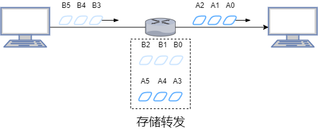
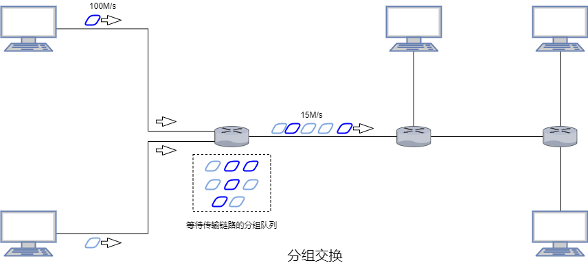
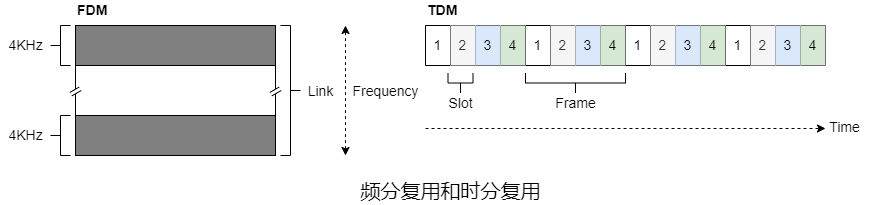
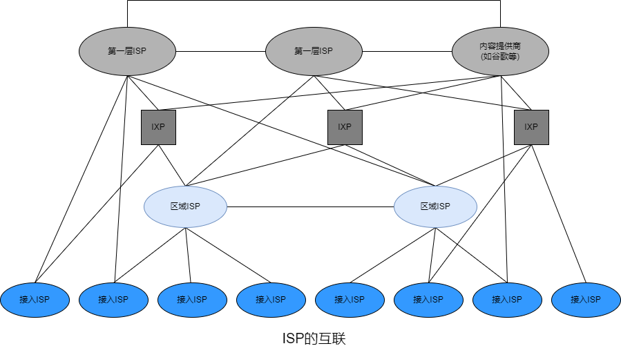
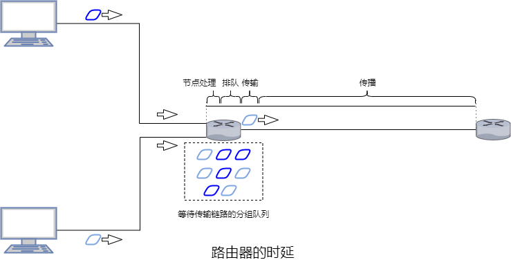
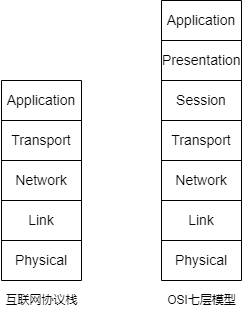
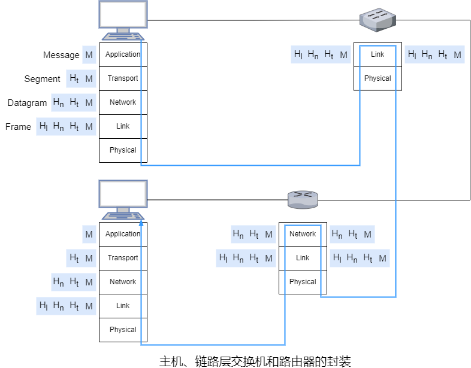

### 第一章 计算机网络和互联网

#### 1.1 互联网

&emsp;&emsp;与互联网连接的设备称为**主机**(因为容纳/运行应用程序)或**端系统**(因为位于互联网的边缘)。

&emsp;&emsp;主机分为**客户端**和**服务器**。

&emsp;&emsp;端系统彼此交换**报文**。端系统通过**通信链路**和**分组交换机**连接到一起。

&emsp;&emsp;通信链路的**传输速率**的单位是$bit/s$。一台端系统向另一台端系统发送报文时，发送端将报文分段并为每段加上首部字节，由此形成的信息包称为**分组**。

&emsp;&emsp;交换机主要包括**路由器**和**链路层交换机**。链路层交换机通常用于接入网中，而路由器通常用于网络核心中。从发送端系统到接收端系统，一个分组所经历的一系列通信链路和分组交换机称为通过该网络的**路径**。

&emsp;&emsp;端系统通过**互联网服务提供商**接入互联网。

&emsp;&emsp;端系统、分组交换机和其他互联网部件都要运行一系列**协议**，这些协议控制互联网中信息的接收和发送。**IP**协议定义了在路由器和端系统之间发送和接收的分组格式。互联网的主要协议统称为**TCP/IP**。

&emsp;&emsp;**协议**定义了两个或多个通信实体之间交换的报文的格式和顺序，以及发送/接收一条报文或其他事件所采取的动作。

&emsp;&emsp;**互联网标准**由**互联网工程任务组**研发，其标准文档称为**请求评论**。

&emsp;&emsp;应用程序涉及多个相互交换数据的端系统称为**分布式应用程序**。

&emsp;&emsp;与互联网相连的端系统提供了一个**套接字接口**，该接口规定了运行在端系统上的程序请求互联网基础设施向运行在另一个端系统上的特定目的地程序交付数据的方式。

&emsp;&emsp;ICANN负责分配IP地址，分配AS号，管理DNS根服务器，分配域名以及解决域名纷争。

#### 1.2 网络边缘

&emsp;&emsp;**接入网**指将端系统物理连接到其边缘路由器的网络。**边缘路由器**是端系统到任何其他远程端系统的路径上的第一台路由器。

&emsp;&emsp;家庭接入：DSL、电缆、FTTH、拨号和卫星

&emsp;&emsp;企业/家庭接入：以太网和WiFi

&emsp;&emsp;广域无线接入：3G/4G/5G和LTE

&emsp;&emsp;**物理媒体**包括**导引型媒体**(电波沿着固态媒体传播)和**非导引型媒体**(电波在空气或外层空间传播)。

#### 1.3 网络核心

&emsp;&emsp;通过网络链路和交换机移动数据有两种基本方法：**分组交换**和**电路交换**。

&emsp;&emsp;在电路交换的网络中，端系统间通信会话期间，预留了端系统间沿路径通信所需要的资源(缓存和链路传输速率)，而在分组交换的网络中不会预留这些资源。

##### 1.3.1 分组交换

&emsp;&emsp;多数分组交换机在链路的输入的使用**存储转发传输**机制。存储转发传输是指在交换机能够开始向输出链路传输该分组的第一个比特之前，必须接收到整个分组。

&emsp;&emsp;通过有$N$条速率均为$R$的链路组成的路径，其中有$N-1$台路由器且所有分组的长度都为$L$，则端到端时延为$d_{端到端}=N\frac{L}{R}$。

&emsp;&emsp;对于每条相连的链路，分组交换机有一个用来存储路由器准备发往该链路的分组的**输出缓存/队列**。

&emsp;&emsp;分组需要承受输出缓存的**排队时延**。

&emsp;&emsp;由于缓存空间是有限的，一个到达的分组可能发现该缓存已被其他待传输的分组完全占满，此时刚到达的分组或已经排队的分组其中之一将被丢弃，称为**分组丢失/丢包**。

&emsp;&emsp;每个端系统都有IP地址，分组的首部中包含了目的地的IP地址。

&emsp;&emsp;每台路由器具有一个将目的IP地址(一部分)映射成输出链路的**转发表**。

##### 1.3.2 电路交换

&emsp;&emsp;链路中的电路是通过**频分复用**或**时分复用**来实现的。

&emsp;&emsp;对于频分复用，链路的频谱由跨越链路创建的所有连接共享。在连接期间链路为每条连接专用一个频段，该频段的宽度称为**带宽**。

&emsp;&emsp;对于时分复用，时间被划分为固定期间的帧，称为**时间帧**，并且每个时间帧又被划分为固定数量的**时隙**。当网络跨越一条链路创建一条连接时，网络会为这个连接分配一个时隙，通常时隙的长度能够传输单个帧。

##### 1.3.3 网络的网络

&emsp;&emsp;因为接入ISP向全球传输ISP付费，故接入ISP可视为**客户**，而全球传输ISP可视为**提供商**。

&emsp;&emsp;在任何给定的区域，可能有一个**区域ISP**，每个区域ISP则与**第一层ISP连接**。

&emsp;&emsp;任何ISP(除了第一层ISP)可以选择**多宿**。

&emsp;&emsp;位于相同等级结构层次的邻近一对ISP能够**对等**。

&emsp;&emsp;**互联网交换点**是一个汇合点，多个ISP能够在这里一起对等。

#### 1.4 分组交换网

&emsp;&emsp;当分组从一个节点/主机/路由器沿着这条路劲到后继节点/主机/路由器，该节点在沿途的每个节点承受了几种不同类型的时延，其中最重要的是**节点处理时延**、**排队时延**、**传输时延**和**传播时延**，这些时延的总和是**节点总时延**。若用$d_{proc}$、$d_{queue}$、$d_{trans}$、$d_{prop}$、$d_{nodal}$分别表示处理时延、排队时延、传输时延、传播时延和节点总时延，则$d_{nodal}=d_{proc}+d_{queue}+d_{trans}+d_{prop}$。

&emsp;&emsp;检查分组首部和决定将该分组导向何处所需要的时间是**处理时延**的一部分。

&emsp;&emsp;在队列中，当分组在链路上等待传输时，需要经受**排队时延**。

&emsp;&emsp;**传输时延**是路由器推出分组所需的时间，可表示为$\frac{L}{R}$，$L$表示分组的长度，$R(b/s)$表示链路的传输速率，即从队列中推出1bit的速率。&emsp;&emsp;

&emsp;&emsp;$\frac{L\alpha}{R}$是**流量强度**，其中$\alpha(pkt/s)$表示分组到达队列的平均速率。流量强度主要用于衡量排队时延，设计系统时流量强度不能大于1。

&emsp;&emsp;1bit从一个路由器到另一个路由器所需的时间是**传播时延**。

&emsp;&emsp;源主机和目的主机之间有$N-1$台路由器，网络通畅(排队时延可以忽略)，节点时延累加起来，得到端到端时延：
$$
\begin{align}
d_{end-end}&=N(d_{proc}+d_{trans}+d_{prop})\\&=N(d_{proc}+\frac{L}{R}+d_{prop})
\end{align}
$$

&emsp;&emsp;**吞吐量**是进程交互比特的速率。

#### 1.5 协议层次及其服务模型

&emsp;&emsp;某层的**服务模型**是该层向上一层提供的服务。

&emsp;&emsp;各层的所有协议被称为**协议栈**。

##### 1.5.1 互联网协议栈

|        | 功能                                           | 主要协议                                  | 分组名称 |
| ------ | ---------------------------------------------- | ----------------------------------------- | -------- |
| 应用层 | 存留网络应用程序及其应用层协议                 | HTTP、SMTP、FTP、DNS、DHCP、SNMP和NFS等   | 报文     |
| 传输层 | 应用程序之间传输应用层报文                     | TCP、UDP、DCCP、DCTCP、TRFC、SCTP和QUIC等 | 报文段   |
| 网络层 | 也称为IP层，将数据报从一台主机移动到另一台主机 | IP等                                      | 数据报   |
| 链路层 | 沿着路径将数据报传递给下一个节点               | 以太网、WiFi和DOCSIS等                    | 帧       |
| 物理层 | 将帧中的一个个比特从一个节点移动到下一个节点   |                                           | 比特     |

&emsp;&emsp;**网络体系结构**是通信系统的整体设计，其广泛采用OSI模型。

&emsp;&emsp;相比互联网协议栈，OSI模型多出表示层和会话层。

&emsp;&emsp;表示层的作用是使通信的应用程序能够解释交换数据的含义。这些服务包括数据压缩、数据加密和数据描述。

&emsp;&emsp;会话层提供了数据交换的定界和同步功能，包括了建立检查点和恢复方案的方法。

&emsp;&emsp;在每一层，分组包括首部字段和**有效载荷字段**(通常是上一层的分组)。

#### 1.6 网络安全

&emsp;&emsp;**病毒**是一种需要某种形式的用户交互来感染用户设备的恶意软件。

&emsp;&emsp;**蠕虫**是一种无须任何明显用户交互就能进入设备的恶意软件。

&emsp;&emsp;**Dos攻击**包括弱点攻击(发送特殊的报文来控制或宕机)、带宽洪泛(发送大量分组)和连接洪泛(创建大量TCP连接)。

&emsp;&emsp;用来观察执行协议实体之间交换的报文的基本工具被称为**分组嗅探器**。

&emsp;&emsp;**IP哄骗**指将具有虚假源地址的分组注入互联网。