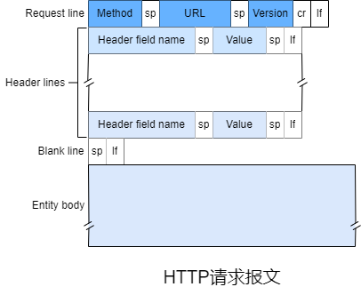
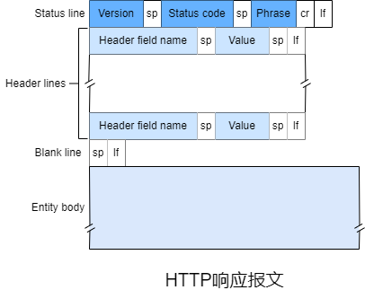
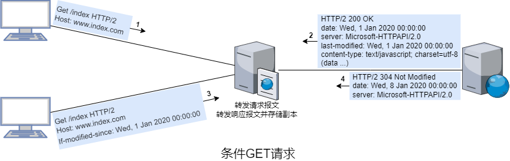
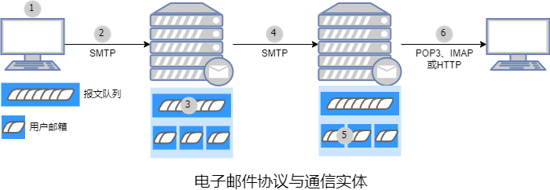
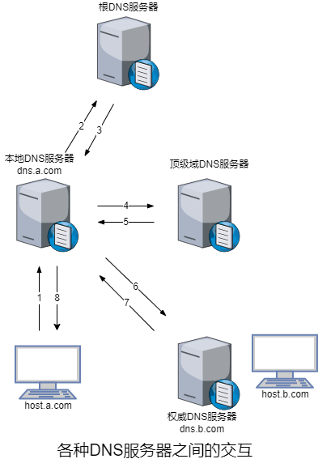
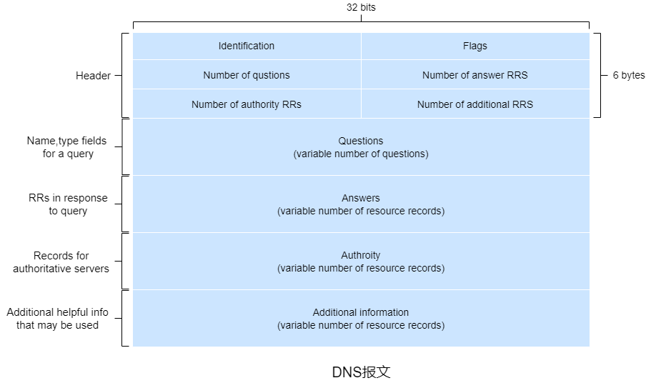
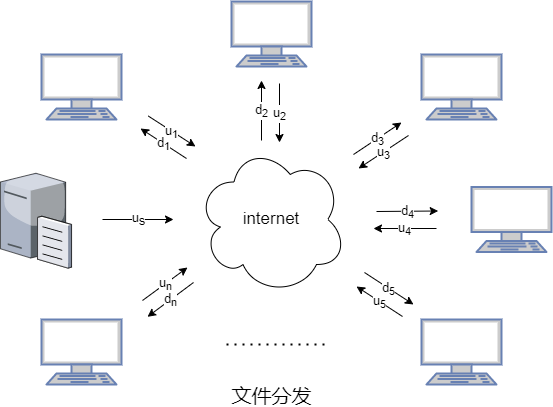
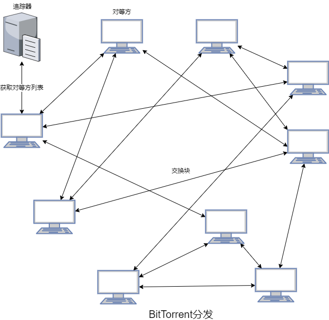
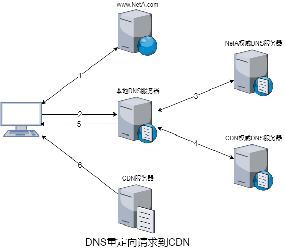

### 第二章 应用层

#### 2.1 应用层协议原理

&emsp;&emsp;**套接字**是应用程序进程和传输层协议之间的接口。一个进程可以有多个套接字。

&emsp;&emsp;应用程序开发者可以通过套接字控制应用层的一切，但是对传输层的控制仅限于选择协议和设定几个传输层参数。应用程序体系结构通常使用客户端/服务器体系结构和对等体系结构。

&emsp;&emsp;当进程向另一台主机的进程发送分组时需要定义目的主机的地址和目的主机中接收进程的标识符。&emsp;&emsp;

&emsp;&emsp;传输层为应用层提供的服务可分为四类：<span style="background-color: yellow">可靠数据传输</span>、<span style="background-color: yellow">吞吐量</span>、<span style="background-color: yellow">定时</span>和<span style="background-color: yellow">安全性</span>。

&emsp;&emsp;**带宽敏感的应用**具有吞吐量要求，而**弹性应用**能够根据可用的带宽尽可能多或少地使用。

&emsp;&emsp;**应用层协议**定义了运行在不同端系统上的应用程序进程如何相互传递报文：	

&emsp;&emsp;● 交互的报文类型

&emsp;&emsp;● 各种报文类型的语法

&emsp;&emsp;● 字段的语义

&emsp;&emsp;● 确定一个进程何时以及如何发送报文，对报文进行响应的规则

#### 2.2 HTTP

&emsp;&emsp;Web的应用层协议是**HTTP**。

&emsp;&emsp;HTTP服务器不保存关于客户端的任何信息，故HTTP是一个**无状态协议**。为了识别客户端，HTTP使用了cookie。

&emsp;&emsp;**持续连接**指一个TCP可以传输多个HTTP请求和响应。**非持续连接**指一个TCP只能传输一个HTTP请求/响应对。HTTP默认使用持续连接，但也能配置为非持续连接。

&emsp;&emsp;**Web缓存器**，也称为**代理服务器**，能够代表Web服务器来满足HTTP请求的网络实体。

&emsp;&emsp;HTTP的**条件GET**机制可以解决Web缓存器缓存的数据陈旧的问题。

&emsp;&emsp;HTTP是一个**拉协议**，因为TCP连接是由接收端发起。

##### 2.2.1 HTTP请求报文

```http
GET /somedir/page.html HTTP/2
Host: www.test.com
User-Agent: Mozilla/5.0
Accept: */*
Accept-Language: zh-CN,zh;q=0.8,zh-TW;q=0.7,zh-HK;q=0.5,en-US;q=0.3,en;q=0.2
Accept-Encoding: gzip, deflate, br
Connection: keep-alive
```

&emsp;&emsp;HTTP请求报文的第一行是**请求行**。请求行包括方法字段、URL字段和HTTP版本字段。

&emsp;&emsp;HTTP请求报文第一行之后的行是**首部行**。



##### 2.2.2 HTTP响应报文

```http
HTTP/2 200 OK
content-type: text/javascript; charset=utf-8
content-encoding: br
last-modified: Wed, 03 Nov 2021 01:12:45 GMT
server: Windows-Azure-Blob/1.0 Microsoft-HTTPAPI/2.0
```

&emsp;&emsp;HTTP响应报文的第一行是**状态行**。状态行包括协议版本字段、状态码字段和相应状态字段。

&emsp;&emsp;HTTP响应报文第一行之后的行是**首部行**。



##### 2.2.3 条件GET

&emsp;&emsp;如果请求报文是GET方法且请求报文的首部行包括`If-modified-since`，该请求报文就是**条件GET**请求报文。



&emsp;&emsp;第三步中`If-modified-since`的值等于第二步中`last-modified`的值，这表示Web服务器仅当指定日期之后该对象修改后才发送该对象，若该对象在指定日期后没被修改，则第四步中Web服务器向Web缓存器发送的响应报文中状态码为304且没有对象，表示Web缓存器可以转发缓存的该对象的副本。

#### 2.3 电子邮件

&emsp;&emsp;互联网电子邮件系统由**用户代理**、**邮件服务器**和**简单邮件传输协议**组成。



&emsp;&emsp;1）发件方调用用户代理撰写内容并发送邮件。

&emsp;&emsp;2）发件方的用户代理把报文发给发件方的邮件服务器，在这里报文被放在报文队列里。

&emsp;&emsp;3）发件方邮件服务器上的SMTP客户端创建一个到收件方邮件服务器上的SMTP服务器的TCP连接。

&emsp;&emsp;4）经过初始SMTP握手后，SMTP客户端通过TCP连接发送报文。

&emsp;&emsp;5）收件方邮件服务器的SMTP服务器接收到报文并将报文投入到收件方的邮箱。

&emsp;&emsp;6）收件方调用用户代理查看邮件。

##### 2.3.1 SMTP

&emsp;&emsp;SMTP是互联网电子邮件中主要的应用层协议。它限制了邮件的报文(不只是首部)只能采用7-bit ASCII表示，若报文包含非7-bit ASCII字符或二进制数据，需要进行7-bit ASCII编码。

&emsp;&emsp;SMTP是**推协议**，TCP连接是发送端发起的。

```ini
S: 220 client
C: EHLO server
S: 250 from | 250 PIPELINING | 250 SIZE 12345
C: AUTH XOAUTH2 oauth
S: 235 2.7.0 Accepted
C: MAIL FROM: <client@email.com> 
S: 250 OK
C: RCPT TO: <server@email.com>
S: 250 OK
C: DATA
S: 354 End data with <CR><LF>.<CR><LF>
C: DATA fragment,content
S: 250 OK: queued as.
C: QUIT
S: 221 Bye
```

&emsp;&emsp;SMTP协议中客户端发送了5条命令：HELO/EHLO(HELLO缩写，ESMTP版本)、MAIL FROM、RCPT TO、DATA以及QUIT。

&emsp;&emsp;ESMTP相比SMTP，在发送邮件时<span style="background-color: yellow">需要验证用户账户</span>。

##### 2.3.2 电子邮件

```ini
From: from@email.com
To: to@email.com
Subject: subject
```

&emsp;&emsp;邮件报文的首部行包括环境信息，必须包含一个`From`和一个`To`，可能包含`Subject`以及其他可选首部行。

&emsp;&emsp;在用户代理建立一个到邮件服务器110端口上的TCP连接后，POP3按照3个阶段进行工作：授权、事务处理以及更新。

&emsp;&emsp;● 授权阶段需要用户代理以明文形式发送用户名和密码来认证，主要指令有`user <username>`和`pass <password>`。

&emsp;&emsp;● 事务处理阶段中用户代理可以取回报文，也可以添加/取消报文删除标记，主要指令有`list`、`retr`和`dele`。

&emsp;&emsp;● 更新阶段在用户代理发出`quit`指令并结束会话后，邮件服务器会删除那些被标记的报文。

&emsp;&emsp;POP3会话期间，邮件服务器会保留一些状态信息，但是在会话中不会携带这些信息。

&emsp;&emsp;IMAP使用了TCP连接的143端口。相比POP3，IMAP把报文和文件夹联系起来并且提供了创建/修改/删除文件夹和获取报文某些部分的指令。

#### 2.4 DNS

&emsp;&emsp;主机可以用**主机名**和**IP地址**来进行识别。

&emsp;&emsp;一台名为a.com的主机，可能还有别名b.com和c.com，此时a.com是**规范主机名**。

&emsp;&emsp;**域名系统**是一个由分层的**DNS服务器**实现的分布式数据库，一个让主机查询分布式数据库的应用层协议。主要用于将主机名解析为IP地址，也提供**主机别名**、**邮件服务器别名**和**负载分配**服务。

##### 2.4.1 DNS工作原理

&emsp;&emsp;DNS服务器主要分为**根DNS服务器**、**顶级域DNS服务器**、**权威DNS服务器**和**本地DNS服务器**。

&emsp;&emsp;● 根DNS服务器提供顶级域DNS服务器的IP地址。

&emsp;&emsp;● 每个顶级域(如com、org、net、edu和gov等)和国家的顶级域(如uk、fr、ca和cn等)都有顶级域DNS服务器(集群)。顶级域DNS服务器提供权威DNS服务器的IP地址。 

&emsp;&emsp;● 互联网上具有公共可访问主机的每个组织机构必须提供公共可访问的DNS记录，这些记录将这些主机的名称映射为IP地址。

&emsp;&emsp;● 每个ISP都有一个本地DNS服务器/默认名称服务器。



&emsp;&emsp;一般情况下，从请求主机到本地DNS服务器的查询是**递归查询**，其余的查询是**迭代查询**。

&emsp;&emsp;为了降低时延并减少报文数量，**DNS缓存**广泛使用，因此在大部分DNS查询中根DNS服务器都被绕过。

##### 2.4.2 DNS报文

&emsp;&emsp;**资源记录**提供了主机名到IP地址的映射，格式为`(Name, Value, Type, TTL)`。

&emsp;&emsp;● `Type = A`时，`Name`是主机名，`Value`是主机名对应的IP地址。

&emsp;&emsp;● `Type = NS `时，`Name`是域名，`Value`是能够获取该域名中主机IP地址的权威DNS服务器的主机名。

&emsp;&emsp;● `Type = CNAME `时，`Value`是别名为`Name`的主机的规范主机名。

&emsp;&emsp;● `Type = MX`时，`Value`是别名为`Name`的邮件服务器的规范主机名。

&emsp;&emsp;对于某个主机名，若DNS服务器是它的权威DNS服务器，则该DNS服务器会有一条包含该主机名的A型记录。若DNS服务器不是它的权威服务器，则该DNS服务器会有一条该主机名所属域名的NS型记录和一条包含该NS型记录中`Value`的A型记录，还可能会有一条包含该主机名的A型记录。



&emsp;&emsp;DNS报文分为查询和应答报文，报文格式相同。

&emsp;&emsp;● 在首部区域，第一个字段占16位，用于标识该查询，该字段会被复制到应答报文中来匹配请求。第二个字段有若干1位的标志位。0/1标识查询/应答报文。若请求的是权威DNS服务器则应答报文会设置权威标志位。若客户端在DNS服务器没有资源记录时希望它执行递归查询则会设置希望递归标志位。若DNS服务器支持递归查询则会在应答报文设置递归可用标志位。剩下四个字段表示后四个区域数据的数量。

&emsp;&emsp;● 问题区域包名称字段和类型字段，名称字段是待查询的主机名称，类型字段对应资源记录中的类型字段。

&emsp;&emsp;● 应答区域可以包含多条资源记录。&emsp;&emsp;

&emsp;&emsp;● 权威区域包含其他权威DNS服务器的资源记录。

&emsp;&emsp;● 附加信息区域包含其他有用的资源记录。

#### 2.5 P2P文件分发

##### 2.5.1 P2P体系结构

&emsp;&emsp;**分发时间**是所有$n$个对等方得到文件的副本所需时间。



&emsp;&emsp;$D_{cs}$表示C/S体系结构的分发时间，其中服务器需要上传$n$个大小为$f$ $bit$文件的副本，$D_c$表示客户端下载所需时间，$d_{min}$表示客户端最低下载速度，$D_S$表示服务器上传所需时间，$u_s$表示服务器的上传速度，则
$$
\begin{align}
D_{cs}&\geqslant max\{D_c,D_s\}\\&\geqslant max\{\frac{f}{d_{min}},\frac{nf}{u_s}\}
\end{align}
$$
&emsp;&emsp;$D_{P2P}$表示P2P体系结构的分发时间，分发开始时只有服务器有文件，分发一次后可由对等方来分发，则
$$
\begin{align}
D_{P2P}&\geqslant max\{D_c,D_s,\frac{nf}{u_{total}}\}\\&\geqslant max\{\frac{f}{d_{min}},\frac{f}{u_s},\frac{nf}{u_s+\sum_{i=1}^{n}u_i}\}
\end{align}
$$

##### 2.5.2 BitTorrent

&emsp;&emsp;参与文件分发的所有对等方集合称为**洪流**。洪流中的对等方彼此下载固定大小的文件块，通常是256KB。每个洪流具有一个基础设施节点，称为**追踪器**。当有对等方加入洪流时需要向追踪器注册并周期性地通知是否在洪流中。



&emsp;&emsp;与对等方建立TCP连接的其他对等方称为该对等方的**邻居/邻近对等方**。

&emsp;&emsp;**最稀缺优先**即优先请求本身没有且邻居中副本最少的块，这样可以大致地均衡每个块在洪流中的副本量。

&emsp;&emsp;对等方优先响应那些当前能够以<span style="background-color: yellow">最高速率</span>提供副本的邻居。对等方会每十秒进行速率测量并确定速率前四的邻居，这四个邻居会被**疏通**。此外，每三十秒会随机再选择一个邻居进行交换，如果彼此都能满足，则继续交换。除了这五个邻居，其他邻居将被阻塞，即无法从该对等方获取块。这种机制被称为**一报还一报**。

#### 2.6 CDN

##### 2.6.1 视频流

&emsp;&emsp;一张未压缩/数字编码的图像有像素阵列组成，每个像素由一些比特编码来表示亮度或颜色。

&emsp;&emsp;视频是一系列图像以每秒二十四/三十张图像来展现。视频能被压缩，故可以比特率来权衡视频质量。

&emsp;&emsp;在**HTTP动态自适应流**中，视频编码为比特率不同的多个版本，每个版本都有一个不同的URL，每个版本的URL和比特率都存在HTTP服务器中的**告示文件**中。DASH运行客户端自由地切换版本。

##### 2.6.2 CDN

&emsp;&emsp;**内容分发网络**分布在多个地理位置的服务器上，并且将用户请求重定向到一个时延更低的CDN。

&emsp;&emsp;CDN分为**专用CDN**和**第三方CDN**，专用CDN由内容提供商自身拥有，第三方CDN分发多个内容提供商的内容。

&emsp;&emsp;CDN通常采用**深入**和**客邀**这两种安置原则。

&emsp;&emsp;● 深入由Akamai首创，该原则通过在遍及全球的接入ISP中部署服务器集群来深入到ISP的接入网中。其目标是靠近端系统，通过减少端系统和CDN集群之间的链路和路由器来减少时延和提供吞吐量，但也带来了较高的维护管理成本。

&emsp;&emsp;● 客邀被Limelight和很多其他CDN公司采用，该原则通过在少量的关键位置(通常是互联网交换点)建立大量集群来客邀ISP。相比深入，客邀的维护管理成本更低，但时延较高且吞吐量较低。



&emsp;&emsp;大多数CDN利用DNS来截获和重定向请求。

&emsp;&emsp;1）客户端访问某Web网页。

&emsp;&emsp;2）客户端访问该Web下的某个资源时，发送了对应的DNS请求。

&emsp;&emsp;3）本地DNS服务器将DNS请求中继到该Web的权威DNS服务器，权威DNS服务器返回了CDN域下的主机名。

&emsp;&emsp;4）本地DNS服务器通过CDN域下的主机名向CDN权威DNS服务器发送DNS请求，CDN权威DNS服务器返回了CDN服务器的IP地址。

&emsp;&emsp;5）本地DNS服务器将IP地址返回给客户端。

&emsp;&emsp;6）客户端通过IP地址与CDN服务器建立TCP连接并发送HTTP请求。

&emsp;&emsp;CDN部署的核心都是**集群选择策略**，即动态地将请求重定向到CDN中的某个服务器集群/数据中心。

&emsp;&emsp;较简单的选择策略是将请求重定向到(距离DNS服务器)<span style="background-color: yellow">地理上最近</span>的集群。另一种选择策略是对DNS服务器和集群之间进行周期性的时延以及丢包<span style="background-color: yellow">实时测量</span>来选择。
