### 第三章 传输层

&emsp;&emsp;网络层提供了主机之间的逻辑通信，传输层提供不同主机的进程之间的逻辑通信。

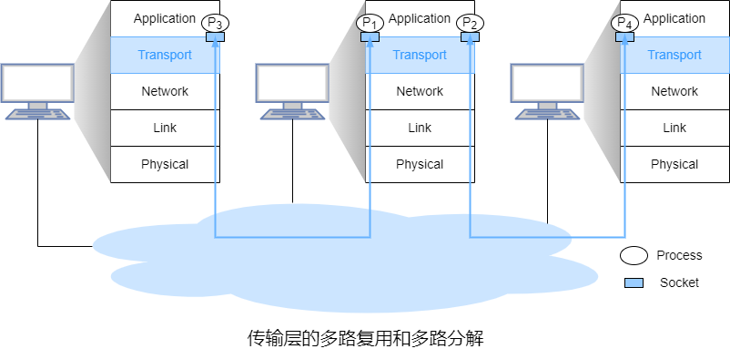

&emsp;&emsp;传输层的**多路复用**与**多路分解**指将主机间交付延伸到进程间交付。

&emsp;&emsp;● 多路复用指在不同套接字中收集数据块，为每个数据块附加首部信息并封装从而生成报文段，再将报文段传递到网络层。

&emsp;&emsp;● 多路分解指将传输层报文段解封并提取数据交付到正确的套接字。

&emsp;&emsp;多路复用需要**源端口号字段**(套接字的唯一标识符)和**目的端口号字段**(报文段中标识目标套接字的字段)。

&emsp;&emsp;端口号的长度是16位。0~1023之间的端口称为**周知端口号**。

&emsp;&emsp;**序号**用于为从发送端发往接收端的分组按序编号。

&emsp;&emsp;**校验和**用于分组的差错检测。

#### 3.1 UDP

&emsp;&emsp;UDP在发送报文段前传输层实体间没有握手，故UDP是无连接的。

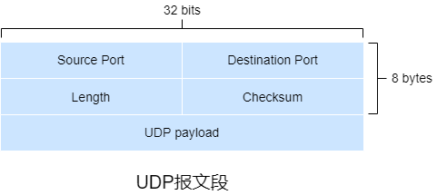

&emsp;&emsp;UDP首部包括16位**源端口**、16位**目的端口**、16位**长度**和16位**校验和**。

&emsp;&emsp;● 长度字段即报文段中的字节数(首部+有效载荷)。

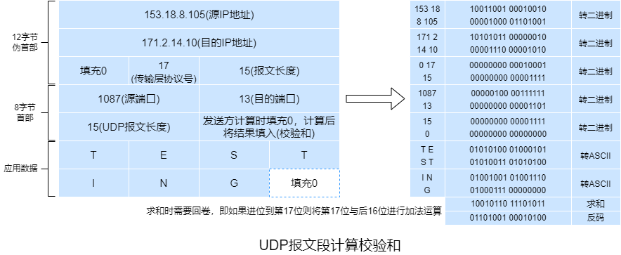

&emsp;&emsp;发送端在计算校验和时需要先加上伪首部并将校验和字段置0，将伪首部、首部和有效载荷转换成16位二进制(不足部分填充0)并求和，求和时需要回卷(如果进位到第17位则将结果加1)，将和取反得到校验和，最后发送端设置校验和并去掉伪首部。接收端计算校验和方式类似于发送端(不需要将校验和置0)，最后结果全为1则说明数据无误，否则警告。伪首部包括源IP地址、目的IP地址、填充0的保留字段、传输层协议号以及报文长度。

&emsp;&emsp;由于无法确保链路的可靠和内存中的差错检测，UDP在端到端基础上的传输层进行差错检测，这种设计被称为**端到端原则**，即同一功能的实现成本在底层相比高层可能更高。

#### 3.2 可靠数据传输

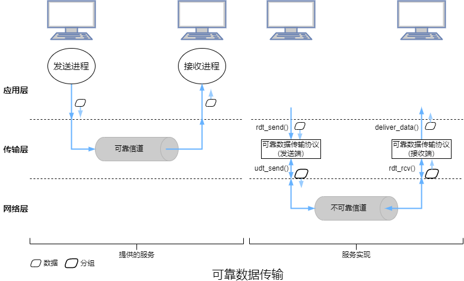

##### 3.2.1 rdt1.0

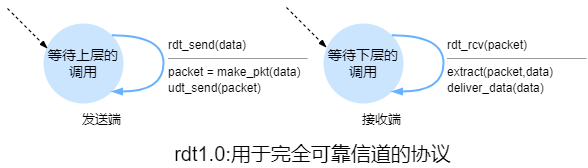

&emsp;&emsp;rdt1.0协议指经完全可靠信道的可靠数据传输，故接收端不需要提供任何反馈信息给发送端。此外，该协议的数据单元与分组无异，所有分组都是发送端到接收端。

&emsp;&emsp;FSM的初始状态用虚线表示。发送端和接收端的FSM都只有一个状态，故变迁必定是从一个状态返回到本身。

&emsp;&emsp;发送端只通过`rdt_send(data)`从高层接收数据，经由`make_pkt(data)`产生一个包含该数据的分组，并将分组发送到信道中。接收端通过`rdt_rcv(packet)`从底层信道接收一个分组，经由`extract(packet,data)`取出数据，并通过`deliver_data(data)`将数据传输给高层。

##### 3.2.2 rdt2.0

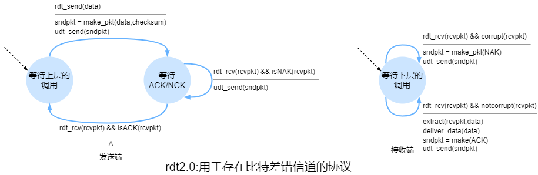

&emsp;&emsp;rdt2.0相比rdt1.0，加入了差错检测和**肯定/否定确认**。肯定/否定确认用于让发送端知道分组被正确接收或接收有误需要重传，因此rdt2.0称为**自动重传请求**协议。自动重传请求协议还需要差错检测、接收端反馈(用1位来表示，0是NAK，1是ACK)和重传来处理比特差错的情况。

&emsp;&emsp;当发送端等待ACK/NCK时不能从高层获取数据或发送分组，故rdt2.0称为**停等**协议。

&emsp;&emsp;发送端有两个状态。在左边的状态中，发送端正在等待高层调用。当出现`rdt_send(data)`时，发送端将通过`make_pkt(data,checksum)`产生一个包含数据和校验和的分组，经由`udt_send(sndpkt)`发送该分组。在右边的状态中，发送端正在等待接收端回传的ACK/NAK。若收到ACK分组，即`rdt_rcv(rcvpkt) && isACK(rcvpkt)`，发送端会回到等待高层调用的状态。若收到NAK分组，即`rdt_rcv(rcvpkt) && isNAK(rcvpkt)`，发送端会重传分组并等待接收回传的ACK/NAK。

&emsp;&emsp;接收端只有一个状态。当分组到达时，接收端回传ACK/NAK，即`rdt_rcv(rcvpkt) && notcorrupt(rcvpkt)`或`rdt_rcv(rcvpkt) && corrupt(rcvpkt)`。

&emsp;&emsp;但是rdt2.0忽视了ACK/NAK分组受损的情况，解决这一问题的简单方法就是添加一个新字段来表示发送数据分组的序号。

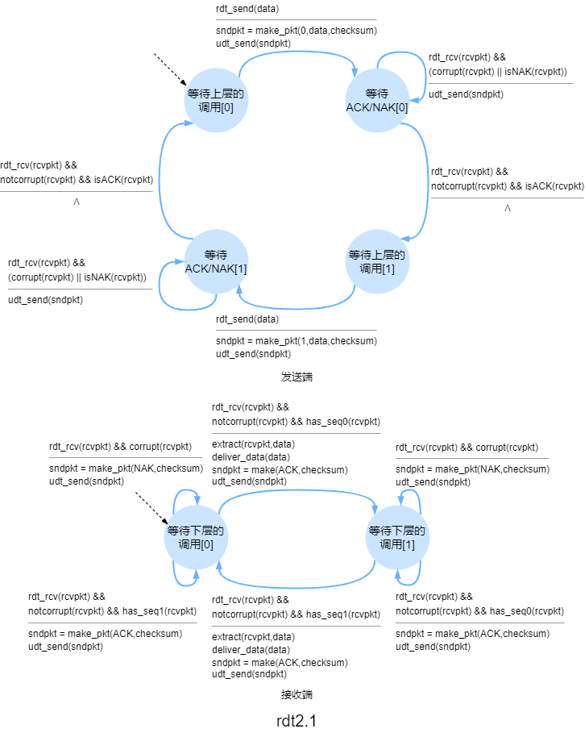

&emsp;&emsp;rdt2.1是rdt2.0的修订版，rdt2.1的发送端和接收端FSM的状态数都是以前的两倍，因为需要反映出目前分组的序号。rdt2.1使用了接收端到发送端的ACK/NAK。当收到乱序的分组时，接收端回传ACK。当收到受损的分组时，接收端回传NAK。

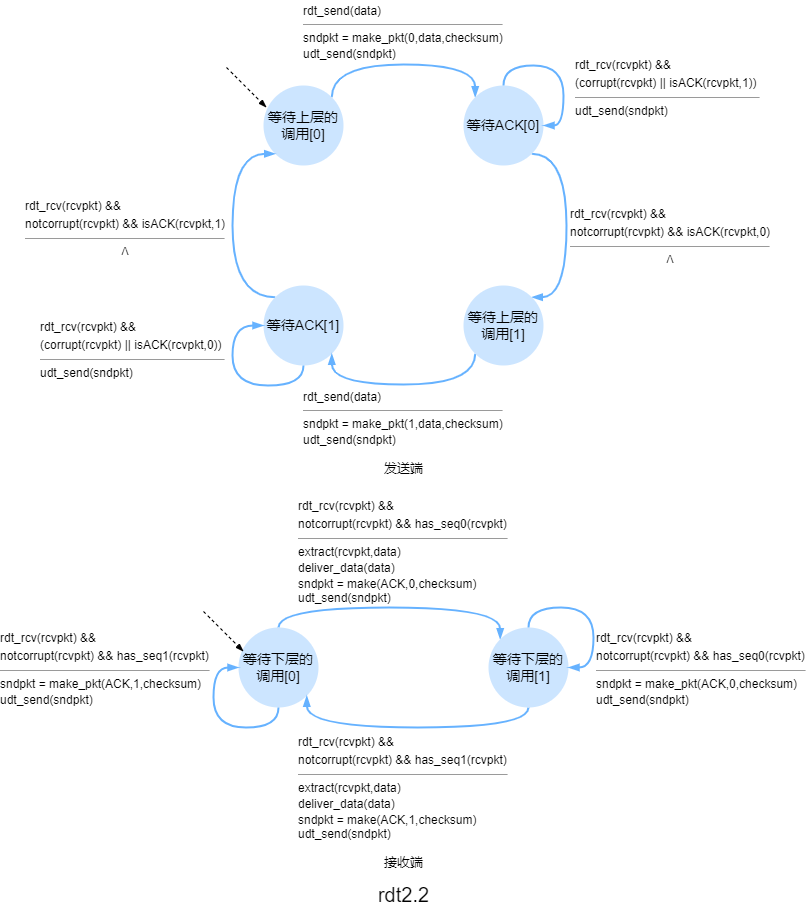

&emsp;&emsp;rdt2.2相比rdt2.1，rdt2.2无NAK，而是对上一次正确接收的分组回传ACK。发送端收**冗余ACK**后，就知道了接收端没有正确接收到冗余ACK对应的分组后的分组。因此，ACK报文需要一个序号字段。

##### 3.2.3 rdt3.0

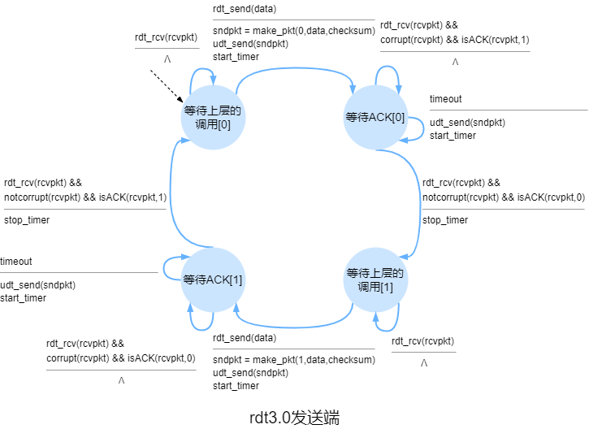

&emsp;&emsp;rdt3.0是用于具有比特差错的丢包信道的协议。通过在发送端中加入**倒数计时器**来解决超时/丢包问题，接收端与rdt2.2相同。

&emsp;&emsp;因为分组序号在0和1之间交替，rdt3.0也被称为**比特交替协议**。

##### 3.2.4 流水线可靠数据传输协议

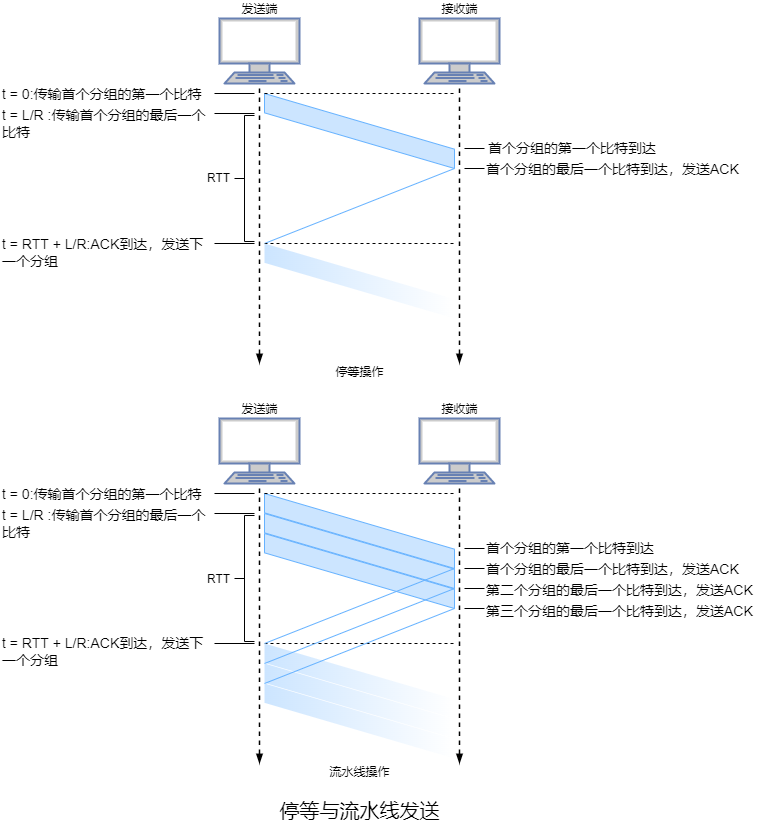

&emsp;&emsp;停等协议存在一定的性能问题，简单的解决方式就是不使用停等，允许发送方发送多个分组而无须等待。因为许多从发送端到接收端的分组可以被看出是填充到一条流水线，故这种技术被称为**流水线**。

&emsp;&emsp;流水线需要可靠数据传输协议增加序号的范围和发送/接收端缓存分组，而这些取决于差错恢复。流水线的差错恢复包括**回退N步**和**选择重传**。

##### 3.2.5 回退N步

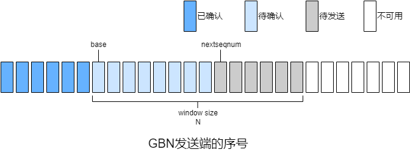

&emsp;&emsp;随着协议的运行，该窗口的序号空间向前滑动，$N$称为窗口长度，故GBN也称为滑动窗口协议。

&emsp;&emsp;$base$表示最早待确认的分组的序号，$nextseqnum$表示最早的待发送的分组的序号。$[0,base-1]$表示已被确认的分组，$[base,nextseqnum-1]$表示待确认的分组，$[nextseqnum,nextnum+N-1]$表示待发送的分组，$[nextnum+N,+\infty)$表示不可用的分组，直到当前流水线中待确认的分组确认。

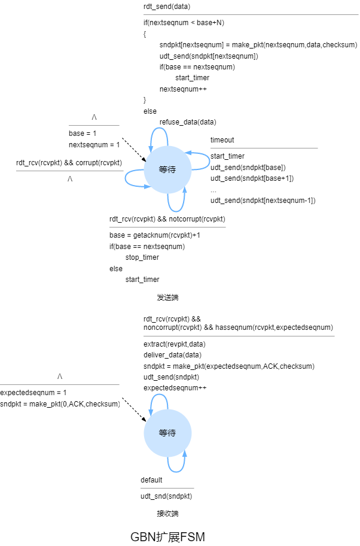

&emsp;&emsp;发送端必须响应高层的调用、接收ACK和处理超时。

&emsp;&emsp;当高层调用`rdt_send()`时，发送端先检测发送窗口是否已满。若窗口未满则产生一个分组发送并更新对应的变量，否则反馈高层。不存在待确认分组的情况下首次发送分组时会设置一个计时器。当收到ACK但仍存在待确认的分组时，计时器将重置。当不存在待确认的分组时停止计时器。

&emsp;&emsp;接收端用$expectedseqnum$来表示按序待接收的分组的序号。

&emsp;&emsp;接收端对序号为$n$的分组使用**累积确认**的方式，表明已正确收到序号在$n$之前且包括$n$的所有分组。

&emsp;&emsp;当接收端收到序号为$n$的分组且上次交付给高层的分组的序号是$n-1$时会对分组$n$回传ACK，否则丢弃该分组并对最近交付给高层的分组回传ACK。

&emsp;&emsp;接收端会丢失所有乱序分组，因为这些分组还会重传。

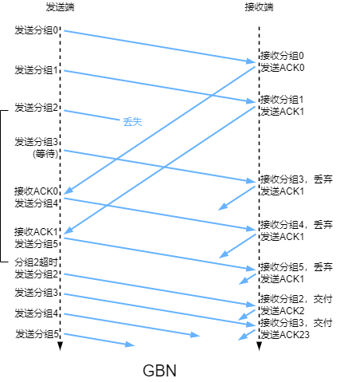

##### 3.2.6 选择重传

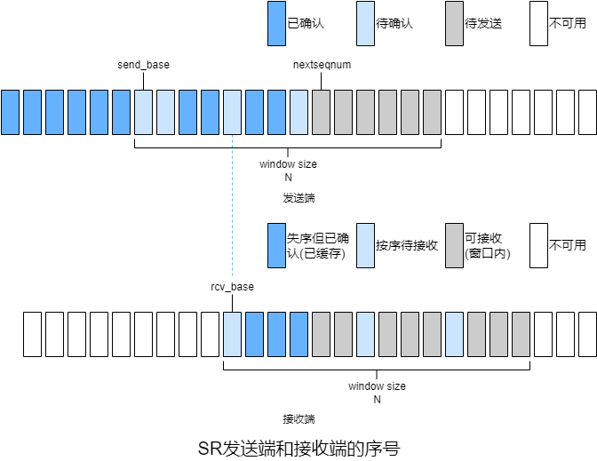

&emsp;&emsp;发送端仅重传那些在接收方可能丢失/受损的分组，也可能收到窗口内某些分组的ACK。

&emsp;&emsp;接收端将确认一个正确接收的分组而不管是否按序，乱序的分组将被缓存，当所有的乱序分组都被接收后再一起交付给高层。

&emsp;&emsp;当高层调用`rdt_send()`时，发送端检测可用于分组的序号是否在窗口内。若在窗口内则产生一个分组发送，否则反馈高层。每个分组都有一个计时器。当收到ACK时，若ACK对应的分组序号在窗口内则将该分组标记为已确认，若ACK对应的分组序号等于$send\_base$则将窗口移动至待确认的最小序号处。窗口移动后且窗口内存在待发送的分组，这些分组将被发送。

&emsp;&emsp;对接收端，序号在$[rcv\_base-N,rcv\_base+N-1]$内的分组将被正确接收。若接收分组的序号在窗口内将回传ACK，分组首次接收时缓存该分组。若接收分组的序号等于$rcv\_base$，则该分组以及缓存中序号始于该分组的序号且连续的所有分组将交付给高层。若接收分组的序号在$[rcv\_base-N,rcv\_base-1]$，则必须回传一个ACK，无论该分组是否已被确认。

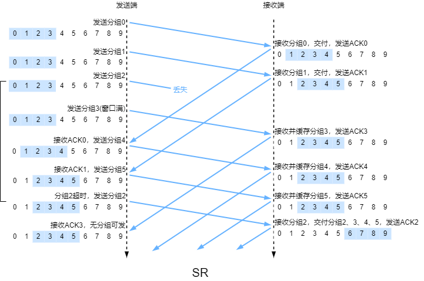

&emsp;&emsp;SR问题在于发送端/接收端之间缺乏同步，唯一能确定的是只有信道中收到的分组/ACK。

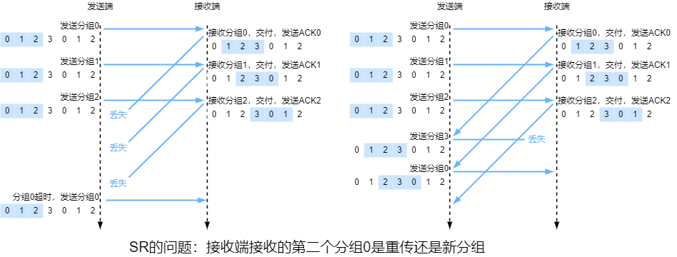

&emsp;&emsp;SR的窗口长度必须小于或等于序号去重后的数量的一半。

&emsp;&emsp;若信道是单段物理连接时，信道中的分组不会重新排序。若信道是网络时，信道中的分组可能会出现重新排序，体现在即使发送端和接收端的当前窗口都不包含序号`x`但信道中可能出现序号为`x`的分组/ACK的副本。信道中的分组重新排序可视为缓存这些分组并在未来的任何时间自发地发出这些分组。由于序号可以重复，这种序号重复的分组应该避免出现，实际中通常是确保在发送端确定之前发送的序号`x`的分组不会出现在网络前，都不会使用序号`x`，这通过设置分组的**生存时间**(一般不超过3分钟)来实现。

#### 3.3 拥塞控制原理

##### 3.3.1 拥塞原因与代价

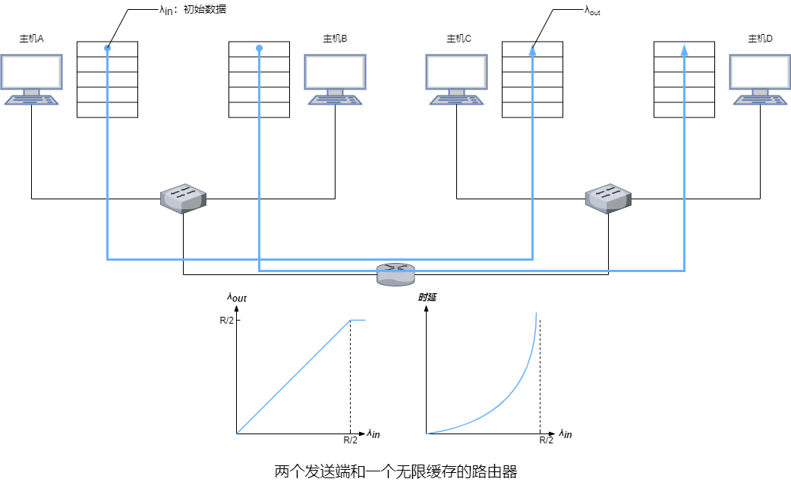

&emsp;&emsp;$\lambda_{in} (B/s)$表示应用层通过套接字发送初始报文到传输层的速率，$\lambda_{out} (B/s)$表示应用层接收报文的速率。

&emsp;&emsp;分组通过一台路由器在容量为$R$的共享式输出链路上传输，忽略添加底层首部信息的开销、差错恢复、流量控制和拥塞控制，显然$\lambda_{out} \leqslant \frac{R}{2}$ 。时延的增长率随着$\lambda_{in}$增长，$\lambda_{in}$达到$\frac{R}{2}$时时延无穷大。这里体现了拥塞的代价之一：当分组的到达速率接近链路容量时，分组承受巨大的排队时延。

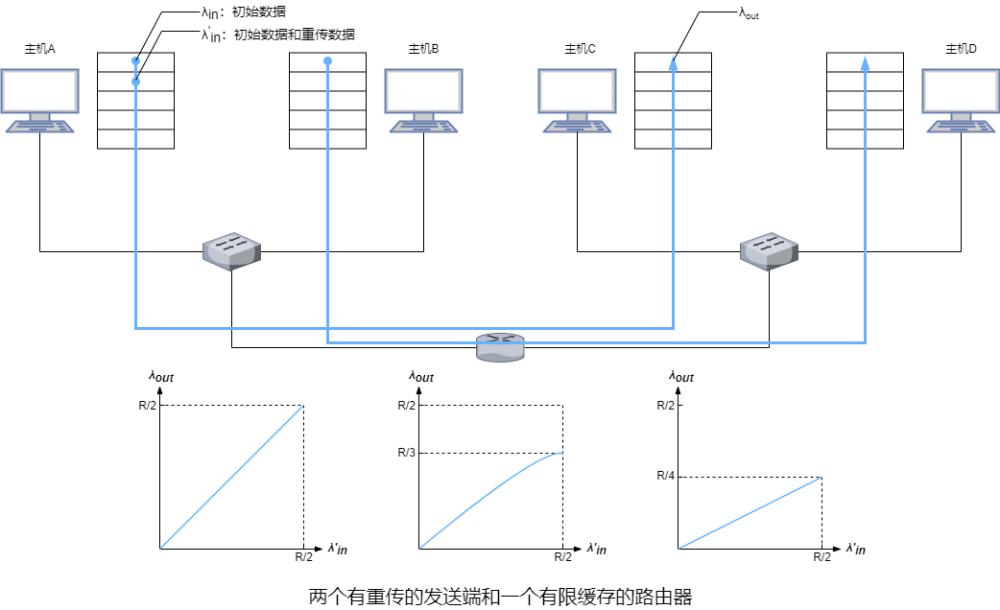

&emsp;&emsp;$\lambda^{'}_{in} (B/s)$表示传输层发送初始报文段和重传报文段到网络层的速率，称为**供给载荷**。

&emsp;&emsp;假设发送端能确定路由器的可用缓存并根据情况发送分组，故不会丢包，$\lambda_{in}=\lambda^{'}_{in}$，连接的吞吐量为$\lambda^{'}_{in}$。在这种情况下，主机平均发送速率不能超过$\frac{R}{2}$。

&emsp;&emsp;假设发送端仅确定分组丢失后下才重传，当$\lambda_{in}^{'}=\frac{R}{2}$时从平均角度有 $\lambda_{in}=\lambda_{out}=\frac{R}{3}$。这里体现了拥塞的代价之一：发送端必须重传因缓存溢出而丢失的分组。

&emsp;&emsp;假设发送端重传因排队时延超时但未丢失的分组，初始分组和重传的分组可能都会到达接收端，接收端只需要一个这样的分组。当$\lambda_{in}^{'}=\frac{R}{2}$时从平均角度(每个分组转发两次)有$\lambda_{in}=\lambda_{out}=\frac{R}{4}$。这里体现了拥塞的代价之一：发送方因较大的时延进行了不必要的重传而占用路由器额外的链路带宽。

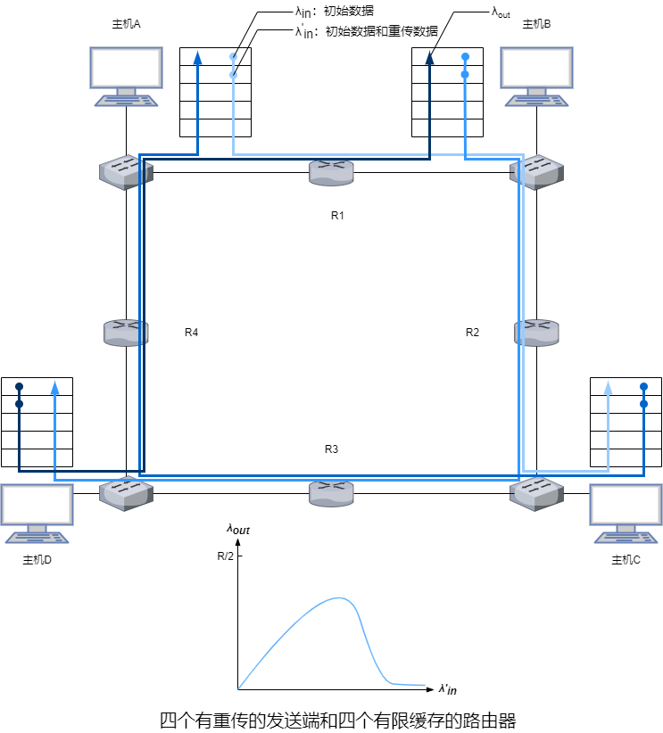

&emsp;&emsp;当$\lambda_{in}$较小时，路由器缓存比较充足，吞吐量大致等于供给载荷，$\lambda_{out}$随着$\lambda_{in}$增大而增大。当$\lambda_{in}$较大时，对于R2，主机B发送的分组的到达速率高于主机A发送的分组的到达速率，这会导致主机A发送的分组因缓存溢出而丢失。

&emsp;&emsp;若考虑网络资源的浪费，当分组在第二跳及之后的路由器丢失时，之前路由器的转发工作毫无意义。这里体现拥塞的代价之一：分组丢失时转发过该分组的上游路由器因转发而使用的传输容量被浪费。

##### 3.3.2 拥塞控制方法

&emsp;&emsp;根据网络层是否为传输层提供了显式支持可将拥塞控制分为端到端拥塞控制和网络辅助拥塞控制。

&emsp;&emsp;在端到端拥塞控制中，网络层没有为传输层提供显示支持。即使网络中存在拥塞，端系统也必须通过对丢包和时延等网络行为的观察来确定是否拥塞。

&emsp;&emsp;在网络辅助的拥塞控制中，路由器向发送端提供关于的拥塞状态的显示反馈信息。拥塞信息反馈到发送端通常有两种方式，一种是路由器直接发送关于拥塞状态的分组给发送端，此时该分组称为**抑制分组**。另一种方式更通用，TCP、DCCP和DCTCP都有使用。路由器更新由发送端到接收端的数据报头部中的ECN拥塞标志位来表示出现拥塞。若接收端收到分组的标志位表示出现拥塞则会通知发送端，故这种方式至少需要一个完整的往返周期。

#### 3.4 TCP

&emsp;&emsp;在进程发送数据之前，进程间必须握手，即相互发送一些预备报文段来设置确保数据传输的参数，故TCP是**面向连接的**。

&emsp;&emsp;TCP连接只能有一个客户端和一个服务器，故TCP是**点对点**的。

&emsp;&emsp;进程间建立TCP连接后，双方都可以发送/接收报文段，故TCP是**全双工服务**。

&emsp;&emsp;TCP根据ACK到达的速率来调节拥塞窗口，故TCP是**自计时**的。

&emsp;&emsp;客户端先发送一个特殊的报文段，服务器用另一个特殊报文段来响应，最后，客户端用第三个特殊报文段作为响应，这种建立连接的过程被称为**三次握手**。前2个报文段不承载有效载荷，第三个报文段可以承载有效载荷。

&emsp;&emsp;TCP的双方都由一个接收缓存、一个发送缓存和几个变量组成。

&emsp;&emsp;TCP会使用**重传计时器**、**坚持计时器**、**保活计时器**和**时间等待计时器**这四种计时器。重传计时器用于报文段重传。坚持计时器用于防止双方的死锁。保活计时器用于在长连接中断开无响应的连接。时间等待计时器用于四次握手断开连接前的等待。

&emsp;&emsp;**最大传输单元**指从源到目的地所有链路上发送的最大链路层帧。**最大报文段长度**是报文段中有效载荷的最大长度。最大传输单元一般是1500字节，TCP/IP首部的长度一般是40字节，故TCP报文段最大长度一般是1460字节。

&emsp;&emsp;当收到按序报文段时，若序号在按序报文段之前的报文段都已经确认，则等待下一个按序报文段最多500ms，超时则发送ACK。若还存在另一个按序报文段待确认，则立即发送单个累积ACK来确认这两个报文段。

&emsp;&emsp;当收到序号在按序报文段之后的报文段时则立即发送冗余ACK。

&emsp;&emsp;当超时或收到3个冗余ACK时，表示出现了丢包。一旦收到3个冗余ACK，TCP就执行**快速重传**。

&emsp;&emsp;TCP的差错恢复机制是**选择性确认**，即有选择地确认乱序报文段。

##### 3.4.1 TCP报文段

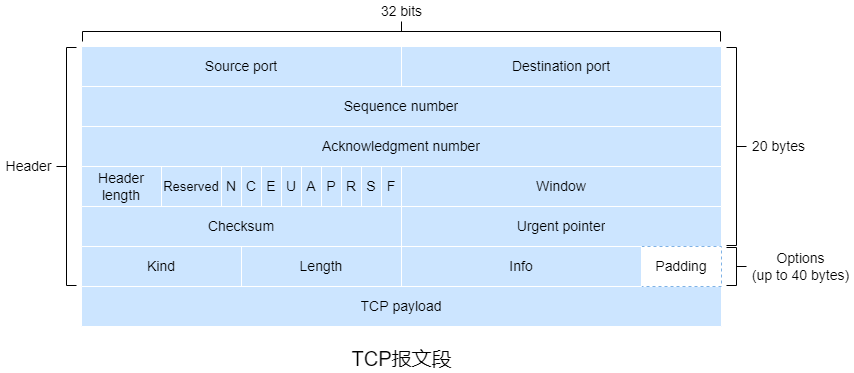

&emsp;&emsp;TCP报文段包括16位**源端口**、16位**目的端口**、32位**序号**、32位**确认序号**、4位**首部长度**、3位保留字段、9个标志位、16位**窗口长度**、16位**校验和**、16位**紧急指针**以及最多40字节的的选项字段。

&emsp;&emsp;TCP将数据看成一个无结构且有序的字节流，通过字节流确定序号，序号是报文段首字节的编号。初始序号一般随机。

&emsp;&emsp;确认号是下一次按序应接收报文段首字节的编号。TCP只确认报文段有效载荷中到第一个丢失字节为止的字节，故TCP提供**累积确认**。当有效载荷为空时吗，确认号被**捎带**在报文段中。

&emsp;&emsp;9个标志位中第2、3位标志位用于显式拥塞控制，若发送端至接收端链路中的某个路由器出现拥塞，当数据报达到该路由器后，路由器将数据报头部中的ECN标识为置1，接收端收到数据报后将ACK报文段头部中的`ECE`置1来通知发送端链路出现拥塞，发送端像快速重传一样对`ECE`为1的ACK回应ACK，发送端在下一个报文段中将`CWR`置1来通知接收端拥塞窗口已缩减。后6个标志是控制位。

&emsp;&emsp;● **NS/N**通常用于防止标记数据包被意外或恶意地隐藏。

&emsp;&emsp;● **CWR/C**为1时通知对方拥塞窗口已缩减。

&emsp;&emsp;● **ECE/E**为1时通知对方链路出现拥塞。

&emsp;&emsp;● **Urgent/URG/U**为1时表示高优先级报文段，紧急指针生效。

&emsp;&emsp;● **ACK/A**为1时表示确认序号生效，报文段成功接收。

&emsp;&emsp;● **Push/PSH/P**为1时表示应该立即将该报文段交给应用层而不用等待缓存区填满。

&emsp;&emsp;● **Reset/RST/R**为1时表示重置连接。

&emsp;&emsp;● **Synchronization/SYN/S**为1时表示三次握手中建立连接。

&emsp;&emsp;● **Finish/FIN/F**为1时表示四次挥手中断开连接。

&emsp;&emsp;选项字段包括8位Kind、可变的Length以及可变的Info。

| Kind字段值 | Length字段值 | Info字段长度 | 名称                       | 含义           |
| ---------- | ------------ | ------------ | -------------------------- | -------------- |
| 0          | 1            |              | 选项表结束(EOP)            |                |
| 1          | 1            |              | 空操作(NOP)                |                |
| 2          | 4            | 2字节        | 最大报文段长度(MSS)        |                |
| 3          | 3            | 1字节        | 窗口扩大系数(WSOPT)        | 窗口长度扩展   |
| 4          | 2            |              | 选择性确认(SACK-Premitted) | 表示支持SACK   |
| 5          | 可变         |              | 选择性确认(SACK)           | 收到的乱序数据 |
| 8          | 10           |              | TSPOT                      | 时间戳         |
| 19         | 18           |              | TCP-MD5                    | MD5认证        |
| 28         | 4            |              | User Timeout(UTO)          | 超时时间       |
| 29         | 可变         |              | TCP-AO                     | 认证算法       |
| 253/254    | 可变         |              | Experimental               | 保留           |

&emsp;&emsp;窗口长度用于流量控制服务。

&emsp;&emsp;校验和的计算类似于UDP的校验和。

##### 3.4.2 连接管理

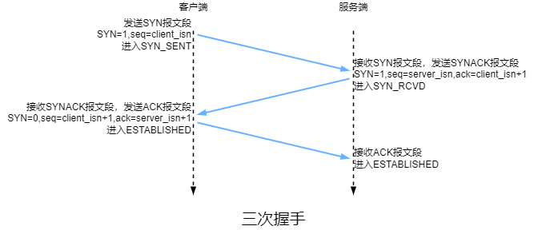

&emsp;&emsp;1）客户端向服务器发送**SYN**(报文段)，即报文段的有效载荷为空，`SYN`为1，客户端进入`SYN_SENT`。

&emsp;&emsp;2）服务器收到SYN后为该连接分配TCP缓存和变量，再向客户端发送**SYNACK**(报文段)，即ACK报文段的`SYN`为1，最后服务器进入`SYN_RCVD`。

&emsp;&emsp;3）客户端收到SYNACK后该连接分配TCP缓存和变量，再向服务器发送ACK，此时连接已建立，`SYN`置为0，最后服务器进入`ESTABLISHED`。服务器收到ACK后进入`ESTABLISHED`。

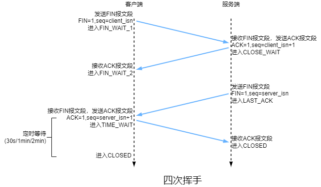

&emsp;&emsp;1）客户端向服务器发送**FIN**(报文段)，即报文段的有效载荷为空，`FIN`为1，客户端进入`FIN_WAIT_1`。

&emsp;&emsp;2）服务器收到FIN后发送ACK并进入`CLOSE_WAIT`。客户端收到ACK后进入`FIN_WAIT_2`。

&emsp;&emsp;3）服务器向客户端发送FIN并进入`LAST_ACK`。

&emsp;&emsp;4）客户端收到FIN后发送ACK并进入`TIME_wAIT`，同时设置时间等待计时器，计时结束后释放资源(包括端口号)并进入`CLOSED`。服务器收到ACK后释放资源并进入`CLOSED`。

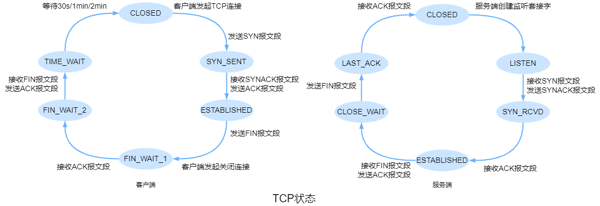

&emsp;&emsp;在TCP连接的生命周期中，运行在每台主机的TCP协议会在各种**TCP状态**间变迁。

##### 3.4.3 超时

&emsp;&emsp;$SampleRTT$表示报文段从发送(交付给IP)到收到该报文段的确认所需时间。TCP不会为重传的报文段测量$SampleRTT$，仅仅为只需要传输一次的报文段测量。

&emsp;&emsp;$EstimatedRTT$表示$SampleRTT$的平均值，其中$\alpha$一般取$\frac{1}{8}$。
$$
EstimatedRTT=(1-\alpha)\times EstimatedRTT+ \alpha \times SampleRTT(\alpha =\frac{1}{8})
$$
&emsp;&emsp;$DevRTT$表示$SampleRTT$偏离$EstimatedRTT$的程度，其中$\beta$一般取$\frac{1}{4}$。
$$
DevRTT=(1-\beta)\times DevRTT+\beta \times |SampleRTT-EstimatedRTT|(\beta=\frac{1}{4})
$$
&emsp;&emsp;$EstimatedRTT$和$DevRTT$的计算方式是**指数加权移动平均**。

&emsp;&emsp;$TimeoutInterval$表示超时时间。
$$
TimeoutInterval=EstimatedRTT+4\times DevRTT
$$

##### 3.4.4 流量控制

&emsp;&emsp;TCP用**流量控制服务**来使发送端的发送速率和接收端的读取速率相匹配，主要通过让发送端维护**接收窗口**(表示接收端可用缓存空间)的变量来实现。

&emsp;&emsp;$RevBuffer$表示接收端的接收缓存的大小。$LastByteRead$表示接收端在接收缓存中读取的数据流的最后一个字节的编号。$LastByteRcvd$表示接收端缓存至接收缓存的数据流的最后一个字节的编号。$rwnd$表示接收窗口。
$$
rwnd=RcvBuffer-[LastByteRcvd-LastByteRead]
$$
&emsp;&emsp;接收端将报文段中窗口长度字段设置为$rwnd$来告知发送端可用缓存空间。

&emsp;&emsp;$LastByteSent-LastByteAcked$表示发送端待确认的数据量。
$$
LastByteSent-LastByteAcked\leqslant rwnd
$$
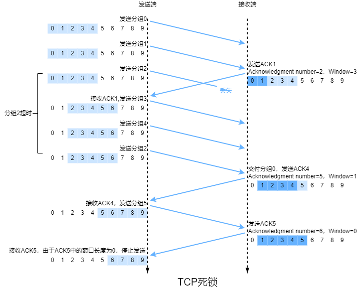

&emsp;&emsp;当发送端收到窗口长度为0的ACK时，会设置坚持计时器并发送一个有效载荷为1字节的探测报文段，若计时器超时或收到窗口长度为0的ACK时会再次发送同样的报文段并重置计时器，否则继续发送有效载荷为有效数据的报文段。

##### 3.4.5 TCP拥塞控制

&emsp;&emsp;网络层不向端系统提供显示的网络拥塞反馈，故TCP只能使用端到端拥塞控制。

&emsp;&emsp;TCP发送端相比接收端多个变量，即**拥塞窗口**，用来限制发送速率。发送端未被确认的数据不能超过接收窗口与拥塞窗口的最小值。
$$
LastByteSent-LastByteAcked \leqslant min\{cwnd,rwnd\}
$$
&emsp;&emsp;假设接收窗口足够大、忽略丢包与时延以及发送端总有数据需要发送，发送速率大致等于$\frac{cwnd}{RTT}(B/s)$。

&emsp;&emsp;当某路径出现拥塞时，该路径上部分路由器的缓存会溢出并导致某个数据包丢失，此时发送端可以确定该路径出现了拥塞。

&emsp;&emsp;带宽探测：丢包表示出现了拥塞，应该降低发送速率。当未确认报文段的ACK到达时应该提高发送速率。

###### 3.4.5.1 TCP拥塞控制算法

&emsp;&emsp;TCP拥塞控制算法包括**慢启动**、**拥塞避免**和**快速恢复**。

&emsp;&emsp;TCP拥塞控制被称为**加性增、乘性减**拥塞控制方式。加性增指在拥塞避免阶段$cwnd$的线性增加，乘性减指进入快速恢复阶段时$cwnd$的减半，若结果不是整数则向下取整。

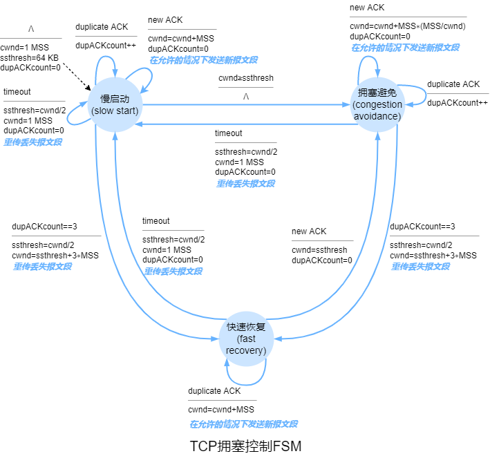

&emsp;&emsp;在慢启动阶段，$cwnd$的初始值是$MSS$，$ssthresh$的初始值是$64KB$。每当报文段首次确认$cwnd$就增加$MSS$，即指数级增长。若出现超时导致的丢包，发送端令$ssthresh=\frac{cwnd}{2}$，$cwnd=MSS$并重新开始慢启动。当$cwnd \geqslant ssthresh$时发送端结束慢启动并进入拥塞避免阶段。当收到3个冗余ACK时，发送端结束慢启动并令$ssthresh=\frac{cwnd}{2}$，$cwnd=\frac{ssthresh}{2}+3MSS$，然后执行快速重传，最后进入快速恢复阶段。

&emsp;&emsp;在不考虑处理时间的情况下，客户端发送请求到远程数据中心并收到响应大致需要$4RTT$，其中建立TCP需要$RTT$，慢启动阶段需要$3RTT$。显然，当$RTT$较大时，时延也较大。可以使用**TCP分岔**解决这一问题，即通过CDN将请求转发至邻近客户端且与远程数据中心有很大窗口的连接的前端服务器，在这种情况下响应所需时间大致是$4RTT_{FE}+RTT_{BE}+处理时间$，其中$RTT_{FE}$表示客户端与前端服务器的往返时间，$RTT_{BE}$表示前端服务器与远程数据中心的往返时间。当前端服务器与客户端足够近，就可以忽略$RTT_{FE}$，此时响应所需时间大致等于$RTT$。

&emsp;&emsp;在拥塞避免阶段，每个$RTT$内$cwnd$仅增加$MSS$。通用实现方法是若$RTT$内发送了$n$个报文段，在此期间每个报文段首次确认时$cwnd$增加$\frac{cwnd}{n}$。超时和3个冗余ACK的情况同慢启动。

&emsp;&emsp;在快速恢复阶段，每收到一个冗余ACK，$cwnd$增加$MSS$。当收到了新报文段的首次ACK，发送端会结束快速恢复阶段并进入拥塞避免阶段。当出现超时导致的丢包时发送端会结束快速恢复并令$ssthresh=\frac{cwnd}{2}$，$cwnd=MSS$，然后进入慢启动阶段。

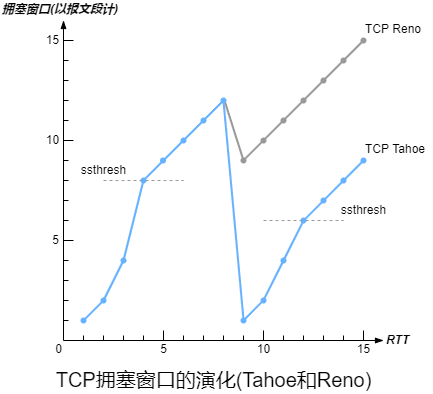

&emsp;&emsp;TCP的较新版本**TCP Reno**的快速恢复阶段符合上述情况。但TCP的早期版本**TCP Tahoe**在快速恢复阶段只要出现丢包都会结束快速恢复并令$ssthresh=\frac{cwnd}{2}$，$cwnd=MSS$，然后进入慢启动阶段。

&emsp;&emsp;TCP Vegas试图在维持较好吞吐量同时避免拥塞，通过测量RTT来衡量拥塞程度，根据拥塞程度线性地降低发送速率。TCP Vegas提供了慢启动、拥塞避免、快速恢复、快速重传和SACK。

###### 3.4.5.2 平均吞吐量

&emsp;&emsp;当计算一个吞吐量较大的连接的平均吞吐量时，因为慢启动阶段和快速恢复阶段通常很短，都可以忽略，故可以认为该连接处于拥塞避免阶段。在一个RTT内，窗口长度是$w(B)$，吞吐量大约是$\frac{w}{RTT}$。在出现丢包之前，每个RTT内$w=w+MSS$。用$W$表示出现丢包时$w$的值。

&emsp;&emsp;若在一段时间内吞吐量从$\frac{W}{2RTT}$线性增长到$\frac{W}{RTT}$，丢包仅出现了一次且发生在最后。
$$
\begin{align}
Segment_{total}&=\frac{W}{2RTT}\times RTT+\frac{W+2}{2RTT}\times RTT+\cdots +\frac{W}{RTT}\times RTT\\
&=(\frac{W}{4}+\frac{W}{2}) \times (\frac{W}{4}+\frac{1}{2})\\
&=\frac{3W^2}{8}+\frac{3W}{4}\\
\end{align}
$$
&emsp;&emsp;丢包率$L=\frac{Segment_{loss}}{Segment_{total}}$。
$$
\begin{align}
L&=\frac{1}{Segment_{total}}\\
&=\frac{1}{\frac{3W^2}{8}+\frac{3W}{4}}\\
&=\frac{8}{3W^2+6W}
\end{align}
$$
&emsp;&emsp;由于${3W^2}>>{6W}$，$6W$可以忽略，故$W \approx \sqrt{\frac{8}{3L}}$。由于增长是线性，平均吞吐量是$\frac{3W}{4RTT}(MSS)$。
$$
\begin{align}
平均吞吐量&=\frac{\sqrt{6}MSS}{2RTT\sqrt{L}}\\
&\approx \frac{1.22\times MSS}{RTT\sqrt{L}}
\end{align}
$$

###### 3.4.5.3 公平性

&emsp;&emsp;**瓶颈链路**指沿着某连接路径上的每条连接都不拥塞且相比该链路的传输容量都具有足够的传输容量。

&emsp;&emsp;假设$K$条TCP连接每条的端到端路径不同，但是都经过一段传输速率为$R(b/s)$的瓶颈链路。若每条连接都在传输一个大文件且无UDP流量通过该链路，而且每条连接的平均传输速率接近$\frac{R}{K}$，则认为该拥塞控制机制是**公平**的。在这种理想情况下，当所有连接的RTT相同时才能平等共享带宽，实际中这些条件不能都满足，具有较小RTT的连接可以更快地扩大拥塞窗口。

&emsp;&emsp;UDP并没有内置的拥塞控制机制，UDP是不公平的，UDP可能抑制TCP。

&emsp;&emsp;当一个应用使用多条并行TCP连接时，对单条TCP连接可能是公平的，但对应用并不公平。