### 第四章 网络层

&emsp;&emsp;网络层提供的服务是**尽力而为服务**。

&emsp;&emsp;**转发**是指将分组从一个输入链路接口转移到适当的输出链路接口的路由器本地动作。转发所需时间通常为几纳秒，故通过硬件实现。

&emsp;&emsp;**路由选择**是指确定数据报从源到目的地的端到端路径的网络范围处理过程。路由选择所需时间通常为几秒，故通过软件来实现。

&emsp;&emsp;网络层可以分为**数据平面**和**控制平面**。

&emsp;&emsp;● 数据平面即<span style="background-color: yellow">路由器的功能</span>，用于从路由器的输入链路向输出链路转发分组，包括传统的<span style="background-color: yellow">IP地址转发</span>和<span style="background-color: yellow">通用转发</span>。两者都采用匹配加动作的模式，匹配是匹配分组，动作是匹配之后的动作，区别在于IP地址转发是根据IP地址匹配，而通用转发是根据协议栈对多个首部字段进行匹配。

&emsp;&emsp;● 控制平面即<span style="background-color: yellow">网络范围的逻辑</span>，用于协调路由器间的转发动作，使得分组最终沿着源主机和目的主机之间的路径进行端到端传输。可以通过传统的**每路由器控制**(每台都有转发和路由选择功能，每台路由器还有一个路由选择组件，该组件与其他路由器中的路由组件通信以计算转发表的值)和**SDN控制**(逻辑集中控制器计算并分发转发表给每台路由器)来构建控制平面。

&emsp;&emsp;**网络服务模型**定义了分组在发送与接收端系统之间的端到端运输特性。

&emsp;&emsp;主机与物理链路之间之间的边界叫做**接口**。路由器与其任意一条链路之间的边界也叫做接口，例如输入端口或输出端口。在技术层面上，一个IP地址与一个接口相关，而不是与包括该接口的主机/路由器相关。在公网中，除NAT接口之外的每台主机/路由器的每个接口都必须有个公网IP地址。

&emsp;&emsp;IP地址一般划分为网络地址和主机地址。主机地址不能全为0/1，主机地址全为0的地址是网络地址，主机地址全为1的地址是广播地址。

&emsp;&emsp;**子网掩码**用来区分IP地址的网络地址和主机地址，故必须与IP地址结合使用。

&emsp;&emsp;**IP广播**分为**受限广播**和**直接广播**。受限广播中发送数据报时不会进行路由选择，而是被广播到所属<span style="background-color: yellow">物理网络</span>上的所有主机，**受限广播IP地址**全为1。直接广播中发送数据报时进行路由选择并广播到所属网络的所有主机，**直接广播IP地址**的主机地址全为1。IP广播地址除了受限广播地址和直接广播地址，还有**指向子网的广播IP地址**(主机地址全为1)以及**指向所有子网的广播IP地址**(子网地址和主机地址去全为1)。

&emsp;&emsp;第一跳路由器的IP地址称为**默认网关**。

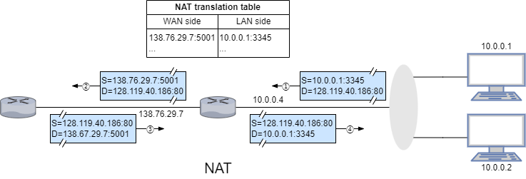

&emsp;&emsp;**网络地址转换**是将数据报中的IP地址转换成另一个IP地址，主要用于实现内网访问公网的功能。

&emsp;&emsp;在互联网中每个**自治系统**由一组受相同管理控制的路由器组成，通常在一个ISP中的路由器以及互联它们的链路构成一个自治系统。自治系统由全局唯一的AS号(ASN)所标识。在同一自治系统中的路由器运行相同的路由选择算法并有彼此的信息。

&emsp;&emsp;在一个自治系统内运行的路由选择协议称为**自治系统内部路由选择协议**。自治系统间的路由选择协议称为**自治系统间路由选择协议**。两者的差别主要体现在策略、规模以及性能这三个方面。

&emsp;&emsp;● 从策略的角度，AS内部都在同一管理控制下，策略在AS内部路由选择中起着微不足道的作用；AS间路由选择承载了路径属性并提供路由信息的受控分布，以便能做出基于策略的路由选择决策。

&emsp;&emsp;● 从规模的角度，规模不是AS内部路由选择的关注重点，但它是AS间路由选择协议的关键问题。

&emsp;&emsp;● 从性能的角度，AS内部路由选择协议注重路由的性能；AS间路由选择是面向策略的，因此所选路由的性能是次要问题。

&emsp;&emsp;互联网中所有AS运行相同的AS间路由选择协议，即**边界网关协议**，边界网关协议还常用于实现**IP任播**。

&emsp;&emsp;**存根网络**又称为桩网络或末端网络，指仅有一条(默认)路径连接到其他网络。

&emsp;&emsp;**网络功能虚拟化**指将用服务器、交换机和存储设备来代替复杂的中间盒。

#### 4.1 路由器

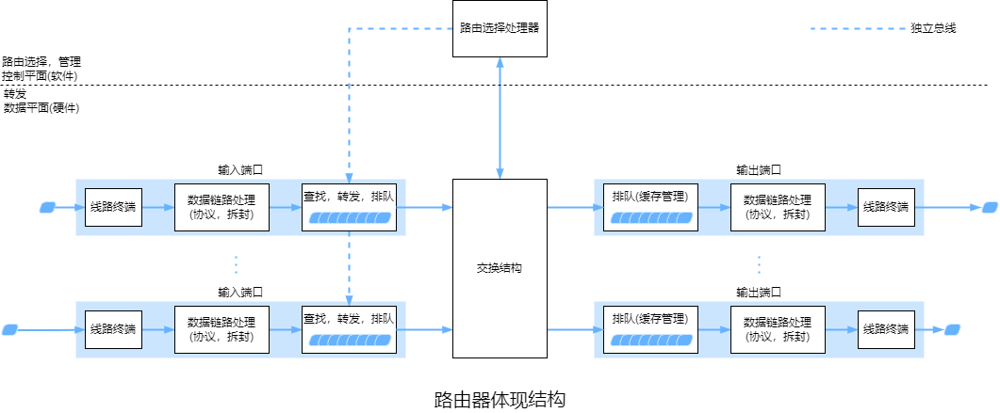

&emsp;&emsp;线路终端的功能是结束传入物理链路的物理层功能。

&emsp;&emsp;数据链路处理的功能是与位于传入链路远端的数据链路层交互的数据链路层功能。

&emsp;&emsp;当一条链路是双向时，输入端口和输出端口通常成对出现在同一线路卡上。

##### 4.1.1 IP地址转发

&emsp;&emsp;每台路由器都有**转发表**。路由选择处理器通过使用路由选择协议与其他路由器中的路由选择处理器交互来计算/更新转发表。在SDN路由器中，路由选择处理器用来接收远程控制器计算的转发表项更新转发表。

&emsp;&emsp;路由选择处理器经过独立总线将转发表复制到线路卡。通过转发表的副本，每个输入端口就可以本地完成转发，避免了集中式处理的瓶颈。

&emsp;&emsp;路由器根据分组目的地址的**前缀**与转发表中的表现进行匹配。当有多个匹配项时，路由器使用**最长前缀匹配规则**。

&emsp;&emsp;可以使用**三态内容寻址存储器**来保证查询转发表所需时间维持在一个常数内。

&emsp;&emsp;找到分组的输出端口后，分组就可以进入交换结构了，但如果该输出端口已被占用，分组可能在进入交换结构前暂时阻塞。

##### 4.1.2 交换结构

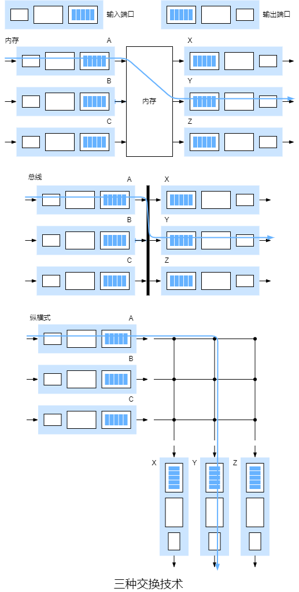

&emsp;&emsp;● <span style="background-color: yellow">经内存交换</span>：最简单、最早的路由器是传统的计算机，输入端口与输出端口之间的交换是在CPU(路由选择处理器)的直接控制下完成的。输入/输出端口的功能就像传统操作系统中的I/O设备一样。当分组到达到达一个输入端口时，该端口先通过中断方式向路由选择控制器发送信号，该分组从输入端口复制到内存，路由选择处理器从分组首部中获取IP，查询转发表获取输出端口并将分组复制到输出端口的缓存中。若内存每秒能读/写$B$个分组，则总转发吞吐量必定小于$\frac{B}{2}$，因为共享系统总线每次仅能执行一个内存读/写。

&emsp;&emsp;● <span style="background-color: yellow">经总线交换</span>：输入端口经一根共享总线将分组直接传输到输出端口，不需要路由选择控制器的干预。输入端口预先为分组指定一个交换机内部标签(仅用来跨越总线)并指示输出端口。每个输出端口都能收到该分组，但只有指定的输出端口才能保存该分组，指定的输出端口保存分组后去掉标签。每次仅有一个分组能跨域总线，故分组有时需要等待，导致路由器的带宽受限于总线速率。

&emsp;&emsp;● <span style="background-color: yellow">经互联网络交换</span>：纵横式交换机是由$2N$条总线构成的互联网络，包括$N$个输入端口和$N$个输出端口。每条垂直的总线与每条水平的总线交叉，交叉点通过交换结构控制器实现随时开启/闭合。纵横式交换机是**非阻塞**的，只有两个或以上的分组同时转发到同一个输出端口，分组不会阻塞，否则会出现分组等待。

&emsp;&emsp;部分现代路由器也通过内存进行交换，不过转发表的查找和将分组存储进适当的内存存储位置是由输入线路卡来处理。

&emsp;&emsp;更复杂的互联网络使用多级交换元素来使多个分组同时转发到同一输出端口时无需等待。例如三级非阻塞交换策略，在这种策略中，输入/输出端口连接到$N$个交换结构，输入端口将分组分成$K$个较小的块并通过$N$个交换结构发送这$K$个块到指定输出端口，输出端口再将这$K$个块组装成原本的分组。

##### 4.1.3 排队

&emsp;&emsp;假设纵横式交换机有$N$个输入端口和$N$个输出端口且输入线路与输入线路速率相同，都为$R_{line}(packet/s)$。此外，所有分组具有相同的固定长度，以同步的方式到达输入端口且采用FCFS方式，即所有链路发送/接收分组的时间相等。用$R_{switch}$表示分组从输入端口传输到输出端口的速率。再假设$R_{switch}=N\times R_{line}$。

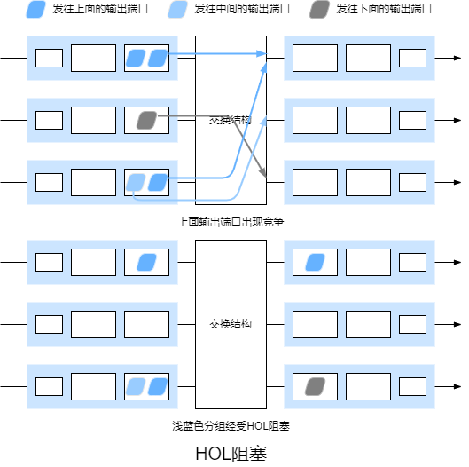

&emsp;&emsp;一个输入队列中排队的分组阻塞后，队列中该分组之后的分组也会阻塞，这种情况称为**线路前部阻塞**。由于HOL阻塞，当输入链路接收分组的度达到其容量的$58\%$时，在某些假设前提下，输入端口的队列长度将无限制地增大。

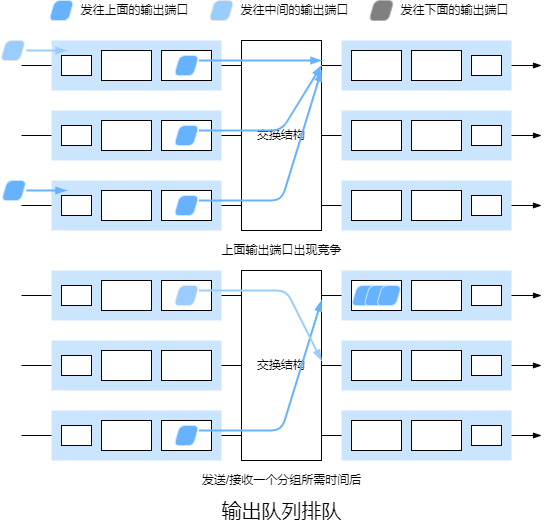

&emsp;&emsp;当没有足够缓存时，要么丢弃到达的分组(即弃尾策略)，要么删除排队中的分组。在某些情况下，在缓存填满之前便丢弃分组或在其首部加上标记，这可以向发送端反馈拥塞信号，这种策略称为**主动队列管理**策略。RED算法是最广泛研究与实现的AQM算法之一。

&emsp;&emsp;$B$表示缓存容量，$C$表示链路容量，通常$B=RTT\times C$，当大量TCP流量经过同一链路时$B=\frac{RTT\times C}{\sqrt{N}}$。

##### 4.1.4 链路分组调度

​		**链路分组调度**指排队分组在链路上传输的方式。

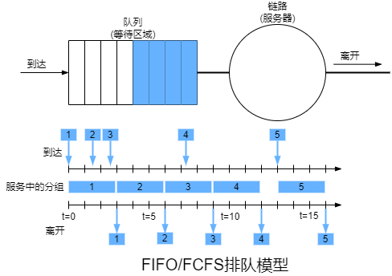

&emsp;&emsp;FIFO/FCFS调度规则安装分组到达输出链路队列的顺序来传输分组。当链路正忙于传输其他分组时，到达链路输出队列的分组需要排队等待传输。若缓存不足则需要丢弃分组。

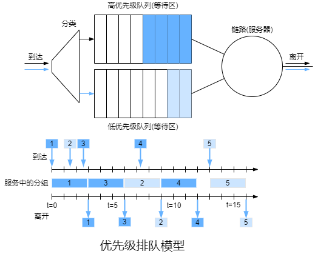

&emsp;&emsp;在**优先级排队**规则下，到达输出链路的分组被分类放入输出队列的优先级类，同一优先级采用FIFO方式。在非抢占式式优先级排队规则下，一旦分组开始传输就不能打断。

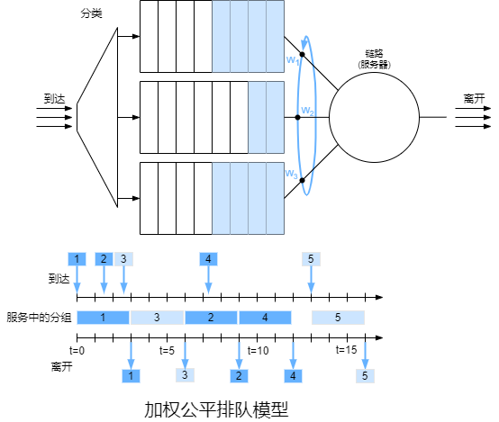

&emsp;&emsp;在**循环排队**规则下，分组会被分类，但是类之间不存在严格的优先级，循环调度器在这些类之间轮流提供服务。在**保持工作排队**规则下，有分组待传输时不会允许链路空闲，当指定类里不存在分组时，会立即检查循环序列中的下一个类。**加权公平排队**就是循环排队的一种通用实现方式，它也是保持工作队列。

&emsp;&emsp;WFQ与循环排队的不同之处在于每个类在任何时间间隔内可能收到<span style="background-color: yellow">不同数量</span>的服务。对于WFQ，若有$n$个类存在分组待传输，类$i$的权值为$w_i$，即使所有类都有分组排队，类$i$总能保证至少$\frac{w_i}{\sum_{j=1}^{n}{w_j}}\times R$的吞吐量。

#### 4.2 网际协议

##### 4.2.1 IPv4数据报

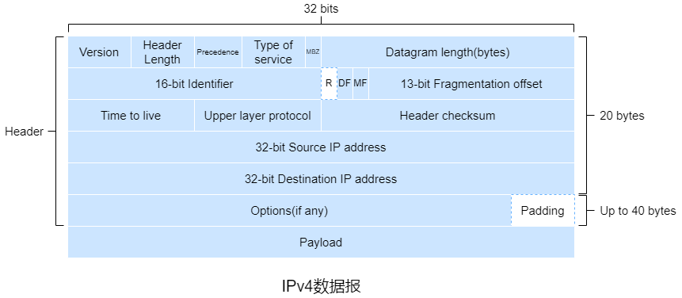

&emsp;&emsp;IPv4数据报包括4位的**版本(号)**、4位的**首部长度**、8位的**服务类型**(3位优先级、4位服务类型子字段和1位必须为零)、16位的**数据报长度**、16位的**标识**、3个**标志位**、13位的**片偏移**、8位的**生存时间**、8位的**上层协议**、16位的**首部检验和**、32位的**源IP地址**、32位的**目的IP地址**、最多40字节的**可选项**和有效载荷。

&emsp;&emsp;版本规定了IP协议版本。由于不同版本的IP协议数据报格式不同，需要版本字段来确定。

&emsp;&emsp;首部长度<span style="background-color: yellow">以4字节为单位</span>表示首部长度。

&emsp;&emsp;服务类型用来区分不同类型的数据报。前3位是优先级字段，第4位到第6位是DTR字段，第4位到第7位是服务类型子字段，最后一位必须为零。服务类型子字段最多只能有1位为1。

| 优先级 | 名称                 | 含义             |
| ------ | -------------------- | ---------------- |
| 000    | routine              | 默认             |
| 001    | priority             | 数据业务         |
| 010    | immediate            | 数据业务         |
| 011    | flash                | 语音控制数据     |
| 100    | flash override       | 视频会议或视频流 |
| 101    | critic               | 语音数据         |
| 110    | internetwork control | 网络控制数据     |
| 111    | network control      | 网络控制数据     |

| 服务类型子字段 | 名称                   |
| -------------- | ---------------------- |
| 0000           | normal service         |
| 1000           | minimize delay         |
| 0100           | maximize throughout    |
| 0010           | maximize reliability   |
| 0001           | minimize monetary cost |

&emsp;&emsp;生存时间表示数据报能经过的最大路由器数量，每当路由器处理数据报时该字段值减1，当该字段值为0时丢弃该数据报。

&emsp;&emsp;由于源到目的地路径的上的每段链路可能使用不同的链路层协议，不同协议的最大传输单元可能不同，所以可能需要将数据报分成多个较小的数据报并封装成合适的链路层帧，这些较小的数据报称为**片**。片到达目的地后需要重组成原始数据报再交给传输层。重组过程在端系统完成，因为组装会给增加协议复杂性和降低路由器的性能。

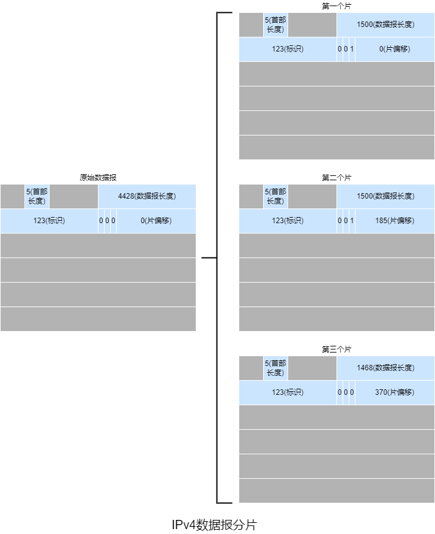

&emsp;&emsp;标识、标志位以及片偏移用于分片和重组。标识是数据报的唯一值，分片时会复制到各个片中。3个标志位中第1位是保留位，第2位是禁止分片标志位，第3位是还有分片标志。DF为1时表示不能分片，MF为1时表示不是最后一个片。片偏移<span style="background-color: yellow">以8字节为单位</span>表示片在原始数据报中的相对位置。

&emsp;&emsp;上层协议表示传输层所用协议的协议号。1表示ICMP，2表示IGMP，6表示TCP，17表示UDP，89表示OSPF。

&emsp;&emsp;首部校验和<span style="background-color: yellow">仅用来校验数据报中的首部</span>，计算方式类似于UDP的校验和。由于每次经过路由器时首部中的某些字段会改变，所以需要重新计算。

##### 4.2.2 IPv4编址

&emsp;&emsp;每个IPv4地址长度是32位，因此共有$2^{32}$个可能的IP地址。IP地址通常使用**点分十进制表示法**。

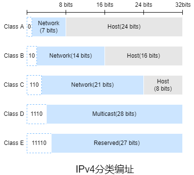

&emsp;&emsp;IPv4**分类编制**包括A、B、C三类普通地址以及D、E两类特殊地址。A类地址一般用于大型网络，B类地址一般用于中型网络，C型地址一般用于小型网络，D类地址是多播地址，E类地址是保留地址。

&emsp;&emsp;互联网的地址分配策略称为**无类别域间路由选择**。CIDR不在使用分类编址，IP地址表示为`a.b.c.d/x`。`x`表示网络地址所占的位数，该部分称为该地址的**前缀**，剩余的几位则表示主机地址。其地址掩码依然是子网掩码。使用单个网络前缀通告多个网络称为**地址聚合**或**路由聚合**或**路由摘要**。

##### 4.2.3 DHCP

&emsp;&emsp;**动态主机配置协议**允许主机自动获得IP地址、子网掩码、默认网关以及本地DNS服务器地址，故它也称为**即插即用协议**或**零配置协议**。DHCP是C/S体系结构，客户端即新到达的主机，若子网没有DHCP服务器则会由一个通常是路由器的DHCP中继代理，中继代理能够获取DHCP服务器。

&emsp;&emsp;DHCP分配IP地址包括**人工配置**、**自动配置**和**动态配置**。人工配置即管理员手动分配。自动配置即服务器为首次连接网络的客户端分配一个永久IP地址，客户端一直使用该IP地址。动态配置即按服务器为首次连接网络的客户端分配一个期限IP地址，到期后停止使用或续约。

&emsp;&emsp;DHCP租约表包括**静态租约表**和**动态租约表**，分别对应静态租约存储文件和周期存储文件。静态租约表中的IP地址不能重复使用。

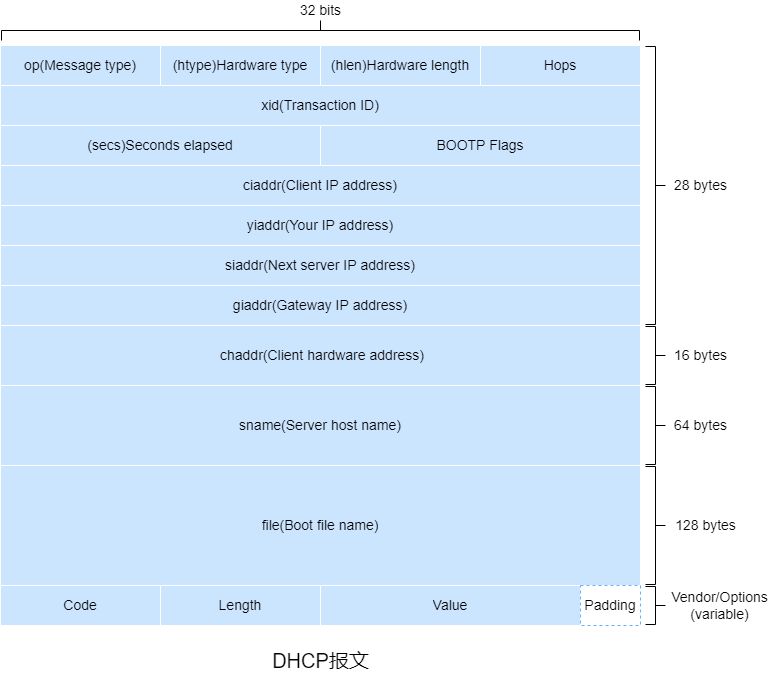

&emsp;&emsp;DHCP属于**引导程序协议**，DHCP报文格式符合BOOTP报文格式。

| 字段   | 长度(字节) | 含义                                                         |
| ------ | ---------- | ------------------------------------------------------------ |
| op     | 1          | 报文类型，1表请求报文，2表示响应报文                         |
| htype  | 1          | 客户端硬件地址类型，1表示以太网地址                          |
| hlen   | 1          | 客户端硬件地址长度                                           |
| hops   | 1          | 跳数，客户端置0                                              |
| xid    | 4          | 报文的唯一值                                                 |
| secs   | 2          | 客户端获取到IP地址或续约成功到现在所消耗的时间，若未获得IP地址则为0 |
| flags  | 2          | DHCP仅用到了第一位，0表示单播的方式，1表示广播的方式，其余位保留 |
| ciaddr | 4          | 客户端IP地址                                                 |
| yiaddr | 4          | 服务器分配给客户端的IP地址                                   |
| siaddr | 4          | 服务器IP地址                                                 |
| giaddr | 4          | 网关IP地址                                                   |
| chaddr | 16         | 客户端硬件地址                                               |
| sname  | 64         | 服务器主机名，全为0则表示没有                                |
| file   | 128        | 引导文件名，全为0则表示没有                                  |
| vender | 可变       | 采用CLV模式，对于DHCP，必须以固定值01100011 10000010 01010011 01100011开头，表示Magic cookie，即之后是vender |

&emsp;&emsp;DHCP有8种报文，根据`Optiont(53)`可以区分，即**DHCP发现报文**、**DHCP提供报文**、**DHCP请求报文**、**DHCP ACK报文**、**DHCP NAK报文**、**DHCP拒绝报文**、**DHCP释放报文**和**DHCP信息报文**。

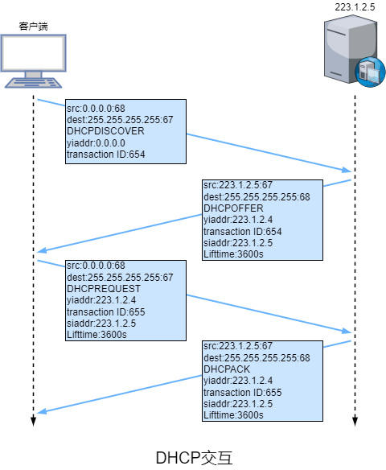

&emsp;&emsp;1）DHCP服务器发现。新到达的DHCP客户端首先需要寻找DHCP服务器。DHCP客户端以广播的方式发送DHCP发现报文，报文段封装成数据报时源IP地址是`0.0.0.0`，目的IP地址使用广播地址。

&emsp;&emsp;2）DHCP服务器提供。所有收到DHCP发现报文的DHCP服务器发送包括发现报文的事务ID、推荐IP地址、子网掩码以及IP**地址租用期**的DHCP提供报文来响应，报文段封装成数据报时目的IP地址使用广播地址，因为子网中可能存在多个新到达的DHCP客户端。若为静态租用则匹配硬件地址，若为动态租约则检测DHCP发现报文中是否包含有效`yiaddr`，有则进一步检测是否可用，否则从IP地址池中分配一个最小可用的IP地址。

&emsp;&emsp;3）DHCP请求。DHCP客户端可能会收到多个DHCP提供报文，DHCP客户端选择一个并发送包含配置参数的DHCP请求报文来响应。报文段封装成数据报时源IP地址是`0.0.0.0`，目的IP地址使用广播地址。

&emsp;&emsp;4）DHCP ACK/NAK。DHCP服务器根据客户端的状态进行响应，若客户端处于`selecting`则验证`yiaddr`和`siaddr`是否匹配，若客户端处于`init_reboot`则验证`yiaddr`是否匹配，若客户端处于`renewing/rebinding`则验证`ciaddr`是否匹配，若都不匹配以单播的方式发送DHCP NAK报文，否则发送DHCP ACK报文。

&emsp;&emsp;● 当客户端的IP地址租期到$\frac{1}{2}$，客户端会以单播的方式向原服务器发送DHCP请求报文，若收到DHCP ACK报文则续租成功并更新租期，最多可重发3次，分别在4s、8s和16s后。

&emsp;&emsp;● 当客户端的IP地址租期到$\frac{7}{8}$，客户端会以广播的方式向所有服务器发送DHCP请求报文，若收到DHCP ACK报文则更新租约，最多可重发3次，分别在4s、8s和16s后。

&emsp;&emsp;租约到期则重新开始【发现-提供-请求-确认】这4个步骤。

&emsp;&emsp;若客户端收到DHCP ACK报文后，向网络发送3个此IP地址的ARP解析请求以执行冲突检测。若出现冲突，客户端向服务器发送DHCP拒绝报文来重新获取IP地址，服务器会将租约表中关于客户端硬件地址置空并保持该IP地址一段时间。若客户端<span style="background-color: yellow">不再需要当前IP地址或租约到期</span>，向服务器发送DHCP释放报文。若客户端需要获取租约的详细信息，可以向服务器发送DHCP信息报文，服务器会以DHCP ACK报文响应。

##### 4.2.4 IPv6

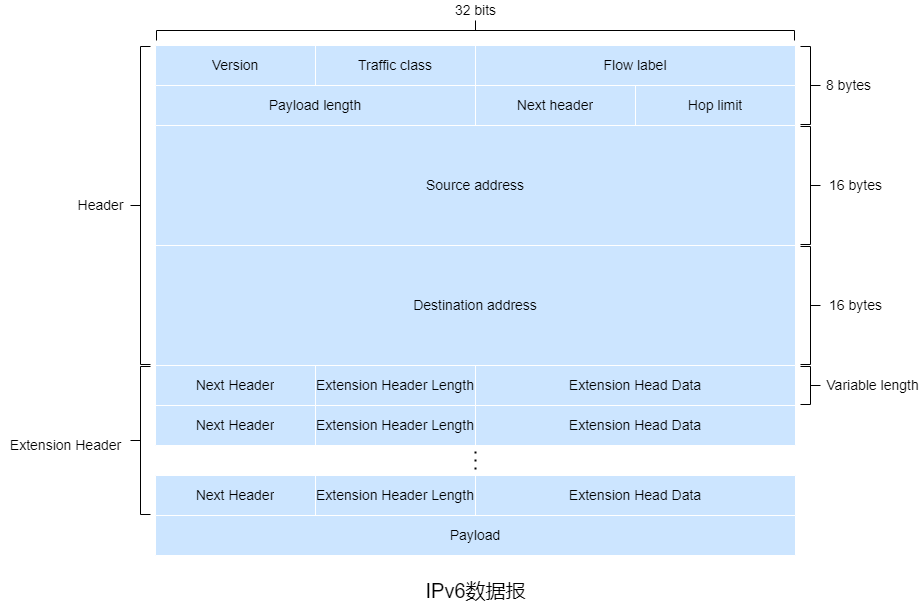

&emsp;&emsp;IPv6数据报包括8位的**版本(号)**、8位的**流量类别**、16位的**流标签**、16位的**有效载荷长度**、8位的**下个首部**、8位的**跳限制**、128位的**源IP地址**、128位的**目的IP地址**、非必需且长度不定的扩展首部以及有效载荷。

&emsp;&emsp;流量类别等同于IPv4数据报中的服务类型。

&emsp;&emsp;类标签用于区分实时流量，不同的流标签+源IP地址可以确定唯一的数据流。

&emsp;&emsp;有效载荷长度包括<span style="background-color: yellow">扩展首部的长度+有效载荷的长度</span>，若超过65535则使用扩展首部中的超大有效载荷来表示。

&emsp;&emsp;下个首部类似于IPv4数据报中的上层协议，若存在下一个扩展首部则表示下一个扩展首部的编号，否则表示传输层协议的编号。

| 扩展首部类型             | 对应的下个首部值 | 描述                                                         |
| ------------------------ | ---------------- | ------------------------------------------------------------ |
| 逐跳选项扩展首部         | 0                | 用于为在传输链路上每跳转发指定参数，传输链路的每台中间节点都要读取并处理该字段。主要应用包括超大有效载荷、设备提示以及资源预留 |
| 路由选择扩展首部         | 43               | 用于强制让数据报经过特定的设备                               |
| 分片扩展首部             | 44               | 用于分片                                                     |
| 封装安全有效载荷扩展首部 | 50               | 由IPsec使用，提供认证、数据完整性校验以及重放防护，类似于认证 |
| 认证扩展首部             | 51               | 由IPsec使用，提供认证、数据完整性校验、首部部分字段保护以及重放防护 |
| 目的选项扩展首部         | 60               | 携带只有目的主机才会处理的信息                               |

&emsp;&emsp;跳限制等同于IPv4数据报中的生存时间。

&emsp;&emsp;IPv6数据报必须按照指定顺序：首部、逐跳选项首部扩展首部、目的选项扩展首部、路由选择扩展首部、分片扩展首部、认证扩展首部、封装安全有效载荷扩展首部、目的选项扩展首部以及有效载荷。

&emsp;&emsp;IPv6<span style="background-color: yellow">只允许源主机和目的主机</span>进行分片与重组。若路由器收到的数据报因太大无法转发到链路上，则路由器丢弃该数据报并向发送端发送一个ICMP差错报文，然后发送端以较小长度的数据报重发。

&emsp;&emsp;由于传输层和链路层的协议都有差错检测，故IPv6并没有校验和。

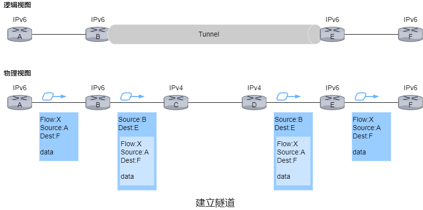

&emsp;&emsp;IPv4迁移到IPv6的方法是**建立隧道**。其基本思想是：假设两个IPv6主机需要使用IPv6数据报进行交互，但它们的传输路径经过IPv4路由器，将路径上的IPv4路由器集合为一个**隧道**，借助隧道，将IPv6数据报作为IPv4数据报的有效载荷。

#### 4.3 路由选择算法

&emsp;&emsp;无向图$G=(N,E)$是一个$N$个节点和$E$条边的集合，其中每条边是取$N$的一对节点。节点可以表示路由器，连接节点的边可以表示路由器之间的物理路径。对于$E$中的任意一条边$(x,y)$，$c(x,y)$表示节点$x$和$y$的成本。若节点对$(x,y)$不属于$E$，则$c(x,y)=\infty$，否则两个节点互称**邻居**。$u$表示源节点。

&emsp;&emsp;对于任何两个节点$x$和$y$，通常有很多条路径，这些路径中的一条或多条是**最低成本路径**。当所有边的成本相同时，最低成本路径就是**最短路径**。

&emsp;&emsp;节点$x$到节点$y$的最低成本可以用Bellman-Ford算法表示，即$d_{x}(y)=min_{v}\{c(x,v)+d_{v}(y)\}$，其中$v$表示$x$的所有邻居。

&emsp;&emsp;路由选择算法根据集中式/分布式可以分为**集中式路由选择算法**和**分布式路由选择算法**，根据静态/动态可以分为**静态路由选择算法**和**动态路由选择算法**，根据负载的敏感可以分为**负载敏感算法**和**负载迟钝算法**。

&emsp;&emsp;● 集中式路由选择算法以网络拓扑以及所有链路的成本为输入。具有全局状态信息的算法称为**链路状态算法**。

&emsp;&emsp;● 分布式路由选择算法中，每个节点开始时仅有与其直连链路的成本信息，然后通过迭代计算过程以及与相邻节点交换信息，逐渐计算出到达某个或某组目的节点的最低成本路径。每个节点维护到其他节点的成本(距离)估计的向量称为**距离向量算法**，主要通过与相邻路由器间交换交互式报文。

&emsp;&emsp;● 静态路由选择算法中路由选择随时间的变化非常缓慢，通常是人工进行调整。

&emsp;&emsp;● 动态路由选择算法随着网络流量负载或拓扑变化而改变路由选择路径。一个动态路由选择算法可以周期性地或直接响应拓扑以及链路成本变化。

&emsp;&emsp;● 负载敏感算法中，链路成本会动态地变化来反映底层链路的当前拥塞水平。若当前拥塞的链路与高成本相关联则该算法会趋向绕开该拥塞链路来选择路由。

&emsp;&emsp;● 负载迟钝算法中，链路成本不会明确地反映其当前会最近的拥塞水平。

&emsp;&emsp;**收敛**指网络中所有路由器的路由选择表中的信息完全一致。

##### 4.3.1 LS算法

&emsp;&emsp;链路状态算法通过让每个节点向网络中所有其他节点广播链路状态分组来获得网络拓扑以及所有链路成本，其中每个链路状态分组包含它所连接的链路的标识和成本，这通常由**链路状态广播算法**来完成。

&emsp;&emsp;Dijkstra算法从某节点到网络中所有其他节点的最低成本路径，该算法是迭代算法，迭代$k$次后可以获得$k$个目的节点的最低成本路径。$D(v)$表示到本次迭代为止，从源节点$u$到节点$v$的最低成本路径的成本。$p(v)$表示源节点$u$到节点$v$的当前最低成本路径中$v$的前一节点。$N'$表示节点子集，若源节点$u$到节点$v$的最低成本路径已知，则$N'$包含$v$。

```assembly
// 初始化阶段：N'仅包含u，若v是u的邻居则D(v)=c(u,v)，p(v)=u，否则D(v)=∞。
Initialization:
	N' = {u}
	for all nodes v
　　if v is a neighbor of u
　　	D(v) = c(u, v)
　　	p(v) = u
　　else D(v) = ∞
// 循环阶段：查找不在N'中且到u的最短成本路径最小的节点w，将w加入N‘。若节点v不在N'中且是w的邻居则更新D(v)和p(v)。当N'包含所有节点时结束循环。
Loop
	find w not in N' such that D(w) is a minimum
	add w to N'
	update D(v) for each neighbor v of w and not in N':
　　if D(v) > D(w) + c(w, v)
　　	p(v) = w
　　	D(v) = D(w) + c(w, v)
until N' = N
```

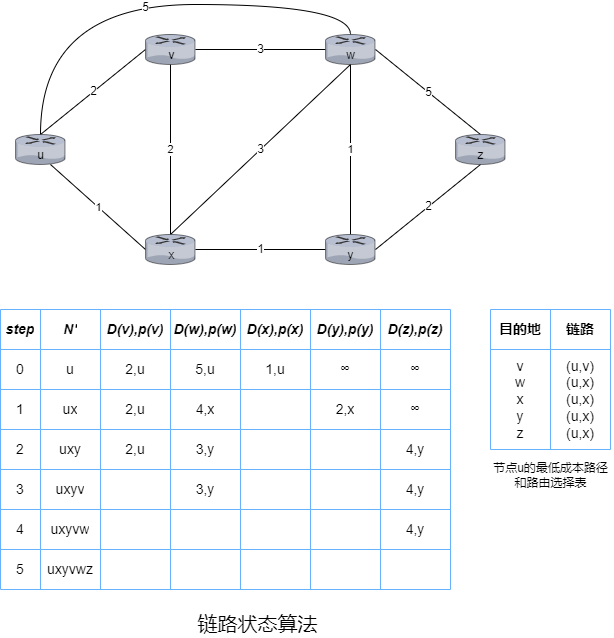

&emsp;&emsp;LS算法结束后，获得了除源节点以外的每个节点的最低成本路径以及前一节点。

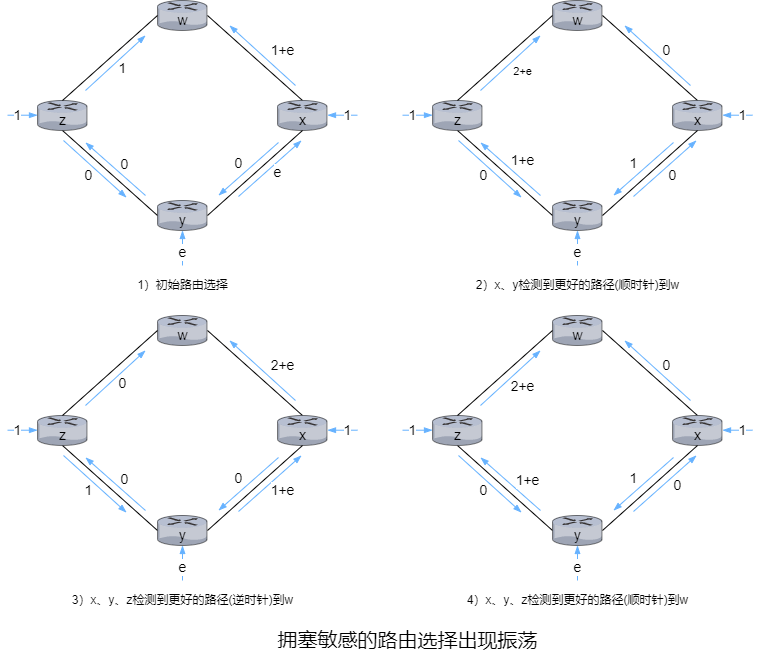

&emsp;&emsp;当出现振荡时，最简单的解决方法是强制链路成本与承载的流量无关，但是这违背了路由选择的初衷之一——避开拥塞严重的链路。另一种解决方法是确保并非所有的路由器都同时运行LS算法。路由器最初在同一周期的不同时间执行算法，但最终算法会在路由器上同步并一直保持。避免这种自同步的方法之一就是让每台路由器发送链路通告的时间随机化。

##### 4.3.2 DV算法

&emsp;&emsp;根据Bellman-Ford算法可以实现邻居间的通信，基本思想是对应每个节点$x$以$D_x(y)$开始，对于$N$中的所有节点$y$，估计从$x$到$y$的最低成本路径的成本。$D_x=[D_x(y):y\in N]$表示节点$x$的距离向量，该向量是从$x$到$N$中所有目的地节点$y$的成本估计向量。

&emsp;&emsp;使用DV算法，每个节点$x$需要维护自身的距离向量$D_x=[D_x(y):y\in N]$，每个邻居$v$的成本$c(x,v)$以及每个邻居$v$的距离向量$D_v=[D_v(y):y\in N]$。每个节点不时地向每个邻居发送它的距离向量副本，邻居收到新的距离向量时，保存该距离向量并使用Bellman-Ford算法更新自身的距离向量。当节点的距离向量因收到邻居的距离向量或链路成本变化而改变时，该节点需要向所有邻居发送改变后的距离向量。

```assembly
Initialization:
	for all destinations y in N:
&emsp;&emsp;Dₓ(y) = c(x,y)
	for each neighbor v
&emsp;&emsp;Dᵥ(y) = ? for all destinations y in N
	for each neighbor v
&emsp;&emsp;send distance vector Dₓ = [Dₓ(y):y in N] to v
Loop
	wait until link cost changes or receive a distance vector
	for each y in N:
&emsp;&emsp;Dₓ(y) = minᵥ{c(x,y) + Dᵥ(y)}
	if Dₓ(y) changed for any destination y
&emsp;&emsp;send distance vector Dₓ = [Dₓ(y):y in N] to all neighbors
forever
```

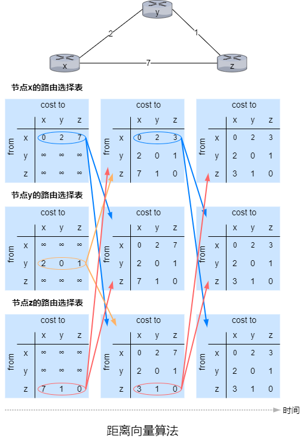

&emsp;&emsp;假设$t_0$时刻$x$与$y$间的链路成本从2增加到10，则$D_y(x)=min\{10+0,1+3\}=4$，若$y$需要发送分组到$x$，则需要通过$z$，$t_1$时刻分组到达$z$，但是$z$节点的路由选择表中是通过$y$到达$x$，然后就出现了**路线选择环路**，即从$y$发往$x$的分组在$y$和$z$间来回传输。在$t_1$后的某个时刻，$z$收到了$y$的新距离向量，即$D_y(x)=4$，重新计算到$x$的最低成本$D_z(x)=min\{7+0,1+4\}=5$，$t_2$时刻$y$收到$z$的新距离向量，即$D_z(x)=5$，重新计算到x的最低成本$D_y(x)=min\{10+0,1+5\}=6$，这个过程会一直持续到$D_z(y)=11$，然后$z$确定到$x$的最低成本路径就是直接到$x$而不是通过$y$。当$c(x,y)$从4变为10000时，这种情况可以称为**无穷计数**问题。

&emsp;&emsp;通过**毒性逆转**可以解决这种<span style="background-color: yellow">仅涉及2个节点</span>的简单路由选择环路，若$z$需通过$y$到达$x$，则发送$D_z(x)=\infty$的新距离向量给$y$来毒化$z$到$y$的逆向路径。$y$会发送$D_y(x)=10$的新距离向量给$z$，因为$y$不再通过$z$到$x$，之后$z$发送$D_z(x)=7$的新距离向量给$y$，$y$更新到$x$的最低成本路径的成本$D_y(x)=8$，此时$z$位于$y$到$x$的最低成本路径上，$y$发送$D_y(x)$的新距离向量来毒化$y$到$z$的逆向路径。

##### 4.3.3 LS算法与DV算法的比较

&emsp;&emsp;在LS算法的具体实现中，每个节点需要将该节点到所有邻居的直接相连链路的成本广播到其他所有节点。而在DV算法的具体实现中，每个节点仅需将已知的该节点到其他节点的估计最低成本发送给所有邻居。

&emsp;&emsp;● 从报文复杂性的角度，LS算法需要发送$O(|N||E|)$个报文，当某条链路的成本改变时需要重新向其他节点发送报文；DV算法需要迭代的过程中仅邻居间交换报文，当某个节点到另一节点的最低成本路径的成本改变时才发送改变后的路径成本。

&emsp;&emsp;● 从收敛速率的角度，LS算法的收敛所需时间为$O(|N|^2)$；DV算法的收敛速率较慢，收敛的过程中可能会出现路由选择环路以及无穷计数。

&emsp;&emsp;● 从健壮性的角度，LS算法使用了广播的形式，每个节点仅计算自身的路由选择表，即每个节点在一定程度上是分离的，若某个节点损坏或丢弃了某个收到的分组也只会影响自身的路由选择表，保证了一定的健壮性；DV算法中每次迭代中每个节点的计算的最低成本路径的成本会发送给邻居，在下次迭代中会进一步扩散，经过一段时间，一个错误的最低成本路径的成本会扩散到整个网络。

#### 4.4 OSPF

&emsp;&emsp;OSPF是一种链路状态协议，它使用链路状态信息泛洪和Dijkstra最低成本路径算法。**链路状态通告**包含在OSPF报文中，OSPF报文由<span style="background-color: yellow">直接由IP承载</span>。每台路由器都构建了整个AS的完整拓扑图，然后每台路由器在本地运行Dijkstra最低成本路径算法，以确定以自身为根节点到所有子网的最短路径树。OSPF不强制设置路径权值，而是提供一种协议，为给定链路权值集合确定最低成本路径的路由选择。

&emsp;&emsp;OSPF协议中，当一条链路的状态发生变化时，路由器会广播链路状态信息，即使未发生变化，路由器也周期性地广播链路状态信息。OSPF协议需要检测链路是否正常运行(通过邻居间发送HELLO报文)，允许路由器获得邻居网络范围内链路状态的数据库。

&emsp;&emsp;OSPF的优点包括安全、多条相同成本的路径、对单播与多播路由选择的综合支持以及支持单个AS中的层次结构。

&emsp;&emsp;● OSPF协议提供了报文的认证来保证安全性。OSPF报文默认不启用认证，可以配置简单认证和MD5认证。简单验证基于配置在所有路由器中的共享密码，但密码会以明文的形式出现在OSPF报文中。MD5认证基于配置在所有路由器上的共享密钥，发送路由器在OSPF报文中加入报文内容加密钥的MD5散列值。MD5认证与序号一起使用来防御重放攻击。

&emsp;&emsp;● 当存在多条成本相等的路径时，无须仅选择单一的路径来承载所有的流量。

&emsp;&emsp;● MOSPF是OSPF的简单扩展，用来提供多播的支持。

&emsp;&emsp;● 一个OSPF自治系统可以分层并配置为区域，其中只能存在一个主干区域，每个区域都运行自身的LS算法。在每个区域内，一台或多台区域边界路由器负责为发往区域外的分组提供路由选择。主干区域包含所有的区域边界路由器，可能包含一些非边界路由器。分组在区域间的路由选择需要先区域内路由到一个区域边界路由器，再通过主干区域路由到目的区域的区域边界路由器，最后路由到目的地。

#### 4.5 BGP

##### 4.5.1 BGP

&emsp;&emsp;在BGP中，分组并不是路由到一个特定的目的IP地址，而是路由到类似于CIDR的前缀，该前缀表示一个子网或一个子网的集合。因此，路由器的转发表将具有$(x,I)$形式的表项，$x$表示例如138.116.68/22的前缀，$I$表示该路由器的某个接口的接口号。

&emsp;&emsp;BGP允许每个子网向互联网的其他部分通告它的存在，同时确保所有AS收到该通告。

&emsp;&emsp;一台路由器可能知道多条到指定前缀的不同路由，为了确定最好的路由，而最好的路由基于策略以及可达性信息来确定，该路由器将在本地运行BGP路由选择(类似于DV算法，通过邻居获得前缀的可达性信息)。

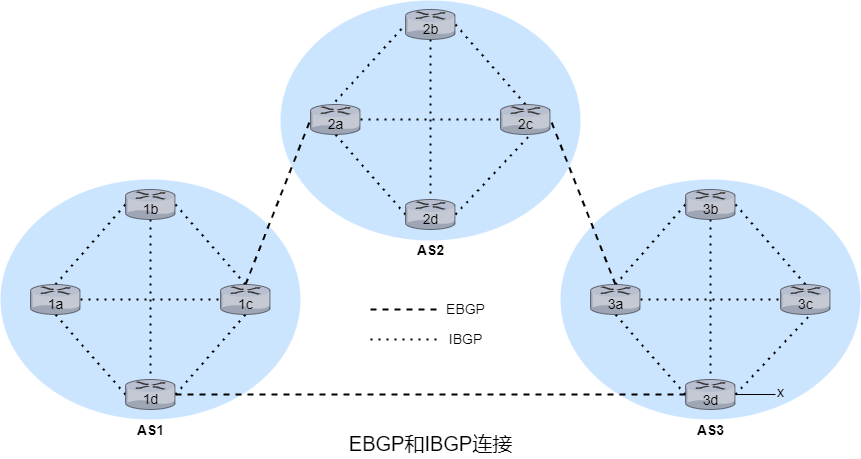

&emsp;&emsp;在BGP中，每条直接连接以及所有通过该连接发送的报文称为**BGP连接**。若BGP连接跨越AS则称为**外部BGP**连接，若在同一AS则称为**内部BGP**连接。内部BGP连接<span style="background-color: yellow">并不总是</span>对应物理链路。建立BGP连接的两个路由器互称**BGP对等体**，其中发送BGP报文的路由器称为**BGP发言者**。

&emsp;&emsp;对于每个AS，其中的路由器是要么是**网关路由器**，要么是**内部路由器**。网关路由器位于AS边缘，内部路由器仅连接AS内部的主机和路由器。

&emsp;&emsp;若需要通告前缀$x$的可达性信息，对于跳数较多的路径，首先网关路由器3a向网关路由器2c发送EBGP报文“AS3 $x$”，然后网关路由器2c向AS2内的所有其他路由器发送IBGP报文“AS3 $x$”，最后网关路由器2a向网关路由器1c发送EBGP报文"AS2 AS3 $x$"。

&emsp;&emsp;路由器通过BGP连接通告前缀时，前缀中包括一些**BGP属性**，前缀以及属性称为**路由**。BGP属性分为**公认必遵**、**公认任意**、**可选传递**和**可选非传递**。

| BGP属性类别 | BGP属性类别详情                                              | 包含的BGP属性                              |
| ----------- | ------------------------------------------------------------ | ------------------------------------------ |
| 公认必遵    | 所有BGP路由器必须支持，必须包含于更新报文中                  | ORIGIN、AS_PATH、NEXT_HOP                  |
| 公认任意    | 所有BGP路由器必须支持                                        | LOCAL_PREF、ATOMIC_AGGREGATE               |
| 可选传递    | 可以不支持，即使不支持也应该能接收包含该属性的路由并传递给邻居 | COMMUNITY、AGGREGATOR                      |
| 可选非传递  | 可以不支持，若不支持则可以忽略包含该属性的更新报文           | MULTI_EXIT_DISC、ORIGINATOR_ID、CLUSTER_ID |

&emsp;&emsp;**ORIGIN**标识路由信息的来源。

&emsp;&emsp;**AS_PATH**包含了通告已通过的AS列表，可用来检测和防止通告环路，若路由器在AS_PATH中发现包含了自身所属的AS则拒绝该通告。

&emsp;&emsp;**NEXT_HOP**是<span style="background-color: yellow">AS_PATH起始路由器接口的IP地址</span>。对于从AS1通过AS2到$x$的路由"AS2 AS3 $x$"，NEXT_HOP是路由器2a的左边接口的IP地址。对于AS1直接路由到AS3的路由"AS3 $x$"，NEXT_HOP是路由器3d的最左边接口的IP地址。

&emsp;&emsp;**LOCAL_PREF**表示路由的优先级，仅用在IBGP对等体间，由<span style="background-color: yellow">本地AS的路由选择策略</span>决定。

&emsp;&emsp;**ATOMIC_AGGREGATE**表示路由是经过了聚合。

&emsp;&emsp;**COMMUNITY**表示共享相同属性的目的地集合，用于将路由信息编组，通过组的标识决定路由策略的传递。

&emsp;&emsp;**AGGREGATOR**是ATOMIC_AGGREGATE的补充，包含发起路由聚合的ASN和形成聚合路由的BGP发言者的IP地址。

&emsp;&emsp;**MULTI_EXIT_DISC**用于区分同一相邻AS的多个接口。

&emsp;&emsp;**ORIGINATOR_ID**用于标识路由反射器。

&emsp;&emsp;**CLUSTER_ID**用于标识路由反射器组。

##### 4.5.2 BGP路由选择

&emsp;&emsp;**热土豆路由选择**可以从所有可能的路由中选择到对应NEXT_HOP路由器成本最小的路由，忽略剩余端到端成本。

&emsp;&emsp;使用热土豆路由选择在转发表中增加AS外部目的前缀的步骤如下：

&emsp;&emsp;①从AS间路由选择协议知道可通过多个网关到达子网$x$。

&emsp;&emsp;②通过AS内部路由选择协议获取的路由选择信息来计算到每个网关的最低成本路径的成本。

&emsp;&emsp;③根据热土豆路由选择来选择成本最低的网关。

&emsp;&emsp;④从转发表确定通往最低成本网关的接口$I$并在转发表中加入表项$(x,I)$。

&emsp;&emsp;BGP实际使用的路由选择算法结合了热土豆路由选择的特点但更复杂。对应给定的目的前缀，算法的输入是到路由器已知悉且接受的到该前缀的所有路由的集合。若集合中多个路由则按下列消除原则直至最后一条路由：

&emsp;&emsp;1）路由被分配LOCAL_PREF作为BGP属性之一。路由的LOCAL_PREF可能已由路由器设置，也可能已从同一AS中的另一台路由器获悉。选择具有最高LOCAL_PREF的路由。

&emsp;&emsp;2）选择具有最短AS_PATH的路由。若该规则是路由选择的唯一规则，则BGP将使用DV算法决定路径，其中距离测量使用AS跳的跳数而不是路由器跳的跳数。

&emsp;&emsp;3）使用热土豆路由选择，选择到NEXT_HOP路由器成本最小的路由。

&emsp;&emsp;4）使用BGP标识符来选择路由。

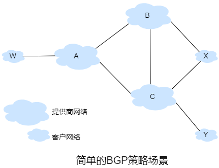

&emsp;&emsp;假设A、B、C是主干提供商网络，且A、B、C直接向彼此发送流量，并向它们的客户网络提供全部的BGP信息，则W、Y是接入ISP，X是**多宿接入ISP**。可以通过控制BGP路由的通告的方式保证W、X和Y的存根网络行为，例如X可能知道到Y的一条路径(XCY)，但X<span style="background-color: yellow">不会</span>将此路径通告给B，因此B也不会经由X来转发到C或Y的分组。

&emsp;&emsp;所有进入接入ISP网络的流量必定是以该网络为目的地，所有离开接入ISP网络的流量必定源自该网络。

&emsp;&emsp;各个对等协议通常都是ISP双方协商且通常对外保密。

&emsp;&emsp;商业规则是任何流经ISP提供商网络的流量的源或目的地(或两者)必须位于该ISP的客户网络中，否则这些流量将免费通过该ISP的网络。

##### 4.5.3 IP任播

&emsp;&emsp;当BGP被用于实现IP任播时，常用于DNS中。

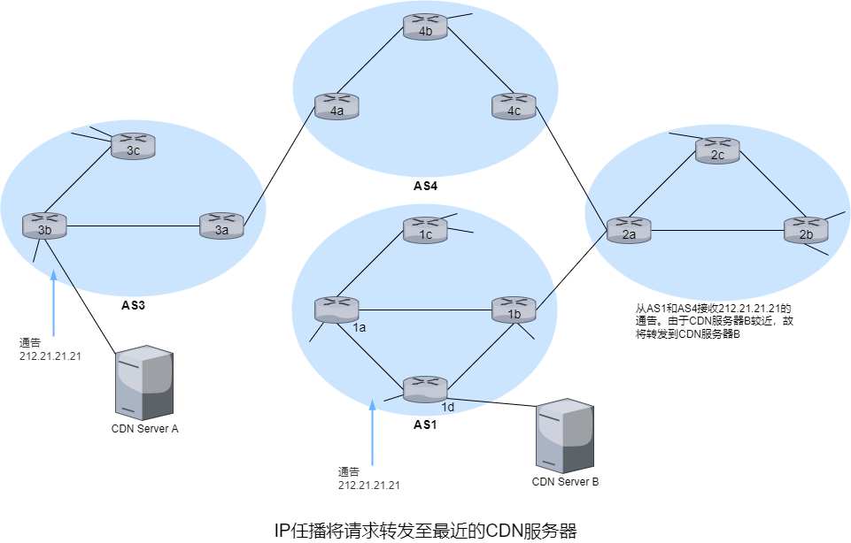

&emsp;&emsp;在IP任播配置时，CDN公式为多台CDN服务器指派了<span style="background-color: yellow">相同的IP地址</span>，然后这些服务器中的每一台都使用BGP来通告该IP地址。当某台BGP路由器该IP地址的多路由通告时，它将这些通告视为到同一物理位置的不同路径，配置路由选择表时，路由器将在本地使用BGP路由选择算法来确定最合适的路由。实际中CDN通常不使用IP任播，因为BGP路由选择的变化可能导致同一的TCP连接的的分组到达Web服务器的不同实例。

&emsp;&emsp;在DNS系统中，IP任播常用于将DNS请求指向最近的根DNS服务器。

#### 4.6 SDN

&emsp;&emsp;SDN体系结构包括**基于流的转发**、**数据平面和控制平面分离**、**网络控制**以及**可编程网络**这4个关键特征。

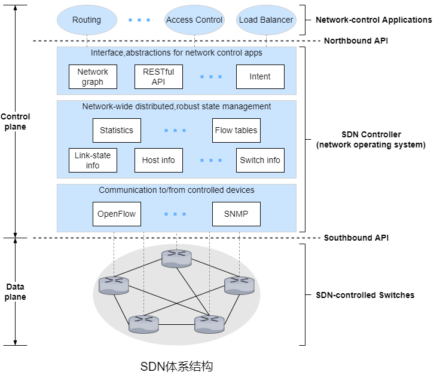

&emsp;&emsp;控制平面由SDN控制器(或网络操作系统)以及若干网络控制应用程序(运行在网络控制服务器上)组成。控制器维护准确的网络状态信息并为网络控制应用程序提供这些信息，还为这些应用程序提供方法来监控、编程以及控制底层网络设备。

&emsp;&emsp;SDN控制器的功能可分为**通信层**、**网络范围状态管理层**和**网络控制应用层的接口**。

&emsp;&emsp;● 若SDN控制器需要控制远程设备，则需要一个协议(OpenFlow)来为SDN控制器和该设备传输信息。此外，该设备必须能够将本地观察到达的事件传输给SDN控制器。SDN控制器和受控网络设备之间的通信跨越了SDN控制器所谓的“南向”接口。

&emsp;&emsp;● SDN控制平面做出的最终控制决策将要求SDN控制器具有网络主机、链路、交换机和其他SDN控制的设备的最新状态信息。交换机的流表包含计数器，其值可以为网络控制应用程序所用。因为控制平面的最终目标是确定各种受控设备的流表，SDN控制器可能也维护这些表的副本。

&emsp;&emsp;● SDN控制器通过它的“北向”接口与网络控制应用程序交互。该接口允许网络控制应用程序在状态管理层中读取/写入网络状态和流表。应用程序可以注册以状态更新事件时收到通知，这样它们可以采取行动以响应来自受控于SDN的设备发送的网络事件通知。

##### 4.6.1 OpenFlow

&emsp;&emsp;<span style="background-color: yellow">OpenFlow</span>是一个得到高度认可和成功的标准，它开创了匹配加动作转发抽象、控制器的概念以及更广泛的SDN革命。实际应用包括简单转发、负载均衡以及防火墙。

&emsp;&emsp;匹配加动作转发表在OpenFlow中称为**流表**。表项包括首部字段值的集合、计数器集合以及匹配项对应的动作集合。当匹配成功时更新计数器，计数器可能包括匹配成功分组的数量以及上次更新时间。匹配失败的分组将被丢弃或发送到远程控制器进行更多处理。在实践中，一个流表可能由多个流表实现。动作包括转发给指定的一个或多个输出端口、丢弃、复制以及重写部分首部字段。

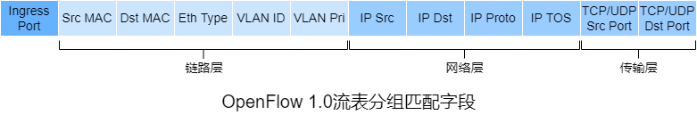

&emsp;&emsp;支持OpenFlow的设备可以充当路由器转发分组以及充当交换机转发帧。以太网类型对应用来分解复用帧的有效载荷的传输层协议。

&emsp;&emsp;输入端口指路由器接收分组的输入端口。

&emsp;&emsp;流表项可以使用通配符`*`。每个流表项具有优先级。

&emsp;&emsp;动作中重要的动作包括转发、丢弃和修改字段。

&emsp;&emsp;● 分组可以转发到指定的物理输出端口，可以广播到所有端口，也可以通过所选的端口集合进行多播。该分组可能被封装并发送到远程控制器，远程控制器可能会对分组进行某些动作，例如安装新的流表项并可能返回分组来更新流表项来根据更新的流表项转发。

&emsp;&emsp;● 没有对应动作时分组将被丢弃。

&emsp;&emsp;● 分组被转发到指定的输出端口之前，源MAC地址、目的MAC地址、以太网类型、局域网ID、局域网优先级、源IP地址、目的IP地址、服务类型、源端口、目的端口这些字段的值可以重写。

&emsp;&emsp;从SDN控制器流向受控路由器的重要报文包括<span style="background-color: yellow">配置</span>报文、<span style="background-color: yellow">修改状态</span>报文、<span style="background-color: yellow">读取状态</span>报文、<span style="background-color: yellow">发送分组</span>报文。配置报文允许SDN控制器查询并设置路由器的配置参数。修改状态报文用于增加/删除/修改路由器流表中的表项并设置路由器的端口属性。读取状态报文用于从路由器的流表和端口收集统计数据以及计数器值。发送分组报文用于从受控路由器的指定端口发送特定报文，报文的有效载荷包含分组。

&emsp;&emsp;从受控路由器流向SDN控制器的重要报文包括<span style="background-color: yellow">流删除</span>报文、<span style="background-color: yellow">端口状态</span>报文、<span style="background-color: yellow">分组进入</span>报文。流删除报文用于通知SDN控制器已删除一个流表项。端口状态报文用于向SDN控制器通知端口状态的变化。分组进入报文用于分组匹配成功的分组发给SDN控制器。

##### 4.6.2 数据平面与控制平面的交互

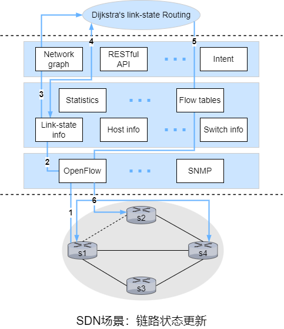

&emsp;&emsp;Dijkstra算法是实现在每台路由器中泛洪链路状态更新，这里Dijkstra算法作为路由器外部的一个单独的程序而且路由器将链路更新发送到SDN控制器而不是彼此。

&emsp;&emsp;假设OpenFlow作为通信层协议，控制平面只执行路由选择。此外，s1与s2之间的链路出现了故障。

&emsp;&emsp;1）s1使用OpenFlow的端口状态报文通知SDN控制器链路状态改变。

&emsp;&emsp;2）SDN控制器收到报文后通知链路状态管理器，链路状态管理器更新链路状态数据库。

&emsp;&emsp;3）因为用于实现Dijkstra算法的网络控制应用程序之前已经注册，网络控制应用程序收到了链路状态更改的通知。

&emsp;&emsp;4）链路状态应用程序与链路状态管理器交互以获取最新的链路状态信息，也可能会与链路状态管理层的其他组件交互，然后计算新的最低成本路径。

&emsp;&emsp;5）链路状态应用程序与流表管理器交互来更新流量。

&emsp;&emsp;6）流表管理器使用OpenFlow更新受影响路由器的流表项。

##### 4.6.3 SDN的发展

&emsp;&emsp;Google的B4网络使用定制的交换机，每台交换机实现了OpenFlow的扩展版并带有本地OpenFlow代理。每个OFA与网络控制服务器中的OpenFlow控制器连接，使用单独的带外网络，该网络不同于数据中心间传输数据中心流量的网络。OpenFlow控制器因此提供网络控制服务器和其受控交换机之间的通信。在B4中，OpenFlow控制器还执行状态管理功能，将节点与链路信息保存在网络信息数据库中。OpenFlow控制器的实现基于ONIX SDN控制器。B4网络实现了BGP和IS-IS(类似于OSPF)。

&emsp;&emsp;在SDN发展早期，采用单一的SDN协议(OpenFlow)和单一的SDN控制器。最近，OpenDaylight(ODL)控制器和ONOS控制器得到业界广泛支持。

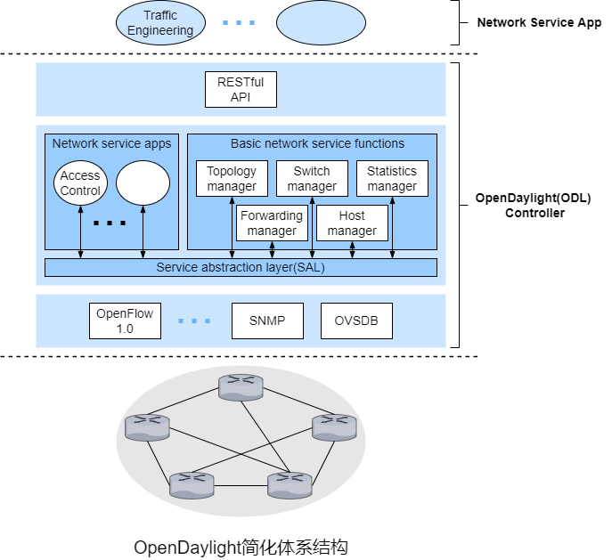

&emsp;&emsp;**网络服务应用程序**用于决定受控路由器完成数据平面转发和其他服务(如防火墙和负载均衡)。ODL控制器的核心是**基本网络服务功能**。控制器有RESTful接口和网络抽象层这2个接口，外部应用程序通过HTTP上的RESTful接口与控制器通信，内部应用程序通过SAL相互通信。应用程序实现在控制器外部还是控制器内部由应用程序设计者决定。

&emsp;&emsp;SAL允许控制器组件和应用程序互相调用并订阅彼此生成的事件，它还为通信层中特定的协议(如OpenFlow、SNMP和OVSDB)提供统一的抽象接口。

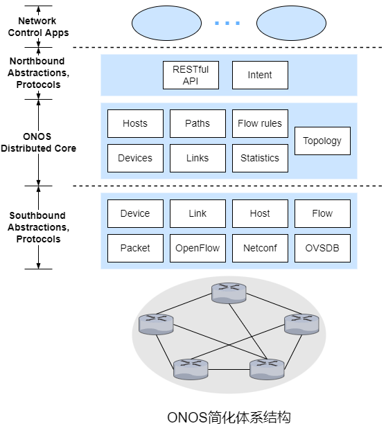

&emsp;&emsp;ONOS作为服务部署在一组互联的服务器上，每台服务器都运行相同的ONOS软件副本。

&emsp;&emsp;ONOS的一个独特功能是它的意图框架，它允许网络控制应用程序请求高级服务而无须了解该服务的具体信息。状态信息通过北向接口以同步(查询)或异步(监听器回调)提供给应用程序。

&emsp;&emsp;ONOS的分布式核心维护网络链路、主机以及设备的状态等。ONOS核心提供复制和实例间协调机制，为上层的应用程序和下层的受控设备提供逻辑上的集中式核心服务抽象。

&emsp;&emsp;ONOS的南向接口屏蔽底层主机、链路、交换机和协议的差异，允许分布式核心和这些无关。

#### 4.7 ICMP

&emsp;&emsp;ICMP虽然是网络层协议，但ICMP报文作为IP数据包的有效载荷，类似于TCP和UDP。ICMP最典型的用途是差错报告。基于ICMP的常用程序是ping和traceroute。

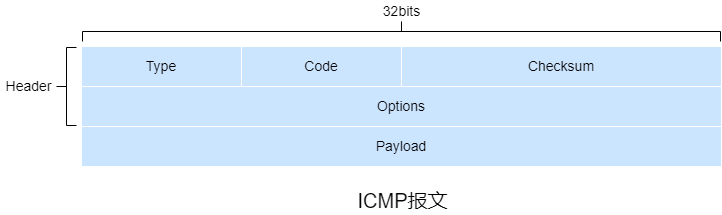

| ICMP type | ICMP code | 描述                              |
| --------- | --------- | --------------------------------- |
| 0         | 0         | echo(ping) reply                  |
| 3         | 0         | destination network unreachable   |
| 3         | 1         | destination host unreachable      |
| 3         | 2         | destination protocol unreachable  |
| 3         | 3         | destination port unreachable      |
| 3         | 6         | destination network unknown       |
| 3         | 7         | destination host unknown          |
| 4         | 0         | source quench(congestion control) |
| 8         | 0         | echo(ping) request                |
| 9         | 0         | router advertisement              |
| 10        | 0         | router discovery                  |
| 11        | 0         | TTL exceeded                      |
| 12        | 0         | IP header bad                     |

&emsp;&emsp;源抑制报文最初的目的是用于拥塞控制，即发送或对方减小发送速率。

&emsp;&emsp;在traceroute中，为了确定源主机和目的主机之间的路由器的主机板和IP地址，源主机向目的主机发送了一系列的IP数据报，这些数据报都带有一个不可达的UDP端口的UDP报文段，其中第$n$个数据报的TTL为$n$。因此，当第$n$个数据报到达第$n$个路由器时TTL刚好过期，路由器丢弃数据报并向源主机发送ICMP报文(type=11,code=0)，该报文包括路由器的主机名以及IP地址。当数据报到达目的主机时，由于UDP端口不可达，目的主机会向源主机发送ICMP报文(type=3,code=3)，源主机收到该报文后停止发送数据报。

#### 4.8 网络管理

##### 4.8.1 网络管理

&emsp;&emsp;**网络管理**包括对硬件、软件和人为元素的部署、集成和协调，以便对网络资源进行监视、测试、轮询、配置、分析、评估和控制，这样能以合理的成本满足例如实时运行性能、服务质量等需求。

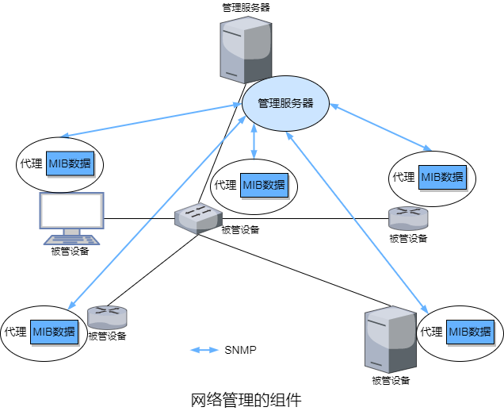

&emsp;&emsp;网络管理的重要组件包括管理服务器、被管设备、MIB数据、远程代理以及SNMP。

&emsp;&emsp;管理服务器是一个应用程序，通常有人的参与，并在网络运营中心的集中式管理站上运行。管理服务器用于网络管理，负责网络管理信息的收集、处理、分析以及显示。

&emsp;&emsp;被管设备是被管网络中的网络设备(包括软件)。一个被管设备内可能有几个**被管对象**。这些被管对象包括被管设备中的实际硬件(例如网络接口卡是主机或路由器的一个组件)以及用于这些硬件和软件组件的配置参数(例如AS内部路由选择协议)。

&emsp;&emsp;被管设备中的每个被管对象的相关信息收集在**管理信息库**中，这些信息可供管理服务器使用。一个管理信息库的对象称为SMI，可以是计数器、收到的UDP报文的数量、描述性信息或状态信息等。

&emsp;&emsp;每个被管设备上都有**网络管理代理**，它是一个与管理服务器通信的进程，在管理服务器的命令和控制下在被管设备执行本地操作。

&emsp;&emsp;**网络管理协议**在管理服务器与被管设备间运行，运行管理服务器查询被管设备的状态并通过代理间接地在被管设备上采取行动。代理通过网络管理协议通知管理服务器异常事件。

##### 4.8.2 SNMP

&emsp;&emsp;**简单网络管理协议**用于管理服务器和被管设备上的网络管理代理之间传输网络管理控制和信息报文。SNMP常用模式是请求响应模式，管理服务器向代理发送请求，代理收到请求后执行某些操作并响应请求。请求通常用于查询或修改被管设备相关的MIB对象值。另一种情况是代理向管理服务器发送未被请求的报文，该报文称为**陷阱报文**。陷阱报文是异步产生的，即不是为了响应报文，而是为了响应管理服务器要求通知的事件，用于通知管理服务器异常情况导致MIB对象值改变。

| PDU类型        | 发送端-接收端                           | 描述                                                         |
| -------------- | --------------------------------------- | ------------------------------------------------------------ |
| GetRequest     | 管理服务器到代理                        | 获取一个或多个MIB对象值                                      |
| GetNextRequest | 管理服务器到代理                        | 获取下一个MIB对象值                                          |
| GetBulkRequest | 管理服务器到代理                        | 获取大数据块的值                                             |
| InformRequest  | 管理服务器到管理服务器                  | 通知<span style="background-color: yellow">远程</span>管理服务器远程访问的MIB值 |
| SetRequest     | 管理服务器到代理                        | 设置一个或多个MIB对象值                                      |
| Response       | 代理到管理服务器/管理服务器到管理服务器 | 响应GetRequest、GetNextRequest、GetBulkRequest、InformRequest和SetRequest |
| Trap           | 代理到管理服务器                        | 通知管理服务器异常事件                                       |

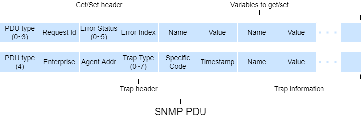

&emsp;&emsp;SNMP通常基于UDP，但UDP并不可靠，类似于rdt，管理服务器用Request Id来标识报文。SNMP并没有强制重传，若需要重传，管理服务器设置重传频率和周期。

&emsp;&emsp;GetRequest、GetNextRequest、GetBulkRequest PDU请求的值在PDU的变量绑定部分。GetRequest、GetNextRequest、GetBulkRequest PDU的数据请求颗粒度不同， GetRequest可以请求任意一组MIB值，多个GetNextRequest可用于对MIB对象的列表或表格进行排序，GetBulkRequest用于返回大块数据，相比多个GetRequest或GetNextRequest减小了成本。代理会使用包含对象标识符以及相关值的PDU来响应。

&emsp;&emsp;代理用带有"noError"错误状态的PDU来响应SetRequest。