### 第五章 链路层

&emsp;&emsp;运行链路层协议的设备称为**节点**。连接相邻节点的通信信道称为**链路**。

&emsp;&emsp;链路层提供的服务包括**封装成帧**、**链路接入**、**可靠交付**、**差错检测和纠错**。

&emsp;&emsp;通常链路层是通过**网络适配器**实现的，网络适配器也成为**网络接口卡**。网络适配器的核心是链路层控制器，通常是一个实现了很多链路层服务的专用芯片。因此，链路层控制器的大部分功能(封装成帧、链路接入和差错检测)是通过硬件实现的。链路层的软件部分实现更高级别的链路层功能(组装链路层寻找信息和激活控制器硬件)。

&emsp;&emsp;交换机的工作是主机与路由器之间传输数据报，即交换机不明确式地将帧寻址，因此它没有相连的主机或路由器的链路层地址。&emsp;&emsp;

&emsp;&emsp;主机和路由器的网络适配器(即网络接口)拥有链路层地址。链路层地址又称**LAN地址**、**物理地址**或**MAC地址**。MAC地址长度为6字节，共有$2^{48}$个可能的地址，常用16进制数表示，即一个字节对应一对16进制数。没有两块适配器拥有相同的MAC地址，因为一个公司想要生产网络适配器时需要向IEEE购买$2^{24}$个地址组成的地址空间，这些地址的前24位相同。

&emsp;&emsp;当网络适配器发送帧时会将目的网络适配器的MAC地址插入帧中。交换机可能将帧广播到所有接口，因此网络适配器可能收到不是发送给它的帧。当网络适配器收到帧时会将目的MAC地址与自身MAC地址进行匹配，若匹配则提取数据报并沿协议栈向上传递，否则丢弃该帧。

&emsp;&emsp;若网络适配器需要将帧广播到其他网络适配器，发送端网络适配器需要将帧的MAC地址设置为特殊的广播地址，即48位全是1。

&emsp;&emsp;**集线器**是物理层设备，作用于比特，当比特从一个接口到达时，集线器只需要重新生成该比特来提供其能量强度，并将该比特传输到其他所有接口。

&emsp;&emsp;**中继器**是物理层设备，用来放大信号，比特从输入接口达到后会重新生成该比特并传输到输出接口。

|          | 路由器 | 集线器 | 交换机 |
| -------- | ------ | ------ | ------ |
| 流量隔离 | ✓      | ⨉      | ✓      |
| 即插即用 | ⨉      | ✓      | ✓      |
| 优化路由 | ✓      | ⨉      | ⨉      |

#### 5.1 差错检测和纠错

&emsp;&emsp;**前向纠错**指接收端检测并纠错。

&emsp;&emsp;传输层通常由主机中的软件实现并作为主机操作系统的一部分，传输层的差错检验同样是通过软件实现的，故传输层使用了更简单快速的差错检测(例如校验和)。而链路层的差错检测通常在网络适配器中的专用硬件实现，可以快速执行更复杂的CRC操作。

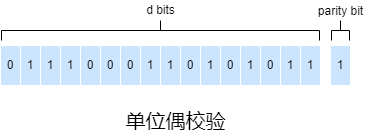

&emsp;&emsp;最简单的差错检测技术是用单个**奇偶校验位**。假设待发送的信息$D$有$d$位，若使用偶校验，发送端只需要再加上1位，使得这$d+1$位有偶数个1，若使用奇校验则$d+1$位中有奇数个1。显然这种方案只能检测出奇数比特的差错。

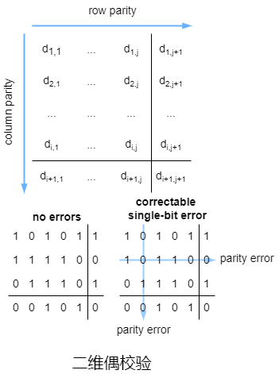

&emsp;&emsp;**二维奇偶检验**可以检测出单比特的错误并纠错，只能检测错两比特的错误。

&emsp;&emsp;另一种差错检测技术是校验和，比较简单的校验和方法就是将$d$位数据看作$k$位整数的序列化，再将这$k$位整数相加并将得到的和用作差错检测位。**互联网校验和**就基于这种方法，即将待发送数据字节视作16位的整数并求和，求和时需要回卷，求和后再取反码，这个反码设置为分组首部的校验和字段。接收端收到分组后用同样的方式(包括校验和)求和取反码，若结果全为1则表示没有出现差错。

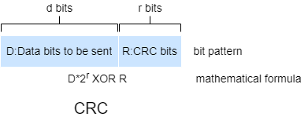

&emsp;&emsp;现在常用的差错检测技术是**循环冗余校验编码**，循环冗余校验编码也称为多项式编码，因为该编码将待发送的位串视作多项式，其系数是位串中的0和1，对位串的操作被视为多项式算术。

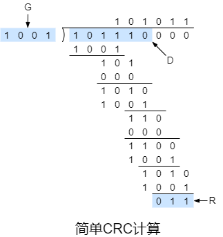

&emsp;&emsp;所有的CRC都采用模2运算，模2运算不考虑进位和借位，模2加法和模2减法等价于操作数的异或运算$\oplus$，模2乘法和模2除法运算规则与二进制中的乘法和除法相同。

&emsp;&emsp;依然假设待发送的数据$D$有$d$位，发送端接收端必须先就$r+1$位模式(二进制形式)达成一致，称为**生成多项式**，用$G$表示，$G$的最高有效位必须是1并且使用模2运算时$d+r$位模式(二进制形式)能整除$G$，若有余数则说明出现了差错。

&emsp;&emsp;根据二进制乘法中乘$2^k$相当于左移$k$位的特性，$d+r$位模式可以表示为$D\times 2^r\oplus R$。
$$
\begin{align}
D\times 2^r \oplus R&=nG\\
D\times 2^r\oplus R\oplus R&=nG\oplus R\\
D\times 2^r&=nG \oplus R\\
\end{align}
$$
&emsp;&emsp;显然，$R= (D\times 2^r) \bmod G$。

&emsp;&emsp;CRC能检测出奇数比特的差错，而且CRC能检测出小于$r+1$位的差错，在适当的假设下还可以以$1-\frac{r}{2}$的概率检测出大于$r+1$位的差错。

#### 5.2 多路访问链路和协议

&emsp;&emsp;**点对点链路**由链路一端的单个发送端和链路另一端的单个接收端组成，相关协议包括PPP和HDLC。

&emsp;&emsp;**广播**指当任何节点通过广播信道传输帧时其他所有节点都会收到该帧的副本。**广播链路**可以有多个发送端和接收端都连接到同一共享广播信道。

&emsp;&emsp;因为所有的节点都能传输帧，所有可能多个节点会同时传输帧，此时，传输的帧在所有接收端**碰撞**，涉及此次碰撞的所有帧都会丢失。

&emsp;&emsp;**多路访问**指多个节点共享同一信道，其中任意节点发送的帧可以被多个节点接收。多路访问协议分为**信道划分协议**、**随机接入协议**和**轮流协议**。

&emsp;&emsp;在理想情况下，速率为$R(b/s)$的广播信息的，多路信道应该具有以下理想特性：

&emsp;&emsp;1）当仅有一个节点发送数据时，该节点吞吐量为$R(b/s)$。

&emsp;&emsp;2）当$M$个节点发送数据时，每个节点的吞吐量为$\frac{R}{M}(b/s)$。

&emsp;&emsp;3）协议是去中心化的，即不会因为主节点故障而导致整个系统崩溃。

&emsp;&emsp;4）协议是简单，故实现成本也不贵。

##### 5.2.1 信道划分协议

&emsp;&emsp;频分复用和时分复用可以用于信道划分。

&emsp;&emsp;频分复用消除了碰撞并且很公平，每个节点都获得了专用带宽$\frac{R}{N}(b/s)$。频分复用的缺点是带宽的限制。

&emsp;&emsp;时分复用也消除了碰撞而且很公平，每个节点在每个时间帧内都获得了专用传输速率$\frac{R}{N}(b/s)$。但是时分复用有两个主要缺点，首先是节点的平均速率被限制在$\frac{R}{N}(b/s)$，其次是节点必须等待传输序列的轮次。

&emsp;&emsp;另一种信道划分协议是**码分多址**，码分多址对每个节点分配了不同的编码，每个节点使用它的唯一编码来对待发送的数据进行编码。若精心选择编码，码分多址既可以保证不同节点同时传输，又可以保证它们对应的接收端仍能正确地接收数据。

&emsp;&emsp;在CDMA协议中，发送端的每个比特都通过乘一个信号(编码)进行编码，该信号的变化速率(称为**码片速率**)比初始数据比特序列的变化速率快很多。

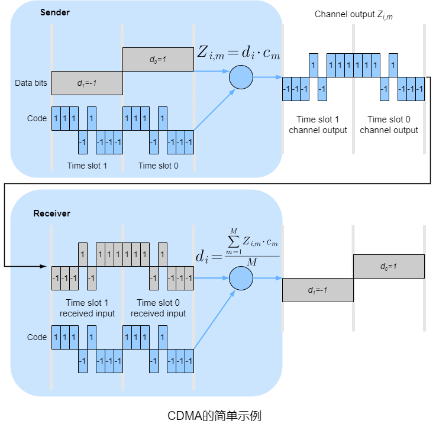

&emsp;&emsp;假设初始数据比特达到CDMA编码器的速率定义了时间单位，即每个待发送的初始数据比特需要1比特的时隙。为了数学上的便利，这里用$-1$代替$0$。$d_i$表示第$i$个比特时隙中的数据比特值。每个比特时隙进一步细分为$M$个微时隙(这里$M=8$，实际中$M$的值大得多)。发送端使用CDMA编码由$M$个值的一个序列$c_m$组成。

&emsp;&emsp;对于$d_i$比特传输时的第$m$微时隙，CDMA编码器的输出$Z_{i,m}=d_i\cdot c_m$。在没有其他发送端的干扰时，接收端将收到比特$Z_{i,m}$并恢复成初始的数据比特$d_i=\frac{\sum_{m=1}^MZ_{i,m}\cdot c_m}{M}$。

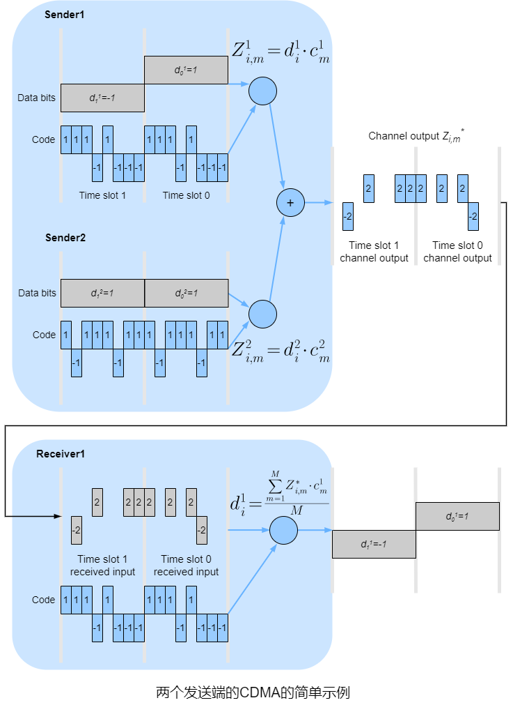

&emsp;&emsp;实际中干扰在所难免，CDMA在原始数据比特与干扰比特传输信号是相加的假设下工作。相比无干扰情况，接收端收到比特的值是所有发送端传输的比特总和$Z_{i,m}^*=\sum_{s=1}^NZ_{i,m}^s$。

##### 5.2.2 随机接入协议

&emsp;&emsp;随机接入协议中，节点总是以信道的最高速率$R(b/s)$进行传输，当发送碰撞时，涉及碰撞的每个节点都会重传直到无碰撞为止。当节点发生碰撞时，它不一定立即重传，它会等待随机时延后重传。涉及碰撞的节点都独立地选择随机时延。

###### 5.2.2.1 时隙ALOHA

&emsp;&emsp;在时隙ALOHA协议中，先做如下假设：

&emsp;&emsp;● 所有帧的长度固定为$L$位。

&emsp;&emsp;● 时间划分为$\frac{L}{R}(s)$的时隙，即一个时隙等于传输一帧所需时间。

&emsp;&emsp;● 节点仅在时隙的开始传输帧。

&emsp;&emsp;● 节点是同步的，每个节点都指定时隙的开始时间。

&emsp;&emsp;● 若两个或多个帧在同一时隙内碰撞则所有节点在时隙结束前会检测到该碰撞。

&emsp;&emsp;当节点有帧待发送时，它等到下个时隙的开始并在该时隙内传输整个帧。若出现碰撞，该节点在时隙结束前会检测到该碰撞，在之后的每个时隙内以概率$p$(二项分布)重传该帧直到不出现碰撞。

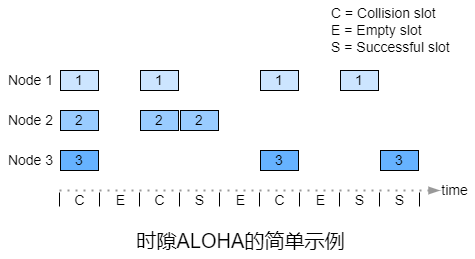

&emsp;&emsp;只有一个节点传输的时隙称为**成功时隙**。时隙ALOHA协议的**效率**指大量活动节点的情况下成功时隙的比例。

&emsp;&emsp;假设$N$个节点，则某个时隙是成功时隙的概率就是其他$N-1$个节点不进行传输的概率。某个节点传输的概率是$p$，其他节点不传输的概率是$(1-p)^{N-1}$，因此该节点成功传输的概率是$p(1-p)^{N-1}$。因为有$N$个节点，其中任一节点成功传输的概率是$Np(1-p)^{N-1}$。
$$
\begin{align}
f(p)&=Np(1-p)^{N-1}\\
f'(p)&=(Np)'(1-p)^{N-1}-Np((1-p)^{N-1})'\\
&=N(1-p)^{N-1}-Np(N-1)(1-p)^{N-2}\\
&=N(1-p)^{N-2}(1-p-p(N-1))\\
&=N(1-p)^{N-2}(1-pN)
\end{align}
$$
&emsp;&emsp;令$f'(p)=0$时，则$p=\frac{1}{N}$或$p=1$。

&emsp;&emsp;当$p=\frac{1}{N}$时，$f(\frac{1}{N})=(1-\frac{1}{N})^{N-1}>0$，$p=\frac{1}{N}$是$f(p)$的极大值点。

&emsp;&emsp;当$p=1$时，$f(1)=0$，$p=1$是$f(p)$的极小值点。
$$
\begin{align}
\lim \limits_{N\rightarrow \infty} f(\frac{1}{N})&=\lim \limits_{N\rightarrow \infty} (1-\frac{1}{N})^{N-1}\\
&=\lim \limits_{N\rightarrow \infty} \frac{(1-\frac{1}{N})^N}{1-\frac{1}{N}}\\
&=\frac{\lim \limits_{N\rightarrow \infty}(1-\frac{1}{N})^N}{\lim \limits_{N\rightarrow \infty}(1-\frac{1}{N})}\\
&=\frac{1}{e}
\end{align}
$$

###### 5.2.2.2 ALOHA

&emsp;&emsp;ALOHA是无时隙的。在ALOHA中，当一个帧首次到达(数据报从发送端的网络层向下传递)，节点立即将整个帧传输到广播信道中。若出现碰撞，该节点(传输完出现碰撞的帧后)下一个帧传输时间以概率$p$重传。

&emsp;&emsp;为了确定ALOHA的最高效率，关注的重点是单独的节点。类似于时隙ALOHA，时间单元为帧的传输时间。对于指定时间，节点$i$传输帧的概率是$p$。该节点在$t_0$开始传输，若该帧能够成功传输，在$[t_0-1,t_0]$内不能有其他节点传输，因为这样会导致传输干扰。其他所有节点在$[t_0-1,t_0]$内不传输的概率是$(1-p)^{N-1}$。当节点$i$传输时不能有其他节点传输，这样概率也是$(1-p)^{N-1}$。因此，节点$i$成功传输的概率是$(1-p)^{2N-2}$。当有$N$个节点，其中任一节点成功传输的概率是$Np(1-p)^{2N-2}$。
$$
\begin{align}
f(p)&=Np(1-p)^{2N-2}\\
f'(p)&=(Np)'(1-p)^{2N-2}-Np((1-p)^{2N-2})'\\
&=N(1-p)^{2N-2}-Np(2N-2)(1-p)^{2N-3}\\
&=N(1-p)^{2N-3}(1-p-p(2N-2))\\
&=N(1-p)^{2N-3}(1-p(2N-1))
\end{align}
$$
&emsp;&emsp;令$f'(p)=0$时，则$p=\frac{1}{2N-1}$或$p=1$。

&emsp;&emsp;当$p=\frac{1}{2N-1}$时，$f(\frac{1}{2N-1})= \frac{N}{2N-1} \times (1-\frac{1}{2N-1})^{2N-2}>0$，$p=\frac{1}{2N-1}$是$f(p)$的极大值点。

&emsp;&emsp;当$p=1$时，$f(1)=0$，$p=0$是$f(p)$的极小值点。
$$
\begin{align}
\lim \limits_{N\rightarrow \infty} f(\frac{1}{2N-1})&=\lim \limits_{N\rightarrow \infty} [\frac{N}{2N-1} \times (1-\frac{1}{2N-1})^{2N-2}]\\
&=\lim \limits_{N\rightarrow \infty} \frac{N}{2N-1}\times \lim \limits_{N\rightarrow \infty} (1-\frac{1}{2N-1})^{2N-2}\\
&=\frac{1}{2}\times \frac{\lim \limits_{N\rightarrow \infty}(1-\frac{1}{2N-1})^{2N-1}}{\lim \limits_{N\rightarrow \infty}(1-\frac{1}{2N-1})}\\
&=\frac{1}{2e}
\end{align}
$$

###### 5.2.2.3 CSMA

&emsp;&emsp;**载波侦听**指节点在传输前先侦听信道。若有其他节点在通过该信道传输则该节点会等待，直到短时间内未检测到传输再开始传输。

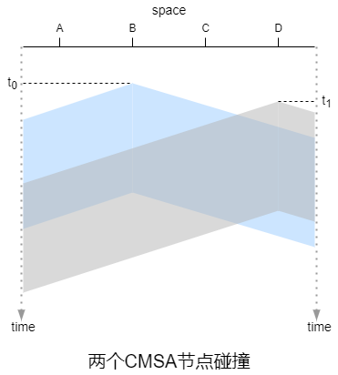

&emsp;&emsp;假设一条广播总线有A、B、C、D这4个节点。在$t_0$时刻，节点B侦听到信道是空闲的，因此节点B开始传输，帧向着总线的两端传输。在$t_1$时刻，节点D有帧待发送，此时节点B的帧还未到达节点D，因此D侦听到信道是空闲的，因此节点D也开始传输帧。过了一段时间后B的传输与D的传输碰撞。

&emsp;&emsp;广播信道的端到端**信道传播时延**在性能方面起到关键作用。信道传播时延越长，载波侦听节点不能侦听到另一节点已开始传输的几率越大。

###### 5.2.2.4 CSMA/CD

&emsp;&emsp;**碰撞检测**指节点在传输时侦听信道。若检测到其他节点在传输，该节点会停止并等待随机时延，再进入“侦听-空闲时传输”的循环。

&emsp;&emsp;从连接到广播信道的节点的网络适配器角度来说明CSMA/CD的内容：

&emsp;&emsp;1）网络适配器从网络层获取数据报，将数据报封装成帧并将帧放入网络适配器的缓存中。

&emsp;&emsp;2）如果网络适配器侦听到信道是空闲的(无信号能量从信道进入网络适配器)则开始传输帧，否则网络适配器将等待，直至信道空闲。

&emsp;&emsp;3）传输帧时网络适配器会监视该信道中其他网络适配器的信号能量。

&emsp;&emsp;4）若传输整个帧的过程中未检测到其他网络适配器的能量信号则网络适配器完成了传输，否则网络适配器将中止传输。

&emsp;&emsp;5）中止之后，网络适配器将等待随机时延并回到第2步。

&emsp;&emsp;**二进制指数退避算法**可以让碰撞后节点等待的随机时延随着碰撞次数增长而增长。512比特在端到端的往返时间表示为$2\tau$，也称为**冲突窗口**或**竞争期**，一般设置为基本退避时间。若一个帧的碰撞次数达到16次时会丢弃该帧并向上层反馈错误。定义一个与冲突次数相关的参数$k$，$k=min\{碰撞次数,10\}$。从$[0,1,2,\cdots ,2^k-1]$中选取随机数$r$，则等待的随机时延是$r$倍的基本退避时间，即$r\times 2\tau$。

&emsp;&emsp;CSMA/CD的效率指大量活动节点时，帧在信道上无碰撞地传输的时间所占的比例。
$$
effciency\approx \frac{1}{1+5\frac{d_{prop}}{d_{trans}}}
$$
&emsp;&emsp;$d_{prop}$表示信号能量在任意两个网络适配器之间传输所需的最长时间。$d_{trans}$表示传输最大长度的帧所需时间。

&emsp;&emsp;假设$S$表示类似于时隙ALOHA的时隙，$S$比传输一帧的时间小很多且$S>d_{prop}$，这样在时隙结束前每个节点都能检测到其他节点的信号能量。所有帧的长度固定，用$L$表示，$L=kRS$，$R$表示信道的速率，即成功传输帧需要连续$k$个传输成功的时隙。由于时隙结束前每个节点都能检测到其他节点的信号能量，首个传输成功的时隙后的$k-1$个时隙无时隙竞争。此外，有$N$个节点且每个节点有无限帧待发送。每个节点在时隙内传输的概率是$p$。每$x$个传输失败的时隙后有传输成功的时隙。时隙内成功传输的概率是$\beta$，$\beta=Np(1-p)^{N-1}$。$Y$表示时隙序号。
$$
P(Y=x+1)=\beta (1-\beta)^{x}
$$
&emsp;&emsp;根据几何分布期望，$E(x+1)=\frac{1}{\beta}$，则$E(x)=\frac{1-\beta}{\beta}=\frac{1-Np(1-p)^{N-1}}{Np(1-p)^{N-1}}$。
$$
\begin{align}
effciency&=\frac{k}{k+x}\\
&=\frac{k}{k+\frac{1-Np(1-p)^{N-1}}{Np(1-p)^{N-1}}}
\end{align}
$$
&emsp;&emsp;显然$\beta$越大，效率越高，在时隙ALOHA中推导了$p=\frac{1}{N}$时$\beta$取最大值$\frac{1}{e}$，$effciency_{max}=\frac{k}{k+e-1}$。

##### 5.2.3 轮流协议

&emsp;&emsp;轮流协议中，只有一个节点活跃时，该节点的吞吐量为$R(b/s)$，当有$M$个活跃节点是，每个活跃节点的吞吐量接近$\frac{R}{M}(b/s)$。

&emsp;&emsp;**轮询协议**需要一个主节点，主节点以循环的方式**轮询**其他节点。主节点通过侦听信道来确定节点是否完成了传输帧。例如，主节点向节点1发送报文来告诉它能够传输的帧的最大数量。节点1传输了一些帧后，主节点再向节点2发送报文来告诉它能够传输的帧的最大数量。主节点通过这种方式来轮询每个节点。

&emsp;&emsp;轮询协议相比随机访问协议消除了碰撞和空时隙。但轮询协议需要引入了轮询延迟，更严重的的是问题是当主节点发生故障时整个信道将无法运行。

&emsp;&emsp;**令牌传递协议**相比轮询协议没有主节点，而是一个称为的**令牌**的小型专用帧以某种固定顺序在节点之间交换。当节点收到令牌时，若有帧待传输才持有令牌并发送最大数量的帧，否则它将按序向下一个节点转发令牌。

##### 5.2.4 DOCSIS

&emsp;&emsp;有线接入网通常将数千个住宅有线调制解调器连接到**电缆调制解调器终端系统**。**有线电缆数据服务接口规范**规定了有线网络架构及其协议。

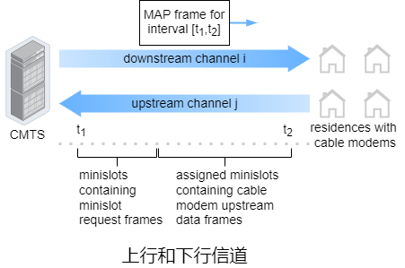

&emsp;&emsp;DOCSIS使用FDM将下行(CMTS到调制解调器)和上行(调制解调器到CMTS)网段划分为多个频率信道。

&emsp;&emsp;每个下行信道的带宽是$6M(hz)$，每个信道的最大吞吐量大约为$40M(b/s)$。每个上行信道的最大带宽是$6.4M(hz)$，最大上行吞吐量约为$30M(b/s)$。每个上行和下行通道都是一个广播信道。

&emsp;&emsp;每个上行信道被划分为时间间隔(类似于TDM)，每个时间间隔包含一个微时隙序列，电缆调制解调器可以通过这些微时间序列向CMTS传输。CMTS显式地授予各个电缆调制解调器在指定微时隙序列传输的权限(通过CMTS在下行信道发送的称为MAP报文的控制报文来实现)。

&emsp;&emsp;CMTS在下行信道上传输的帧被所有接收该信道的电缆调制解调器接收。由于只有一个CMTS传输到下行信道，故不存在多路访问的问题。多个电缆调制解调器共享相同的上行信道到CMTS，因此可能出现碰撞。

&emsp;&emsp;电缆调制解调器在微时隙请求帧专用的微时隙间隔内向CMTS发送微时隙请求帧来达到让CMTS知晓自身有数据待发送的目的。这些微时隙请求帧以随机接入方式传输，故可能出现碰撞。电缆调制解调器既不能侦听上行信道是否空闲，也不能检测碰撞。相反，若电缆调制解调器没有在下一个下行信道的控制报文中收到微时隙请求帧的响应，则推断微时隙请求帧出现了碰撞并使用二进制指数退避算法来重传。

&emsp;&emsp;当上行信道的流量很少时，电缆调制解调器可以在微时隙请求帧专用的信道中传输帧。

#### 5.3 交换局域网

##### 5.3.1 ARP

&emsp;&emsp;**地址解析协议**用于将网络层地址解析为链路层地址，而**反向地址解析协议**用于将链路层地址解析为网络层地址。ARP仅解析同一子网下的主机和路由器接口的IP地址。

&emsp;&emsp;每个主机或路由器的内存中都有一个**ARP表**，其中包含IP地址到MAC地址映射。ARP表字段包括IP地址、MAC地址和TTL，TTL表示每个映射的删除时间，一般设置为20min。ARP表是自动构建的，若主机与子网断开连接，子网中的其他ARP表会删除该主机的表项。

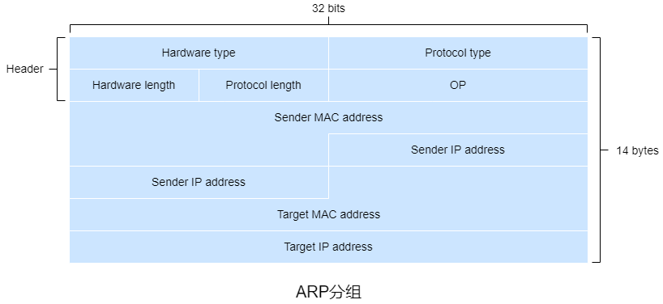

&emsp;&emsp;ARP分组包括16位**硬件地址类型**、16位**协议地址类型**、8位**硬件地址长度**、8位**协议长度**、16位**操作类型**、48位**发送端MAC地址**、32位**发送端IP地址**、48位**目的MAC地址**、32位**目的IP地址**。

&emsp;&emsp;● 硬件地址类型为1时表示以太网。

&emsp;&emsp;● 协议类型为0x0080时表示IP。

&emsp;&emsp;● 硬件地址长度和协议地址长度的单位是字节。

&emsp;&emsp;● 操作类型为1时表示ARP请求分组，操作类型为2时表示ARP响应分组，操作类型为3时表示RARP请求分组，操作类型为4时表示RARP响应分组。

&emsp;&emsp;ARP请求分组用于获取目的IP地址对应的MAC地址，因此目的MAC地址为空(全为0)。

&emsp;&emsp;若需要发送一个IP寻址的数据报，发送端需要获取目的IP地址的目的MAC地址。若发送端的ARP表中没有目的IP地址的表项，则需要ARP协议来解析这个IP地址。

&emsp;&emsp;1）发送端构造ARP分组，网络适配器将分组封装成帧时将广播地址作为帧的目的MAC地址。

&emsp;&emsp;2）将待发送的数据报放入缓存。

&emsp;&emsp;3）同一子网下的其他网络适配器接收帧后将帧内的ARP分组传递给ARP模块。ARP模块会将分组中的目的IP地址与自身IP地址进行匹配，若匹配则向请求主机发送一个带有所需映射的ARP响应分组。发送端根据ARP响应分组更新ARP表。若接收端无法收到ARP响应分组，则会丢弃数据报。

&emsp;&emsp;4）从缓存中取出数据报并查询ARP表获取MAC地址。

&emsp;&emsp;5）将数据报封装成帧并发送。

&emsp;&emsp;某些ARP模块在等待ARP响应报文时丢弃数据报而不是放入缓存。

&emsp;&emsp;若子网1的主机A需要向子网2的主机B发送数据报，数据报首先发送到子网1中的第一跳路由，封装成帧时目的MAC地址应该是第一台路由的IP地址对应的MAC地址。路由器收到帧后提取数据报，再次封装成帧并根据转发表进行转发。

##### 5.3.2 交换机

&emsp;&emsp;交换机是全双工的，它可以在任何接口同时发送和接收。

&emsp;&emsp;交换机消除了碰撞，支持不同物理介质混搭且易于管理。

&emsp;&emsp;**过滤**是决定帧应该被转发到某个接口还是将其丢弃的交换机功能。**转发**是决定帧应该到哪个接口并移动到这个接口的交换机功能。交换机的过滤和转发功能是通过**交换机表**完成的。交换机表的表字段包括MAC地址、通向该MAC地址的接口和表项加入的时间。交换机表不一定包含局域网下所有主机和路由器的表项。

&emsp;&emsp;若一个帧从交换机的接口$x$到达，交换机用帧的目的MAC地址索引交换机表。若交换机表中没有帧的目的MAC地址的相关表项，交换机将帧的副本移动到接口$x$之外的所有接口的输出缓存，即广播该帧。若交换机表中帧的目的MAC地址关联接口$x$，交换机会丢弃该帧来执行过滤。若交换机表中有帧的目的MAC地址的相关表项且关联的接口不是$x$，交换机会将帧的副本移动到该接口的输出缓存来执行转发。

&emsp;&emsp;交换机表是**自学习**的。交换机表初始为空。对于每个从接口上到达的帧，交换机表会存储帧的源MAC地址、帧到达的接口和当前时间。交换机通过这种方式记录发送端所在的局域网。若一段时间(老化期)后没有收到源MAC地址为该地址的帧，交换机将删除表中的地址。

&emsp;&emsp;**交换机毒化**指向交换机发送大量不同伪造源MAC地址的帧来填满交换机表。

##### 5.3.3 以太网

&emsp;&emsp;在基于集线器的星形拓扑以太网中，主机或路由器通过双绞铜线直接连接到集线器。因此，这种局域网是一种广播局域网，只有集线器从一个接口收到比特，它就向所有其他接口发送副本。若集线器同时从两个接口接收帧就会发送碰撞，生成该帧的节点需要重新传输该帧。随着以太网的发展，集线器被交换机代替。集线器是半双工设备，交换机是全双工设备。

&emsp;&emsp;最初的以太网的吞吐量是$10M(b/s)$，使用了CMSA/CD协议，称为标准以太网。后来以太网出现了不同风格，用字符缩略词表示，例如10BASE-T、100BASE-2等。缩略词的第一部分为数字，表示吞吐量。第二部分通常是BASE或BROAD。BASE指基带以太网，表示物理介质仅承载以太网流量。BOARD指宽带以太网。第三部分表示物理介质，2表示细同轴电缆，5表示粗同轴电缆，F表示光纤，T表示双绞线。

&emsp;&emsp;$100M(b/s)$以太网除了吞吐量的提高，还定义了更高速的物理层。双绞线的距离限制为100m，光纤距离限制为几千米。

&emsp;&emsp;吉比特/千兆以太网是$10M(b/s)$和$100M(b/s)$的扩展，除了兼容前者和吞吐量的单位提高到了$G(b/s)$，还提供了全双工和半双工两种方式。半双工基于集线器，使用了一对电缆线，需要CMSA/CD。全双工基于交换机，使用了两对电缆线，不需要链路层协议。

&emsp;&emsp;以太网提供无连接且不可靠服务。

&emsp;&emsp;以太网帧包括8字节**前同步码**、6字节**目的MAC地址**、6字节**源MAC地址**、2字节**类型**、46字节~1500字节的**有效载荷**和4字节的**帧校验序列**。

&emsp;&emsp;● 前同步码的前7个字节都是10101010，用于保证接收MAC帧时接收端的网络适配器的时钟频率与发送端的网络适配器同步。前同步码最后一个字节是10101011，最后连续的11表示之后是帧的信息。

&emsp;&emsp;● 类型表示上层(网络层)协议类型。值为0x0800时表示IPv4，值为0x0806表示ARP，值为0x86DD表示IPv6。

&emsp;&emsp;● 有效载荷不足46字节时会将数据报填充到46字节，网络层根据数据报首部中的长度字段来去掉填充的字节。

&emsp;&emsp;● 帧校验序列用于差错检测，一般是CRC编码。

##### 5.3.4 虚拟局域网

&emsp;&emsp;支持**虚拟局域网**的交换机可以在单个物理局域网基础设施上定义多个虚拟局域网。

&emsp;&emsp;在基于端口的VLAN中，交换机的接口被分组。每个组构成一个VLAN，每个VLAN中的端口组成一个广播域，即来自端口的广播流量只能达到组中的其他端口。

&emsp;&emsp;将交换机端口连接到外部路由器，并将路由器接口中连接交换机的接口配置为属于交换机所属VLAN。通过这种方式可以实现基于端口的VLAN互联，从逻辑上就是通过路由器转发。

&emsp;&emsp;另一种更加可扩展性的实现基于端口的VLAN互联的方式是**虚拟局域网干道**，每个交换机的部分接口配置为干道接口，干道端口用于连接其他交换机，干道接口属于所有VLAN，干道接口之间的链路称为干道链路，发送到任何VLAN的帧都会通过干道链路转发到另一台交换机。为了区分VLAN，IEEE定义了一种扩展以太网帧格式802.1Q。相比以太网帧在首部加入了4字节**VLAN标签**用于标识VLAN。

| 字段名         | 长度  | 描述                                                     |
| -------------- | ----- | -------------------------------------------------------- |
| 标签控制信息   | 2字节 | 表示帧类型，一般取固定值0x8100，若自定义则各个设备需统一 |
| 优先级         | 3位   | 网络拥塞时，优先发送优先级高的帧                         |
| 标准格式指示位 | 1位   | 取值0时表示以标准格式封装，取值1时表示非标准格式封装     |
| VLAN标识符     | 12位  | 全为0和全为1为协议保留值                                 |

&emsp;&emsp;在基于接口的VLAN中，以太网帧分为**有标记帧**和**无标记帧**，有标记帧有VLAN标签，无标记帧没有。若交换机不支持有标记帧则会丢弃。干道链路上传输的帧都是有标记帧，接入链路上传输的帧都是无标记帧。交换机内部处理的帧都是有标记帧，若收到无标记帧，交换机会为无标记帧添加VLAN标签并重新计算FCS。交换机向接入链路发送帧时会将有标记帧的VLAN标签去除。

&emsp;&emsp;由于802.1Q以太网帧中的VLAN标识符只能表示$2^{12}-2=4096$个VLAN，为了扩展VLAN数量，可以将802.1Q以太网帧作为另一个802.1Q以太网帧的有效载荷，称为QinQ(802.1Q in 802.1Q)，这样VLAN数量增加到了$4096\times 4096$。

&emsp;&emsp;除了VLAN除了基于接口，还可以基于其他方式，例如MAC地址和网络层协议等。在基于MAC地址中的VLAN中会为VLAN指定MAC地址集。VLAN也可以跨IP路由器扩展，允许LAN岛连接在一起形成全球性的VLAN。

#### 5.4 MPLS

&emsp;&emsp;为了提高路由器的转发速率，MPLS采用了虚电路网络的一个关键概率：固定长度标签，其目标是在可能的情况下，标记数据报并允许路由器基于固定长度标签转发数据报，通常与IP协同，来提供转发速率。

&emsp;&emsp;MPLS是一种分类转发技术，它将具有相同转发处理方式的分组归类，称为**转发等价类**。

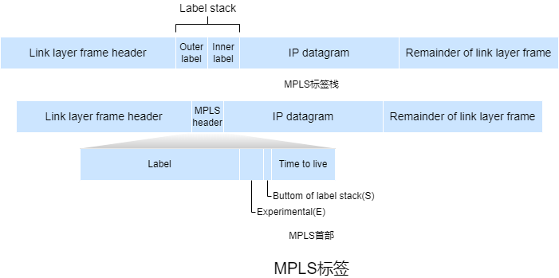

&emsp;&emsp;**MPLS标签栈**表示MPLS首部的排序集合。靠近链路层帧的MPLS首部称为栈顶标签或外层标签，靠近网络层数据报的MPLS首部称为栈底标签或内层标签。MPLS标签栈按后进先出方式组成首部，从栈顶开始处理首部。

&emsp;&emsp;MPLS首部位于链路层帧首部和网络层数据报首部之间。MPLS首部包括20位**标签**、3位**实验**、1位**栈底标识**和8位**生存时间**。

&emsp;&emsp;● 标签用于标识分组所属FEC。

&emsp;&emsp;● 实验常用于**服务分类**。

&emsp;&emsp;● 栈底标识值为1时表示为最底层标签。

&emsp;&emsp;● 生存时间与IPv4数据报中的生存时间相同。

&emsp;&emsp;支持MPLS的路由器称为**标签交换路由器**，MPLS分组仅能标签交换路由器之间传输。LSR通过在其转发表中查找MPLS标签来转发MPLS分组，然后将数据报移动到对应的输出接口。**标签交换路径**指同一FEC报文在MPLS域内转发的路径。

&emsp;&emsp;MPLS标签的基本操作包括**标签压入**、**标签交换**和**标签弹出**。

&emsp;&emsp;● 标签压入指当LSP入口节点添加新MPLS标签或LSP中间节点按需添加一层新的标签。

&emsp;&emsp;● 标签交换指LSP中间节点根据标签转发表替换MPLS分组的栈顶标签。

&emsp;&emsp;● 标签弹出指当LSP出口节点去除标签或在LSP倒数第二跳节点去除栈顶标签。

&emsp;&emsp;在MPLS域内的最后一跳时，MPLS标签已失去作用，可以利用**倒数第二跳弹出**在MPLS域内倒数第二跳节点将标签弹出以减少最后一跳的处理负担。

&emsp;&emsp;R1-R4是LSR，R5和R6是标准IP路由器。R1已向R2、R3通告可以路由到A，MPLS标签为6的帧将被转发到A。R3已向R4通告可以到达A和D，MPLS标签为10的帧将被转发到A，MPLS标签为12的帧将被转发到D。R2已向R4通告可以到达A，MPLS标签为10的帧将被转发到A。与交换LAN或ATM网络一样，R1-R4路由器的转发与IP数据报无关。

&emsp;&emsp;MPLS是一种简单形式的**流量工程**，其中ISP可以覆盖常规的IP路由并强制一些流量沿着一条链路传输到指定目的地，而其他流量则沿着另一条链路流向同一目的地。

&emsp;&emsp;MPLS可用于执行MPLS转发路径的快速恢复，例如用过预先计算的故障转移链路重新路由流量来响应链路故障。

&emsp;&emsp;MPLS可用于来实现**虚拟专用网络**，ISP使用支持MPLS的网络将客户的各种网络连接在一起。MPLS还可用于将VPN客户端使用的资源和地址与跨ISP网络的其他用户的资源和地址隔离。

#### 5.5 数据中心网络

&emsp;&emsp;每个数据中心都有**数据中心网络**，将其主机互联并将数据中心与互联网互联。数据中心网络的关键需求是计算和服务放置的灵活。

&emsp;&emsp;数据中心的主机称为**刀片**。刀片负责提供内容、存储数据并共同执行大型分布式计算。主机堆叠在机架上，每个机架顶部都有一台**机架式**交换机。TOR交换机将机架上的互联。机架上的主机都有一个与TOR交换机连接的网络接口卡，每个TOR交换机都有可以连接到其他TOR交换机的额外接口。每台主机都分配了数据中心的内网IP。

&emsp;&emsp;数据中心网络支持两种流量：外部客户端和内部主机之间的流量以及内部主机之间的流量。为了处理外部客户端和内部主机之间的流量，数据中心网络包括一个或多个**边界路由器**用于将数据中心网络连接到互联网。所以数据中心网络需要将所有主机互联并将机架与边界路由器连接。

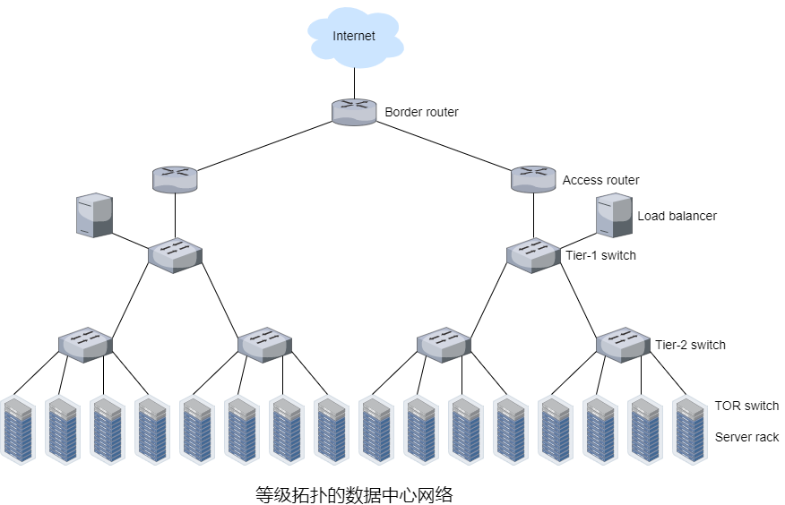

&emsp;&emsp;大型数据中心通常使用**等级拓扑**形式，其中有多个负载均衡器，每个负载均衡器专门用于一组特定的应用程序，这种负载均衡器也称为第四层交换机，因为它根据分组的端口号和目的IP地址进行决策。收到请求后，负载均衡器会将其转发到对应的主机，主机处理请求后将响应发送给负载均衡器，负载均衡器再将响应发送给客户端。负载均衡器不仅可以提供负载均衡，还可以提供类似NAT的功能，将公网IP地址转换为内网IP地址并将响应按向相反的转发方式处理。

&emsp;&emsp;在等级拓扑的数据中心网络中，边界路由器与接入路由器相连，接入路由器下有三层交换机。每台接入路由器下的主机构成一个子网，为了本地化ARP广播流量，这些子网进一步划分为VLAN子网。所有链路通常使用以太网作为链路层和物理层并使用铜缆和光纤。此外，数据中心还包括冗余网络设备和链路(例如，TOR交换机连接两台第二层交换机，每台接入路由器、第一层交换机和第二次交换机都可以冗余)。虽然这种结构解决了扩展性的问题，但是存在吞吐量的问题。

&emsp;&emsp;用**全连接拓扑**来代替交换机和路由器的等级结构可以改善吞吐量，这种结构中每台第一层交换机都连接到所有第二层交换机，因此需要考虑交换机之间选择算法，较简单的算法是随机，另一种在每个主机中部署多个网络接口卡，将主机连接到多个低成本商用交换机并允许主机在交换机之间智能路由流量。

&emsp;&emsp;另一种方式是采用基于集装箱的**模块化数据中心**。在MDC中，工厂在一个集装箱内建造一个迷你数据中心，并将集装箱运送到数据中心位置。当许多组件发生故障并且性能下降到阈值时，整个容器会被换掉。对于MDC，有两种网络类型：每个容器内的容器内部网络和连接每个容器的核心网络。容器内部可以使用全连接拓扑，但核心网络存在吞吐量问题。

#### 5.6 Web页面请求的流程

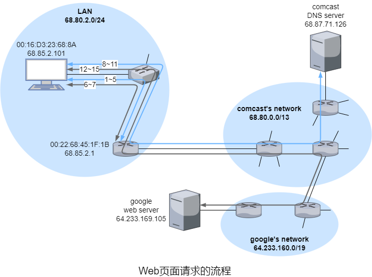

​		用户的主机用以太网电缆连接到局域网的以太网交换机，以太网交换机连接着路由器，路由器连接着ISP(comcast)且ISP为局域网提供DNS服务。就像大多数情况，DHCP服务器在路由器内运行。假设主机刚连接，并未获得IP地址，获得IP地址后用户会访问google主页。

​		1）主机生成DHCP请求报文并封装成源端口是68和目的端口是67的UDP报文段，进一步封装成源IP地址是`0.0.0.0`和目的IP地址是`255.255.255.255`的IP数据报，最后封装成源MAC地址是`FF:FF:FF:FF:FF:FF`和目的MAC地址是主机的MAC地址的以太网帧。

​		2）主机将广播以太网帧发送到以太网交换机，以太网交换机是自学习的，它更新了交换机表，然后在所有的输出接口广播该帧。

​		3）路由器收到帧后解封提取IP数据报，IP数据报被分解为UDP报文段并解封获取DHCP请求报文。路由器在CIDR块`68.85.2.0/24`中给主机分配了`68.85.2.101`并生成DHCP ACK报文，报文除了包含该IP地址还包含DNS服务器的IP地址`68.87.71.226`、默认网关`68.85.2.1`以及子网掩码`68.85.2.0/24`。DHCP ACK报文封装成UDP报文段再封装成以太网帧，以太网帧的源MAC地址是路由器接口的MAC地址，目的MAC地址是主机的MAC地址。路由器将以太网帧发送给以太网交换机。

​		4）以太网交换机收到帧后，根据交换机表将帧转发给连接到主机的接口。

​		5）主机收到帧后经过多次解封后提取DHCP ACK报文，主机中的DHCP客户端根据报文记录IP地址和DNS服务器IP地址并在IP转发表中更新默认网关的表项。此时，主机以完成网络组件的初始化，可以开始访问Web页面。

​		6）主机对google页面生成DNS查询报文，再封装成目的端口是53和目的IP地址是DNS服务器IP地址的数据报，最后封装成以太网帧。该帧将送给网关路由器，但主机并未获取网关路由器MAC地址，需要使用ARP，主机对默认网关生成ARP查询报文，层层封装成源MAC地址是`FF:FF:FF:FF:FF:FF`的以太网帧并发送给以太网交换机，以太网交换机转发给所有输出接口。

​		7）网关路由器收到以太网帧后，层层解封提取ARP查询报文，生成ARP响应报文并层层封装成目的MAC地址为主机MAC地址的以太网帧，最后将该帧发送给以太网交换机，以太网交换机转发给主机。

​		8）主机收到帧后，层层解封提取ARP响应报文并获得网关路由器的MAC地址，将之前待发送的帧的目的MAC地址设置为网关路由器的MAC地址并发送给以太网交换机，以太网交换机再转发给网关路由器。

​		9）网关路由器收到帧后解封提取包含DNS查询报文的IP数据报。网关路由器根据数据报的目的IP地址和转发表再次封装成帧并转发给comcast网络的边界路由器。

​		10）comcast网络的边界路由器收到帧后，解封提取IP数据报根据comcast的路由选择算法以及IBGP再次封装成帧并转发给DNS服务器。

​		11）DNS服务器收到帧后，层层解封提取DNS查询报文，根据DNS源记录生成DNS应答报文，封装成UDP报文段，再封装成IP数据报，最后封装成以太网帧反向转发给主机。

​		12）主机收到帧后，层层解封并获得google主页的IP地址，创建TCP套接字用于将HTTP GET报文发送给google主页。主机创建TCP套接字时必须先进行三次握手，主机生成一个80端口的TCP SYN报文段并封装成目的MAC地址是网关路由器MAC地址的帧，最后将帧发送给以太网交换机。

​		13）局域网、comcast网络和google网络的路由器根据BGP转发包含TCP SYN报文段的数据报。

​		14）google网络的HTTP服务器收到帧后，生成TCP SYNACK报文段并层层封装成目的MAC地址为google网络的第一跳路由器MAC地址的帧，最后转发给google网络的第一跳路由器。

​		14）包含TCP SYNACK报文段的数据报经过google网络、comcast网络和局域网到达主机。主机收到帧后，TCP进入连接状态。主机生成HTTP GET报文并写入套接字，然后封装成TCP报文段，就像12~14步中发送给google网络的HTTP服务器。

​		15）google网络的HTTP服务器从TCP套接字中读取HTTP GET报文，生成HTTP响应报文并发送到TCP套接字中。

