### 第六章 无线网络和移动网络

&emsp;&emsp;无线网络包括**无线主机**、**无线链路**、**基站**和**网络基础设施**。主机通过无线通信链路连接到基站或无线主机，这里的连接指的是主机位于基站的无线通信范围内且主机通过基站来中继和更大的网络。

&emsp;&emsp;连接到基站的主机通常以**基础设施模式**运行，因为所有传统网络服务都是由主机通过连接到基站的网络提供。在**自组织网络**中，无线主机没有可连接的此类基础设施，主机本身必须提供这些传统网络服务。

&emsp;&emsp;当移动主机超出一个基站额度范围并进入另一个基站的范围时，它会将其连接点更改为更大的网络，这个过程称为**切换**。

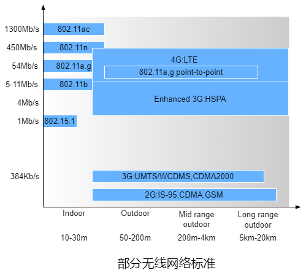

&emsp;&emsp;无线网络可以按基站与主机通信时经过单跳还是多跳以及网络中是否存在基础设施进行分类。

&emsp;&emsp;● **单跳且基于基础设施**的无线网络中有一个连接到更大的有线网络的基站，该基站与无线主机之间的所有通信都仅经过单挑。

&emsp;&emsp;● **单跳且无基础设施**的无线网络中的节点可以协调其他节点的传输。

&emsp;&emsp;● **多跳且基于基础设施**的无线网络中有一个有线连接到更大的网络的基站，为了通过基站通信，其中部分节点需要通过其他节点中继它们的通信。

&emsp;&emsp;● **多跳且无基础设施**的无线网络中没有基站，节点可能需要其他节点中继。若节点是移动的则称为**移动自组织网络**。若移动节点是车载的则称为**车载自组织网络**。

​		**蜂窝**(技术)是蜂窝网覆盖的区域被划分为称为**小区**或**蜂窝**的多个地理覆盖区域。每个蜂窝包含一个**基站收发台**，BTS负责像其蜂窝中的移动设备发送/接收信号。

​		移动设备在呼叫中将其关联从一个基站更改为另一个基站时出现**切换**。切换不仅导致移动设备关联新基站，而且导致呼叫从网络中的交换点重新路由选择到新基站。

​		对于TCP，比特差错或切换导致的报文段丢失不应该减小拥塞窗口，可以通过本地恢复、让TCP双方知晓无线链路、拆分连接来处理这个问题。本地恢复中的目标是在比特差错发生的时间和位置将其恢复，主要通过ARQ或FEC等实现。让TCP双方知晓无线链路的目标是区分有线网络的拥塞和其它两者并仅对拥塞进行拥塞控制。拆分连接常用于蜂窝网络，将连接分成无线部分和有线部分，无线部分使用标准TCP或带有差错恢复的UDP。

#### 6.1 无线链路和网络特征

&emsp;&emsp;相比有线链路，无线链路存在**信号强度的衰减**、**其他源的干扰**以及**多径传播**。

&emsp;&emsp;● 电磁波穿过物体时信号强度会衰减。随着传播距离的增加，电磁波信号强度也会降低，称为**路径损耗**。

&emsp;&emsp;● 同一频段的电磁波将互相干扰，此外，环境中的其他电磁波也会导致干扰。

&emsp;&emsp;● 当部分电磁波在物体或地面上反射时，在发送端和接收端之间经过了不同长度的路径，称为**多径传播**，这样会导致接收端收到的信号模糊。

&emsp;&emsp;无线链路相比有线链路更容易出现比特差错，因此无线链路不仅采用了CRC编码，还使用了链路层ARQ协议来重传受损的帧。

&emsp;&emsp;接收端收到的电磁信号是发送端传输的原始信号的退化形式(信号衰减和多径传播等)和环境中的噪声(干扰信号)的结合。**信噪比**是收到的信号和噪声强度的相对值，即以10为底接收到的信号的振幅的对数与噪声的振幅之比的20倍。

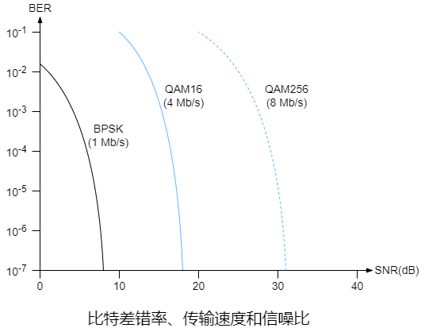

&emsp;&emsp;对于给定的调制技术，SNR越高，BER越低，发送端可以通过增加传输速率来增加SNR，进而降低BER。增加传输速率会消耗更大的能量而且可能干扰其他发送端的传输，传输功率达到某个阈值时收益将微乎其微。

&emsp;&emsp;对于给定的SNR，传输速率越高，BER越高。

&emsp;&emsp;物理层调制技术的动态选择可用于适配信道条件的调制技术。

#### 6.2 IEEE 802无线协议

&emsp;&emsp;在IEEE 802.11(WiFi)协议族中有几个WLAN技术的802.11标准。它们都使用了CSMA/CA协议，链路层帧结构相同，可以通过降低传输速率来增加传输距离，而且向后兼容。

| 标准     | 频率范围(Hz) | 最高传输速率(Mb/s) |
| -------- | ------------ | ------------------ |
| 802.11b  | 2.4G         | 11                 |
| 802.11a  | 5G           | 54                 |
| 802.11g  | 2.4G         | 54                 |
| 802.11n  | 2.5~5G       | 450                |
| 802.11ac | 5G           | 1300               |

&emsp;&emsp;802.11设备工作在2.4G\~2.485G(称为2.4GHz)和5.1\~5.8GHz(5GHz)这两个不同的频段。2.4GHz是无须许可的频段，802.11设备可能与2.4GHz电话或微波炉竞争。在5GHz频段，802.11 LAN在给定功率时传输距离更短且更容易受到多径传播的影响。802.11n和802.11 ac使用多输入多输出(MIMO)天线，即发送端和接收端都有两个或多个天线用来发送/接收不同的信号。802.11 ac基站可以同时向多个基站发送信号，并使用智能天线自适应成型波束向目的地传输，这样减少了干扰并增加了给定速率下的传输距离。

&emsp;&emsp;除了802.11，其他两个802无线协议是使用802.15.1的蓝牙以及使用802.15.4的ZigBee。802.15.1是低功率、小范围、小速率的电缆代替技术，因此802.15.1也称为**无线个人局域网**。802.15.4服务于低功率、低数据率和低工作周期的应用，例如物联网设备。

##### 6.2.1 802.11体系结构

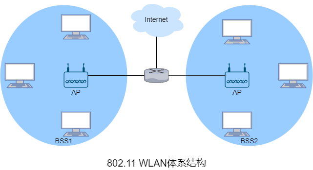

&emsp;&emsp;802.11体系结构的基本构建块是**基本服务集**。BSS包含一个或多个无线主机和一个称为**接入点**的中央基站。在常规的家庭网络中，一个AP和一个路由器(通常集成为一个单元)将BSS连接到互联网。

&emsp;&emsp;类似于以太网设备，每个802.11无线主机都有MAC地址，该地址存储在设备适配器(802.11网络接口卡)的固件中。每个AP的无线接口也有一个MAC地址。

&emsp;&emsp;部署AP的WLAN称为**基础设施WLAN**，基础设施指AP以及互联AP和路由器的有线以太网。802.11设备能将组成一个自组织网络，该网络无中央控制且与外部没有连接。

&emsp;&emsp;在802.11中，每个无线主机都需要与AP相连才能发送或接收网络层数据报。

&emsp;&emsp;在安装AP时会为AP分配一个或两个词的**服务集标识符**和一个信道号。802.11在2.4Ghz~2.485Ghz的频段内运行，在这个85MHz的频段内，802.11定义了11个部分重叠的信道，两个信道只有被4个或更多信道隔开时才不会有重叠，因此信道1、6和11的唯一的三个不重叠信道集合，同一个网络里可以安装3个802.11b AP并为这些AP分配信道1、6和11，然后将每个AP都连接到同一交换机上。两个不同ISP在同一区域都设置了AP且使用了相同的信道，若两个AP同时接收则会导致其中之一丢弃地址错误的帧，若两个AP同时发送则会导致碰撞。

&emsp;&emsp;**WiFi丛林**指无线主机能从两个或多个AP接收到足够强的信号的任何物理位置。无线主机需要与AP**关联**才能加入AP所属子网并访问互联网，关联表示无线主机与AP建立一条虚拟链路。

&emsp;&emsp;802.11标准中AP会定期发送**信标帧**，每个信标帧包含AP的SSID和MAC地址。无线主机会扫描11个信道来获悉信标帧以及发送的AP。802.11标准并没有指定AP关联的算法，该算法由无线主机中的802.11固件和软件设计者决定。通常，设备会选择接收到的信标帧信号强度最高的AP，显然信号强度并不是决定设备接收性能的唯一AP特性。

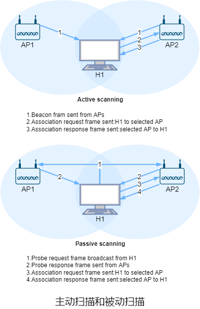

&emsp;&emsp;扫描信道和侦听信标帧的过程称为**被动扫描**。无线主机也能通过向无线主机范围内所有的AP广播探测帧来**主动扫描**。无线主机选择AP后，向AP发送关联请求帧，AP响应关联响应帧。一旦与AP关联，无线主机将加入AP所属子网。

&emsp;&emsp;为了创建与特定AP的关联，无线主机可能需要向AP认证自身。802.11 WLAN为认证和访问提供了多种选择，例如基于主机的MAC地址和使用账户和密码，这两种方式中，AP通常与认证服务器通信，使用诸如RADIUS或DIAMETER之类的协议在无线主机与认证服务器之间中继信息。分离认证服务器和AP使得认证服务器可以为多个AP服务，将认证和访问的决策集中在单个服务器中，并降低AP成本和复杂度。

##### 6.2.2 802.11 MAC协议

&emsp;&emsp;802.11的载波侦听分为物理侦听和虚拟侦听，主要使用虚拟侦听。802.11使用**网络分配向量**来实现虚拟侦听，NAV是一个微秒计时器，用来指示预计使用信道的时间，当NAV不为0时则表示信道忙碌。由于各种原因，帧可能无法完整地达到目的地，因此使用了类似于rdt2.0中ACK的**链路层确认**。

&emsp;&emsp;802.11MAC协议中帧间都有**帧间间隔**。一般情况下，发送帧前需要等待**分布式帧间间隔**，发送ACK帧前需要等待**短帧帧间间隔**，重传帧时需要等待**扩展帧间间隔**。SIFS是固定值，DIFS=SIFS+2slot time。t(ACK)表示最低速率传输ACK所需时间，则EIFS=time(ACK)+SIFS+DIFS。

&emsp;&emsp;802.11 MAC协议包括**分布式协调功能**、**点协调功能**和**混合协调功能**三种工作模式，其中DCF是PAF和HCF的基础，PCF是可选项，HCF提供QOS的支持。DCF采用竞争的方式接入信道，PCF采用统一分配的方式接入信道，HCF在DCF的基础上加入了QOS的支持。

&emsp;&emsp;● DCF是站点共享信道的接入方式，接入方式是CSMA/CA，还加入了可选的短**请求发送**控制帧和短**允许发送**控制帧来避免长数据帧的碰撞。

&emsp;&emsp;● PCF中需要一个站点作为**点协调器**，点协调器周期性地发送信标帧来广播WLAN的网络标识和管理参数，其他站点根据管理参数来设置NAV。由于信标帧通过DCF发送，点协调器必须参与信道竞争。PCF只能在**非竞争期**工作，其机制类似于轮流协议中的轮询协议，点协调器轮询其他节点，轮询的节点才能传输帧，帧的长度受到限制。

&emsp;&emsp;● HCF类似于PCF，但可以在**竞争期**工作且支持QOS。

&emsp;&emsp;802.11并未实现碰撞检测，因为碰撞检测需要同时传输和侦听，由于接收信号的强度通常远小于发送信号的强度，实现碰撞检测成本较高。即使网络适配器可以同时传输和侦听(并在检测到碰撞时时中止传输)，由于隐藏终端和信号衰减的问题，网络适配器依然无法检测到所有碰撞。

&emsp;&emsp;当源站点有帧待发送时需要先侦听信道，当信道空闲后需要等待DIFS，若在此期间未侦听到信号就发送帧，否则源站点像CSMA/CD一样使用二进制指数退避算法计算退避时间并启动**退避计时器**，不同的是基本退避时间为一个时隙，退避时间的随机区间为[0,CW*slot time)，CW是**竞争窗口**，最小值是$2^4-1$，最大值是$2^{10}-1$。侦听到的信道空闲时间至少为一时隙时，计时器才会减一(时隙)。若在退避时间内侦听到信号则暂停计时器，然后会重新等待到信道空闲并在下一个DIFS后再次启动计时器(计时器时间是剩下的时间)，计时器为0时发送帧。若两个或多个站点选择了相同的退避时间则可能导致碰撞，碰撞后CW会变为原来的2倍加一。当目的站点收到通过CRC的帧时，它会等待SIFS后响应一个ACK帧。若源站点等待ACK帧超时则会等待EIFS后重传，在给定次数的重传后依然未收到ACK帧则丢弃帧。

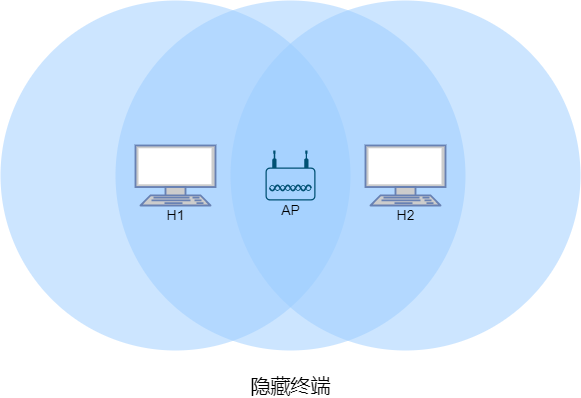

&emsp;&emsp;无线主机H1和H2都在AP的范围内且都与AP关联，但由于信号衰减，两个无线主机对AP不隐藏，但是对彼此隐藏。若H1正在传输帧时，H2也要传输帧，这会导致碰撞，因此H1和H2的整个传输期间，信道都被浪费。

&emsp;&emsp;为了避免隐藏终端导致的问题，802.11协议允许无线主机使用RTS帧和CTS帧来预约信道的访问。类似于TCP建立连接，当源站点有数据帧要发送时，可以先向AP发送一个RTS帧来指示传输数据帧和ACK帧所需的总时间，能够侦听到源站点信号的站点会进入NAV静默状态。当AP收到RTS帧后通过广播CTS帧来响应，这样既给了源站点明确的发送权限，也指示了其他站点在预约时间内不要发送，其他所有节点也进入NAV静默状态。若等待CTS帧超时则像发送普通数据帧一样使用二进制指数退避算法来计算退避时间并等待然后重传。

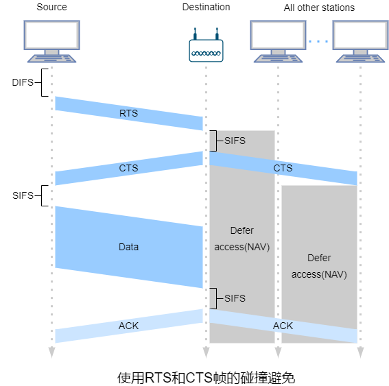

&emsp;&emsp;尽管RTS和CTS帧有助于减少碰撞，但也引入了延迟并消耗信道资源，因此，RTS和CTS帧仅用于长数据帧的传输信道预约。实际上可以为每个无线站点设置RTS阈值，当帧的长度超过阈值时才使用RTS/CTS帧，默认阈值一般是2347字节，即不使用。除了解决隐藏终端，RTS和CTS帧体现了用短帧的碰撞来避免长帧的碰撞。

##### 6.2.3 802.11帧

&emsp;&emsp;802.11帧分为**数据帧**、**控制帧**和**管理帧**。数据帧用于传输数据，控制帧通常与数据中配合使用。负责区域的清空、信道的取得、载波侦听的维护和响应数据。管理帧用于加入或退出WLAN以及处理基站之间的转移。

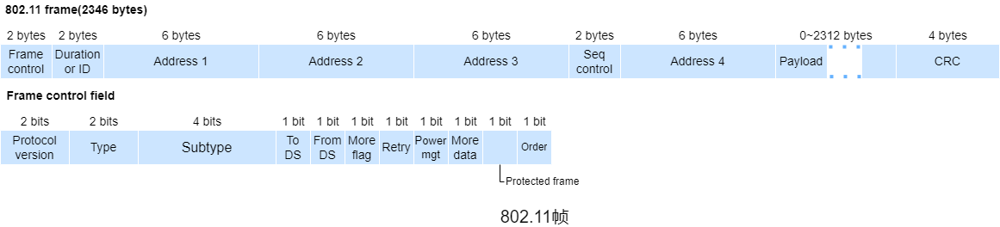

&emsp;&emsp;802.11帧包括2字节**帧控制**、2字节**持续期或ID**、6字节**地址1**、6字节**地址2**、6字节**地址3**、2字节**序号控制**、6字节**地址4**、最大2312字节有效载荷以及4字节CRC。

&emsp;&emsp;帧控制包括帧的类型信息和一些控制位。

| 帧控制字段       | 长度(位) | 描述                                                         |
| ---------------- | -------- | ------------------------------------------------------------ |
| protocol version | 2        | 802.11协议版本，目前只有一个版本，该字段值为0                |
| type             | 2        | 值为00时表示管理帧，值为01时表示控制帧，值为10时表示数据帧，值为11保留 |
| subtype          | 4        | 具体的802.11帧类型信息                                       |
| to DS            | 1        | 值为1时表示帧发送到无线工作站(例如AP)                        |
| from DS          | 1        | 值为1时表示帧由无线工作站(例如AP)发送                        |
| more flag        | 1        | 类似于IPv4数据报中的分片标志位                               |
| retry            | 1        | 值为1时表示重传帧                                            |
| power management | 1        | 值为1时发送完本帧后进入省电模式                              |
| more data        | 1        | 仅用于管理帧，控制帧的该字段值为0                            |
| protected frame  | 1        | 值为1时表示有效载荷已加密                                    |
| order            | 1        | 值为1时表示帧按序传输                                        |

&emsp;&emsp;持续器用于记载NAV的值。当最后一位为0时用于设置NAV，例如RTS和CTS帧中会设置这个值来指示其他站点在指定时间内不要发送帧。

&emsp;&emsp;地址1表示接收端(接收端不一定是目的地)的MAC地址。

&emsp;&emsp;地址2表示发送端(发送端不一定是源)的MAC地址。

&emsp;&emsp;地址3用于基站和传输系统的过滤，具体用法取决于网络类型。例如一台路由器需要向某个BSS中的某台无线主机发送帧，但是路由器并不知道它通过AP到达无线主机间，路由器发送目的MAC地址为无线主机的以太帧到AP。AP收到以太网帧后将其转换为802.11帧，该802.11帧的地址1是无线主机的MAC地址，地址2是自身地址，地址3是路由器发送数据报接口的MAC地址。

&emsp;&emsp;序号控制类似于rdt2.0中的序号。

&emsp;&emsp;地址4仅在无线分布式系统中使用。

##### 6.2.4 蓝牙和ZigBee

&emsp;&emsp;802.15.1的链路层和物理层基于早期的PAN蓝牙规范。802.15.1以TDM方式在2.4GHz频段上运行，时隙是625$\mu s$。在每个时隙中，发送端在79个信道中的一个上进行传输，信道以已知但伪随机的方式跳频，称为**跳频扩频**。802.15.1可提供最高$4 M(b/s)$的传输速率。

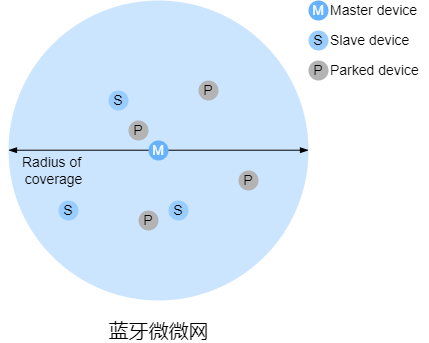

&emsp;&emsp;802.15.1网络是自组织网络，802.15.1设备首先组织成最多八个活动设备的**微微网**，这些设备之一被指定为主设备，其他设备充当从设备。主节点管理微微网，因为它的时钟决定微微网的时间，它可以在每个奇数时隙中传输，而从设备只能在主设备前一时隙与它通信后才能传输。除了从设备，微微网还可以容纳最多255个停放设备，停放设备只能在主设备将其状态变更为活动后才能通信。

&emsp;&emsp;ZigBee定义了20、40、100和250$K(b/s)$的信道速率，具体取决于信道的频率。在ZigBee网络中，多个相对简化功能的设备在单个全功能设备的控制下运行，并且多个全功能设备还能够配置为一个网状网络，全功能设备在它们之间路由帧。

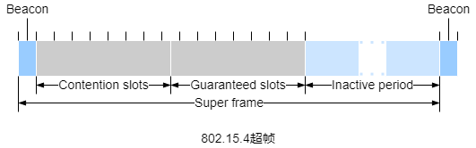

&emsp;&emsp;单个全功能设备使用信标帧以时隙方式控制多个简化功能的设备。ZigBee网络将时间划分为重复出现的超帧，每个超帧以信标帧开始。信标帧将超帧划分为活跃周期(此周期内设备可以传输)和不活跃周期(此周期内设备可以休眠来节能)。活跃周期由16个时隙组成，其中部分由使用CSMA/CA随机接入方式的设备使用，其余部分由控制器分配特定的设备来给这些设备提供有保障的信道接入。

#### 6.3 蜂窝互联网接入

&emsp;&emsp;**蜂窝**(技术)是蜂窝网覆盖的区域被划分为称为**小区**或**蜂窝**的多个地理覆盖区域。每个蜂窝包含一个**基站收发台**，BTS负责像其蜂窝中的移动设备发送/接收信号。

&emsp;&emsp;最早的几代蜂窝主要服务于语音流量。第一代(1G)是专为纯语音通信设计的模拟**频分多址**系统。最初的2G系统也是为语音而设计的，后来扩展了对数据(互联网)的支持(2.5G)。3G系统支持语音和数据，但更强调数据能力和更高速的无线接入链路。4G系统基于LTE，其特点是全IP核心网络并以$M(b/s)$速率提供语音和数据服务。

&emsp;&emsp;2G蜂窝系统的GSM标准使用组合的FDM/TDM(无线电)作为空中接口。对于组合FDM/TDM系统，若将信道划分为$F$个子信道且时间划分为$T$个时隙，则该信道能够支持$F\cdot T$个并发呼叫。GSM系统由$200kHz$的频段组成，每个频段支持8个TDM呼叫。GSM以$13K(b/s)$和$12.2K(b/s)$编码语音。

&emsp;&emsp;单个GSM网络的**基站控制器**通常会为数十个BTS提供服务。BSC的作用是为移动设备分配BTS无线电信道，执行**寻呼**(查找移动设备所在的蜂窝)。基站控制器及其受控的BTS共同构成一个GSM**基站系统**。

&emsp;&emsp;**移动交换中心**在用户授权和计费、呼叫建立和断开以及切换中发挥着决定性作用。单个MSC通常最多包含5个BSC，因此每个MSC大约有20万用户。蜂窝提供商的网络有多个MSC，其中称为网关MSC的特殊的MSC将提供商的蜂窝网络连接到更大的公共电话网络。

&emsp;&emsp;**通用分组无线服务**是2G网络中的一种早期蜂窝数据服务，基于GSM的无线分组交换技术，提供端到端且广域的无线IP连接。

##### 6.3.1 3G蜂窝网

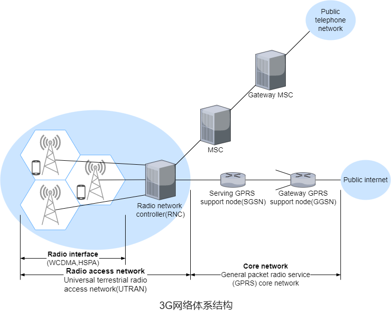

&emsp;&emsp;相比2G，3G UMTS不再使用GSM的FDMA/TDMA方案，而是在TDMA时隙内使用**直接序列宽带码分多址**，类似于DOCSIS。与WCDMA规范相关的数据分为称为高速分组接入。

&emsp;&emsp;3G核心蜂窝数据网络将无线接入网络连接到公网。鉴于现有蜂窝语音网络存在大量现有基础设施，因此3G保持现有核心GSM蜂窝语音网络不变，同时添加额外的蜂窝数据功能到现有的蜂窝语音网络。

&emsp;&emsp;3G核心网中有**GRRS服务支持节点**和**GRPS网关支持节点**这两种节点。SGSN负责向与其连接的无线接入网中的移动节点发送/接收数据报。SGSN与同一区域的蜂窝语音网络的MSC交互，提供用户授权和切换，维护活跃移动节点的蜂窝信息，并在无线接入网络中的移动节点和GGSN间转发数据报。GGSN充当网关，将多个SGSN连接到公网。因此，GGSN是源自移动节点的数据报进入公网之前经过的最后一个3G基础设施。对外界而言，GGSN无异于其他网关路由器。GGSN网络内3G节点的移动性对外隐藏。

&emsp;&emsp;3G**无线接入网络**是移动节点接触的无线首跳网络。**无线网络控制器**(又称为Node B)通常控制多个蜂窝的BTS。每个蜂窝的移动节点和BTS之间通过无线链路连接。RNC通过MSC连接到连接到电路交换蜂窝语音网络，并通过SGSN连接到公网。3G蜂窝语音服务和数据服务虽然使用不同的核心网络，但它们共享第一跳和最后一跳无线接入网络。

##### 6.3.2 4G蜂窝网

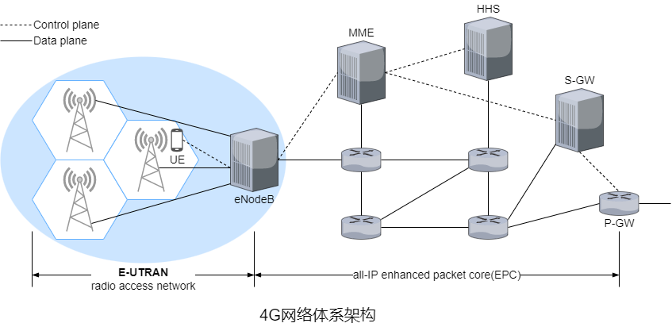

&emsp;&emsp;相比3G，4G使用了**全IP核心网络**(语音和流量全都承载在IP数据报中)和增强的无线接入网络，而且4G对数据平面和控制平面进行了分离。

&emsp;&emsp;**eNodeB**是2G的基站和3G的RNC的逻辑后代。在控制平面中，eNodeB代表UE来处理注册和移动信令流量。在数据平面中，eNodeB负责在UE和P-GW之间转发数据报。UE数据报在eNodeB中封装并通过4G网络的全IP增强型分组核心(EPS)以隧道形式传输到P-GW。eNodeB与P-GW之间的隧道类似于IPv6中IPv4迁移到IPv6的隧道，这些隧道可能具有相关的QOS保证。

&emsp;&emsp;**分组数据网络网关**为UE分配IP地址并保证QOS的执行。作为隧道端点，它负责封装和解封装发给UE和来自UE的数据报。

&emsp;&emsp;**服务网关**是数据平面移动锚点，即所有UE流量都将通过。S-GW还负责收费/计费以及合法的流量拦截。

&emsp;&emsp;**归属用户服务器**容纳包括漫游接入能力、QOS配置文件和认证信道的UE信息，它从UE归属蜂窝提供商获得这些信息。

&emsp;&emsp;**移动性管理实体**代表驻留在其控制的蜂窝中的UE执行连接和移动性管理，它从HHS接收UE订阅信息。

&emsp;&emsp;LTE在下行信道使用组合FDM/TDM，称为**正交频分复用**。在LTE中，每个活跃移动节点在一个或多个信道频率中被分配一个或多个0.5$ms$时隙。分配的时隙越多，移动节点能够获取的传输速率越高。移动节点之间的时隙(重)分配可以每$ms$执行一次。

&emsp;&emsp;LTE标准没有规定分配移动节点特定的时隙。允许那些移动节点在特定频率上的给定时隙中进行传输由LET设备供应商或网络运营商提供的调度算法决定。使用机会调度，将物理层协议与发送端和接收端之间的信道条件相互匹配，并根据信道条件选择分组将发送到达接收端，使RNC能够充分利用无线链路。此外，用户的优先级和约定的服务级别可用于调度下行分组传输。高级LTE通过向移动节点分配聚合信道提供数百$M(b/s)$的下行带宽。

&emsp;&emsp;另外一种4G无线是使用802.16的WiMAX。

#### 6.4 移动管理

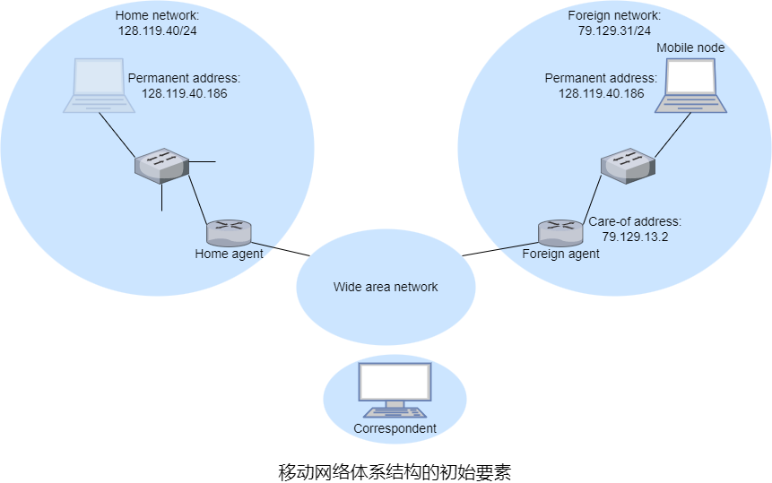

&emsp;&emsp;在网络环境中，一个移动节点的永久归属地称为**归属网络**。归属网络内代表移动节点执行移动管理的实体称为**归属代理**。移动节点当前所在的网络称为**外部网络**或**被访网络**，外部网络中帮助移动节点实现移动管理的实体称为**外部代理**。会话开始时移动节点所在外部网络的外部代理称为**锚外部代理**。将与移动节点通信的实体称为**通信者**。

&emsp;&emsp;当移动节点驻留在外来网络中时，所有发往该节点永久地址的流量需要路由到外地网络。为了实现这一点，一种方法是外部网络向所有其他网络通告移动节点驻留在其网络中，这通常可以通过交换域内和域间路由选择信息实现，而且只需要对现有路由选择基础设施进行少量改动即可。外部网络只需向它的邻居通告有一条特定的路由可以到达该移动节点的永久地址。类似于DV算法，作为更新路由选择信息和转发表的一个流程，这些邻居在整个网络传播此路由信息。当移动节点离开该外部网络并加入另一个外部网络是，新外部网络将通告一条通向该移动节点的新路由，而旧外部网络将撤销与该移动节点相关的路由选择信息。而实际中才用了另一种方法，将移动功能从网络核心转移到网络边缘，主要通过移动节点的归属网络来实现。

&emsp;&emsp;外部代理放置于外部网络的边缘路由器上，外部代理的作用之一是为移动节点创建一个所谓的**转交地址**，COA的网络部分与外部网络CIDR的网络部分相同。因此一个移动节点可与永久地址以及COA关联。外部代理的另一个作用是通知归属代理移动节点驻留在其网络中且具有给定的COA。移动节点可以(通过DHCP等协议)获取外部网络的COA并通知给归属代理。

##### 6.4.1 移动节点的间接路由选择

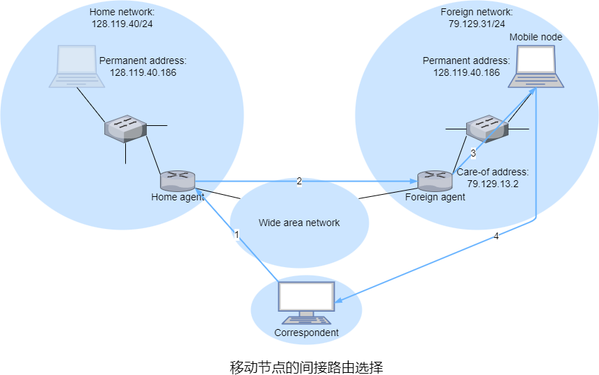

&emsp;&emsp;在**间接路由选择**中，通信者是将数据报寻址到移动节点的永久地址并将数据报发送到网络中，并不知道移动节点是驻留在归属网络还是外部网络。这些数据报首先路由到移动节点的归属网络。归属代理收到数据报后将其转发给外部代理，然后外部代理在转发给移动节点。若移动节点需要发送数据报给通信者，可以直接发送给通信者。

&emsp;&emsp;为了确保通信者发送的数据报的完好无损以及对移动节点隐藏数据报经过了归属代理的转发，可以建立类似于IPv6中IPv4迁移到IPv6的隧道，即归属代理将通信者的数据报封装在另一个数据报。归属代理将移动节点的COA作为封装后的数据报的目的IP地址来将数据报路由到外部网络。外部代理收到封装的数据报后拆封再将原始数据报转发给移动节点。

&emsp;&emsp;间接路由选择需要移动节点到外部代理的协议、外部代理到归属代理的注册协议、归属代理数据报封装协议以及外部代理拆封协议这些网络层新功能。当移动节点连接到外部网络时需要向外部代理注册，离开时也需要注销。此外，外来代理将向归属代理注册移动节点的COA，当移动节点离开网络不需要显式注销COA，因为移动节点再次连接新网络时，新COA的注册会完成注销。

&emsp;&emsp;间接路由选择存在**三角路由选择**问题，即发往移动节点的数据报需要先发送到归属代理再发送到外部网络。最坏的情况是移动节点与通信者在同一外部网络，但数据报还是需要先发往归属代理再回到该外部网络。

##### 6.4.2 移动节点的直接路由选择

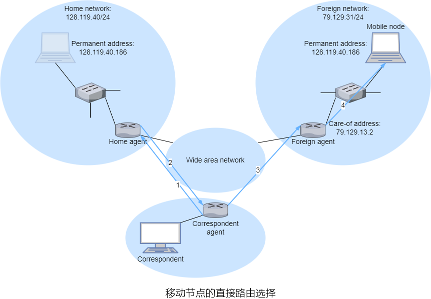

&emsp;&emsp;**直接路由选择**解决了三角路由选择问题，但是在通信者所在的网络中加入了**通信者代理**，通信者代理需要先获取移动节点COA，这可以通过向归属代理查询来完成。通信者代理通过隧道将数据报发送移动节点的COA，外部代理收到数据报后再拆封并转发给移动节点。

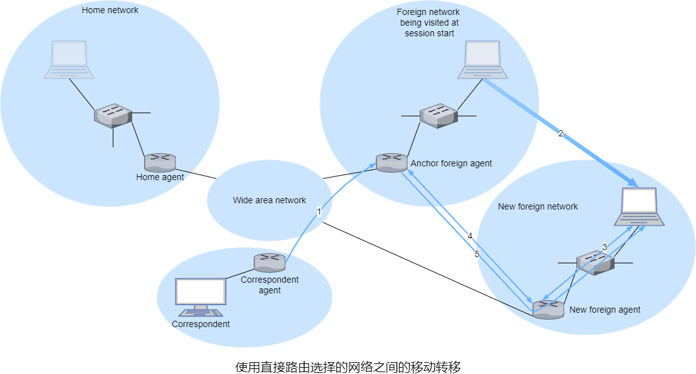

&emsp;&emsp;直接路由选择需要移动节点定位协议来查询归属代理并获得移动节点的COA。通信者代理仅在会话开始时查询归属并代理获得移动节点的COA，这样会导致会话过程中数据无法在移动节点切换外部网络后路由选择到新外部网络。一种解决方法是创建一个协议来告知通信者切换网络后的COA，GSM实践中采用了另一种方法，当移动节点移动到另一个外部网络后，移动节点向新的外部代理注册，新的外部代理再向锚外部代理提供移动节点新COA。当锚外部代理收到发往已离开该外部网络的移动节点的数据报后，它使用新COA再次封装数据报并转发给移动节点。若移动节点再次移动到另一个外部网络，则新外部代理将联系锚外部代理提供新COA。

#### 6.5 移动IP

&emsp;&emsp;移动IP标准由**代理发现**、**向归属代理注册**、**数据报的间接路由选择**这三部分组成。

​		加入新网络(外部网络或归属网络)的移动节点，它都必须知道相应的外部代理或归属代理的身份。实际上，正是具有新IP地址的的外部代理才允许移动节点的网络层知道自身已进入一个新外部网络，称为代理发现。代理发现可以通过**代理通告**或**代理请求**实现。

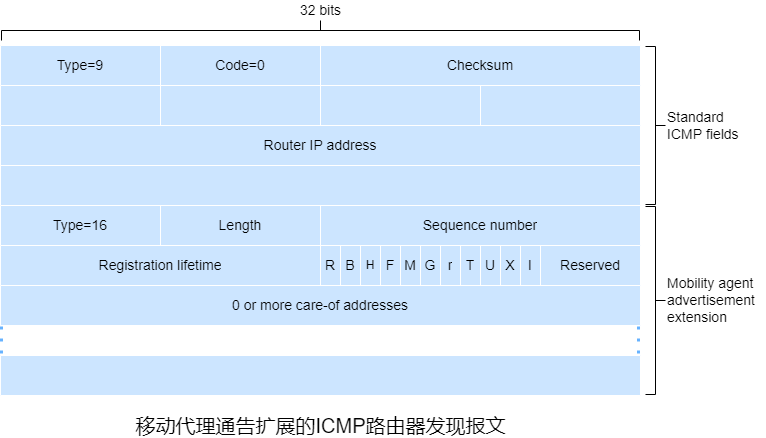

​		借助于代理通告，外部代理或本地代理使用扩展ICMP路由器发现报文来通告其服务。外部代理或本地代理周期性地在所以连接的链路上广播ICMP报文(type=9)。

| 字段名称                 | 字段长度(位) | 字段描述                                                     |
| ------------------------ | ------------ | ------------------------------------------------------------ |
| Router IP address        | 32           | 发送该报文的代理的IP地址                                     |
| type                     | 8            | 值固定为16                                                   |
| length                   | 8            | 值为6+4N，N表示COA的个数                                     |
| sequence number          | 16           | 代理启动后的第一个通告序列号必须是0，之后每次加一，但0xFFFF之后必须是256，这样可以区分序列号减小是由于重启还是达到序列号最大值 |
| registration lifetime    | 16           | 注册的最大生命周期(以秒为单位)。0xFFFF表示无穷大             |
| registration required(R) | 1            | 此网络中的移动节点必须向外部代理注册。若移动节点无法(使用DHCP)在外部网络中获取COA且无法承担自身外部代理的功能，则无需向外地代理注册 |
| busy(B)                  | 1            | 代理不再接受新移动节点的注册                                 |
| home agent(H)            | 1            | 代理为它所在网络的归属代理                                   |
| foreign agent(F)         | 1            | 代理为它所在网络的外部代理                                   |
| minimal encapsulation(M) | 1            | 隧道支持最小封装                                             |
| GRE encapsulation(G)     | 1            | 隧道支持GRE                                                  |
| reserved(r)              | 1            | 值固定为0                                                    |
| reverse tunneling(T)     | 1            | 支持反向隧道                                                 |
| U                        | 1            | 支持UDP                                                      |
| X                        | 1            | 支持撤销注册                                                 |
| I                        | 1            | 支持区域注册                                                 |
| COA address              | 32N          | 外部代理提供COA列表，移动节点选择一个作为其COA               |

​		移动节点可以通过代理请求直接广播ICMP报文(type=10)，收到该报文的代理将单播一个代理通告。

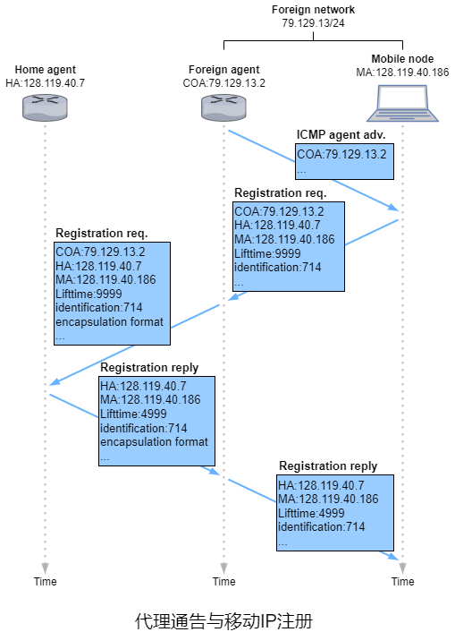

​		1）当收到代理通告后，移动节点向外部代理发送移动代理注册报文。注册报文由UDP数据报承载并发送到434端口，包括选择的COA、归属代理的IP地址、移动节点的永久IP地址、请求注册的生命周期以及一个64位的注册标识。

​		2）外部代理收到注册报文后记录移动节点的永久IP地址，将注册请求报文再封装并以隧道的形式发送给归属代理，报文同样由UDP数据报承载并发送端434端口。

​		3）归属代理收到注册请求并检测其真实性和正确性。归属代理将移动节点永久IP地址和COA绑定，然后将注册响应再封装并以隧道的形式发送给外部代理，报文中包括归属代理的IP地址、移动节点的永久IP地址、实际注册生命周期以及请求的注册标识。

​		4）外部代理收到再封装的注册响应后拆封并转发给移动节点。

#### 6.6 蜂窝网络中的移动性

​		在GSM中移动设备的归属网络称为该移动设备的**归属公共陆地移动网络**，这里简称归属网络，而移动设备当前所在的PLMN简称为被访网络。

​		归属网络维护一个称为**归属位置寄存器**的数据库，其中包含该网络中每个移动设备的永久手机号码和概要信息以及用户当前位置的信息，因此当移动设备漫游到另一个提供商的蜂窝网络中，HLR中包含足够的信息来获取移动设备被呼叫时应该路由选择到的被访网络的的IP地址。当移动设备被呼叫时，通信者会联系归属网络中一个称为**网关移动交换中心**的交换机，这里简称为**归属MSC**。

​		被访网络维护一个称为**拜访位置寄存器**的数据库，其中包含该网络中每个移动设备的表项，VLR表项因此随着移动设备加入或退出网络而新增或删除。VLR通常与MSC位于同一位置，MSC协调到达或离开被访网络的呼叫的建立。

​		在实际中，提供商的蜂窝网络作为其用户的归属网络以及其他提供商的蜂窝网络的用户的被访网络。

##### 6.6.1 移动设备呼叫的路由选择

​		当移动设备切换或进入一个新VLR覆盖的被访网络时，必须和VLR交换信令报文来向被访网络注册。被访网络的VLR再向移动设备的HLR发送位置更新请求报文来告知HLR可用于联系移动设备的**动态漫游号**或VLR地址，VLR从HLR获取移动设备的信息并确定被访网络应向移动设备提供对应的服务(如果有)。MSRN的功能类似于COA，对通信者和移动设备都隐藏。

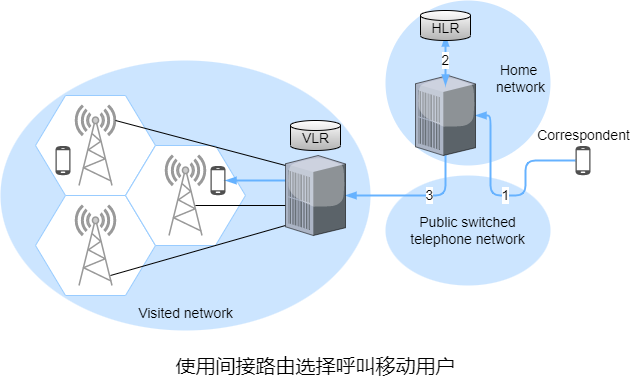

​		与移动IP一样，GSM采用了间接路由选择，先将通信者的呼叫路由选择到移动节点的归属网络，再到被访网络。

​		1）通信者拨打移动设备的电话号码。呼叫通过**公共交换电话网络**到达移动设备的归属MSC。

​		2）归属MSC收到呼叫后查询HLR来确定移动设备的位置。在最简单的情况下，HLR返回MSRN。若HLR中没有MSRN则返回VLR在被访网络中的地址。

​		3）归属MSC获得MSRN后，通过PSTN到达被访网络的MSC建立第二段呼叫来完成呼叫。

##### 6.6.2 GSM中的切换

​		在与基站关联时，移动设备会定期测量关联基站的信标信号强度与其他基站的信标信号强度，结果以每秒一次或两次的频率报告给关联基站，关联基站根据测量结果、附近蜂窝的移动设备负载以及其他因素来切换。GSM标准中没有规定执行切换的具体算法。

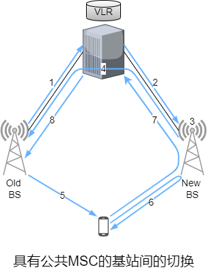

​		1）旧BS通知被访MSC将移动设备执行切换和将切换到的BS(组)。

​		2）被访MSC发起到新BS的路径建立，分配承载重新路由的呼叫所需的资源以及用信令告知新BS切换即将发生。

​		3）新BS分配并激活一个无线信道供移动设备使用。

​		4）新BS向被访MSC和旧BS发生信令通知已建立被访MSC到新BS路径并且应该通知移动设备即将发生的切换。新BS提供移动设备与新BS关联所需的所有信息。

​		5）移动设备被告知它应该执行切换。之前移动设备并不知道网络以及为切换做好所有底层工作。

​		6）移动设备和新BS交换一个或多个报文来完全激活新BS中的信道。

​		7）移动设备向新BS发生一个切换完成报文，然后该报文被转发到被访MSC。被访MSC通过新BS将正在进行的呼叫重新路由到移动设备。

​		8）到旧BS的路径分配的资源随后释放。

​		GSM中定义了类似于锚外部代理的**锚MSC**，锚MSC是呼叫开始时移动设备的被访MSC，它在整个呼叫持续过程中保持不变。无论移动设备在呼叫的过程中转移多少次，呼叫都是从归属MSC路由选择到锚MSC再到移动设备当前的被访MSC，因此，通信者和移动设备间最多有3个MSC。除了保持锚MSC到当前被访MSC的单MSC跳，另一种方法是直接将移动设备被访MSC链接起来(出现在IS-41蜂窝网络中)，每当移动设备移动到一个MSC后，让旧MSC将呼叫转发给新MSC。