### 第七章 网络安全

​		**安全通信**应该具有保密、报文完整、端点认证、运行安全的特点。

​		互联网协议栈中不止网络层提供安全性功能。首先，网络层可以通过加密数据报中的有效载荷以及认证所有源IP地址来提供全面覆盖的安全性，但并不能提供用户级安全，因此也需要其他层的安全性功能来实现。其次，在协议栈的较高层部署新的的互联网服务(包括安全性服务)通常更容易。

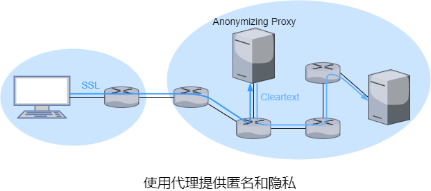

​		为了在访问Web获得隐私和匿名，可以组合使用可信代理服务器和SSL。首先主机与可信代理服务器建立SSL连接，通过SSL连接发送到所需站点的HTTP请求。代理收到SSL加密的HTTP请求后，它会解密该请求并将明文HTTP转发到网站，然后服务器响应代理，代理再通过SSL将响应转发给主机。该Web站点仅能看到代理的IP地址，主机的本地ISP无法记录主机的访问，但代理可以获取主机的IP地址以及主机和网站之间所有明文流量。因此，这种方式的安全取决于代理的可信度。

​		TOR匿名和隐私服务采用一系列非串通代理服务器来路由流量。TOR允许独立个体为其代理池贡献代理。当某用户使用TOR连接到服务器时，TOR从代理池随机选择三个代理形成代理链并通过代理链路由在用户和服务器之间所有流量。若三个代理不串通则无法得知用户与Web站点间的通信。尽管最后一个代理和服务器之间传输明文，但最后一个代理并不知道用户的IP地址。

#### 7.1 密码学

​		使用**加密算法**对**明文**进行加密后生成**密文**。

​		在**对称加密**中双方使用相同的密钥。在**非对称加密**中使用**公钥**和**密钥**，任何人都可以获得公钥。

​		若只能得到截取的密文，也不了解明文内容，统计分析有助于对加密方案的**唯密文攻击**。若能得到部分明文与密文的匹配关系，通过这种方式的攻击称为**已知明文攻击**。在**选择明文攻击**中，能选择明文信息并获取对于的密文，但并不代表能获取加密的过程。

##### 7.1.1 对称加密

​		**凯撒密码**加密字母时，将每个字母在字母表中该字母后第$k$个字母与之替换。
$$
x=(x+k) \bmod 26
$$
​		凯撒密码的改进版是**单表替换密码**，但它不是根据常规模式进行替换，任何字母可以替换其他字母，只需每个字母有唯一的替换字母即可。

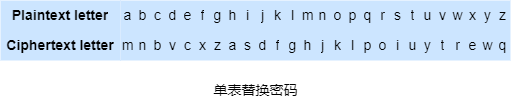

​		单表替换密码的字母配对看似很多，但通过对明文语言进行统计分析后可以发现e和t出现的频率最高且特定的两个和三个字母经常一起出现，实际上破解更容易一些。

​		单表替换密码的的改进版是**多表替换密码**。多表替换密码的基本思想是使用多个单表替换密码，一个单表替换密码用于加密明文中特定位置的字母。因此，明文中不同位置出现的字母可能以不同的方式加密。

​		现代对称加密大致分为**流加密**和**块加密**。块加密用于PGP、SSL和IPsec等，流加密用于WEP等。

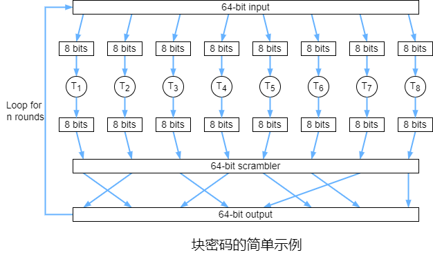

​		在块加密中，明文以$k$位块进行处理。为了对块进行加密，使用一对一映射将明文的$k$位映射到密文的$k$位块，因此每种输入都有不同的输出。块密码通常使用函数模拟随机排列表。以64位块为例并假设置乱函数为公共已知，将64位块分成8个小块，每个小块由8位组成，每个小块由一个8位到8位的映射表进行映射，该表具有的大小可管理的映射长度，然后这8个输出块重新组装成64位块并置乱，最后将结果作为输入再循环$n$次该过程。循环的目的是使每个输入位都影响最后输出位的大部分乃至全部。这种块密码算法的密钥是8张映射表。

​		诸如DES、3DES和AES的块密码都使用位串作为密钥，密钥决定了映射表的映射和算法内部的排列。DES使用了具有56位密钥的64位块，AES使用了128位块且能够使用128、192和256位的密钥进行操作。

​		报文明文中可能存在多个相同的明文块，使用块密码产生的密文也相同，因此可能猜出明文并根据相同的密文块和协议结构相关的知识解密整个报文。为了解决这个问题，可以在密文中混合一些随机性使得相同的明文生成不同的密文。

​		密钥为$S$的块密码加密算法表示为$K_S$，第$i$个明文块和密文块分布表示为$m(i)$和$c(i)$。发送端根据第$i$块生成随机的$k$位数$r(i)$且计算$c(i)=K_s(m(i)\oplus r(i))$。接收端能接收到$c(i)$和$r(i)$，根据$m(i)=K_s(c(i)\oplus r(i))$可以进行解密。但这样需要传输额外的随机数，为了解决这一问题，块密码使用了**密码块链接**，基本思想是仅第一个报文发送一个随机值，然后让发送端和接收端使用计算出的密文代替后继的随机数。

​		1）在加密报文前，发送端生成一个随机的$k$位串，称为**初始向量**，用$c(0)$表示。发送端以明文发送IV给接收端。

​		2）对第一个块，发送端计算$m(1)\oplus c(0)$，然后通过块密码得到对应的密文$c(1)=K_S(m(1)\oplus c(0))$并发送。

​		3）对于第$i$个块，发送端根据$c(i)=K_S(m(i)\oplus c(i-1))$生成第$i$个密文块。

##### 7.1.2 非对称加密

​		公钥和私钥分别表示为$K^+_B$和$K^-_B$。报文$m$通过公钥和众所周知的加密算法加密后得到密文$K^+_B(m)$，密文通过私钥和众所周知的解密算法进行解密$K^-_B(K^+_B(m))=m$。私钥加密后也可以用公钥解密$K^+_B(K^-_B(m))=m$。

​		RSA算法广泛使用了模$n$运算。
$$
\begin{align}
[(a \bmod n)\cdot (b \bmod n)]&=(a\cdot b)\bmod n\\
(a \bmod n)^d \bmod n&=a^d\bmod n
\end{align}
$$
​		为了生成RSA的公钥和密钥，首先选择两个大素数$p$和$q$，$p$和$q$越大，破解RSA越困难，加密和解密的时间也越长。然后计算公共模数$n=pq$和欧拉函数$\varphi(n)=(p-1)(q-1)$。选择一个小于$n$且与$\varphi(n)$没有(非1的)公因数的公钥指数$e$，再选择$d$使$ed\bmod \varphi(n)=1$成立。公钥$K^+_B$是一对数$(n,e)$，私钥$K^-_B$是一对数$(n,d)$。实际中，RSA的$n$一般是1024位和2048位，$e$常使用3、17和65537。

​		对于明文$m(m<n)$的密文$c=m^e \bmod n$，解密时先对该值进行$d$次幂运算，再做模$n$运算。
$$
\begin{align}
(m^e \bmod n)^d \bmod n&=m^{ed}\bmod n\\
&=m^{(ed \mod \varphi(n))} \bmod n\\
&=m^1 \bmod n\\
&=m
\end{align}
$$
​		使用私钥加密同样可以用公钥解密$(m^d \bmod n)^e \bmod n=m^{ed}\bmod n=m$。

​		RSA的指数运算比较耗时，DES则快很多，因此在实际应用中RSA常与对称加密结合使用。首先选择加密数据的共享对称密钥，称为**会话密钥**$K_S$。然后使用RSA密钥对会话密钥进行加密$c=(K_S)^e \bmod n$。最后对方收到后使用私钥进行解密可以获得会话密钥。

##### 7.1.3 密钥分发和管理

​		Diffie-Hellman(DH)密钥协商算法能够让通信双方在非安全的信道中安全地交换密钥，用于加密后续的通信信息。DH算法选择一个大素数$p$和小于$p$的数$g$，这两个数以明文的形式从一方发送到另一方，A、B双方完成共享$g$和$p$后各自选择密钥$S_A$和$S_B$。A、B各自计算公钥$T_A=g^{S_A}\bmod p$和$T_B=g^{S_B}\bmod p$并通过公网交换公钥。A计算共享密钥$S=S_A^{^{S_B}}\bmod p$，同样B计算共享密钥$S'=S_B^{^{S_A}}\bmod p$。
$$
\begin{align}
S&=S_A^{^{S_B}}\bmod p=(g^{S_A})^{S_B}\bmod p=g^{S_A\cdot S_B}\bmod p=S'
\end{align}
$$
​		若$g=p-1$，根据费马小定理可以推出$g^{p-1}\equiv 1( \bmod p)$，这对密钥协商构成威胁，因此$g$只能在$[1,p-2]$中选择。

​		DH算法并不能防御欺骗攻击，攻击者在在双方交换密钥时截获并替换成自身的密钥，双方的密钥协商就变成了每方单独都和攻击者的协商。

​		**密钥分发中心**存储每个用户信息以及仅用户和KDC共享的对称密钥，该密钥称为**长效密钥**，因此通信双方都是KDC用户时KDC可以作为通信双方的第三方。

​		$K_S$表示A和B的会话密钥，$K_{A-KDC}$和$K_{B-KDC}$表示A/B与KDC的长效密钥。A用$K_{A-KDC}$加密A和B的标识得到$K_{A-KDC}(A,B)$并发送给KDC。KDC收到后得知A将与B通信并生成$K_S$，用$K_{B-KDC}$加密A的标识和$K_S$得到$K_{B-KDC}(A,K_S)$，用$K_{A-KDC}$加密$K_S$和$K_{B-KDC}(A,K_S)$得到$K_{A-KDC}(K_S,K_{B-KDC}(A,K_S))$并发送给A。A收到后得到$K_S$并把$K_{B-KDC}(A,K_S)$发送给B，B收到后得到$K_S$。

#### 7.2 报文完整性和数字签名

​		散列函数输入$m$，可以得到一个固定长度的字符串$H(m)$。**密码散列函数**的特点是不同的输入不能得到相同的输出。

​		在MD5散列算法中，首先添加一个64位数来表示明文长度，再填充长度(添加1并在后面添加足够的0)，直到输入满足一定的条件，初始化累加器并进行循环，在循环中对报文的16子块进行4轮处理。另一个常用散列算法是SHA。

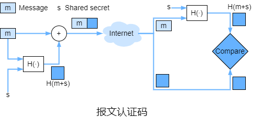

​		为了执行**报文完整性**，除了使用密码散列函数，还需要一个称为**认证密钥**的共享密钥$s$。发送端用报文$m$和$s$级联生成$m+s$并计算散列值$H(m+s)$，散列值$H(m+s)$称为**报文认证码**。然后将MAC附加到$m$生成扩展报文$(m,H(m+s))$并发送。接收端收到扩展报文$(m,h)$，由于接收端也有$s$，若$H(m+s)=h$则表示一切正常。

​		常用的MAC有HMAC，它能够与MD5或SHA一起使用。HMAC实际上通过散列函数计算数据和认证密钥两次。在LS算法中，可以通过物理操作或直接使用路由器自带的公钥实现认证密钥分发给AS内的每个路由器。

​		可以使用非对称加密和散列函数来进行**数字签名**。发送端的公钥和密钥表示为$K^+_S$和$K^-_S$，接收端的公钥和密钥表示为$K^+_R$和$K^-_R$。发送端先用散列函数计算明文获得散列值，用$K^-_S$加密散列值得到数字签名并和$K^+_R$加密后的密文一起发送。接收端收到后用$K^+_S$解密数字签名后的结果并和$K^-_R$解密后结果的散列值进行比较，若相等则表示一切正常。

​		**公钥认证**是证明公钥属于特定的实体。将公钥认证通常由**认证中心**完成，其功能是证实一个实体的真实身份，一旦证实了身份后，CA会生成一个其身份和实体的公钥绑定的**证书**，该证书包含公钥和公钥所有者的全局唯一标识信息(人名或IP地址等)，CA会对这个证书进行数字签名。

​		ITU和IETF都研发了用于CA的系列标准。

| 字段名             | 描述                                       |
| ------------------ | ------------------------------------------ |
| version            | X.509规范的版本号                          |
| serial number      | CA颁发的证书的唯一标识符                   |
| signature          | 规定CA用于签署证书的算法                   |
| issuer name        | 颁发此证书的CA的身份(采用DN格式)           |
| validity period    | 证书有效期的时间范围                       |
| subject name       | 其公钥与该证书相关连的实体身份(采用DN格式) |
| subject public key | 公钥以及使用的公钥算法及其参数的指示       |

#### 7.3 端点认证

​		**端点认证**是一个实体通过计算机网络向另一个实体证明其身份的过程。

​		**认证协议**将在两个通信实体运行其他协议之前运行。AP首先建立相互认可的各方的标识，当认证完成后才继续之后的事情。

​		ap1.0就是直接告知对方其身份，但该身份可以假冒。

​		ap2.0使用了类似于IP地址的众所周知的网络地址，但IP哄骗可以在数据报的源地址中填入任何地址且并非所有网关路由器都配置了仅转发源IP地址为路由器所属网络的IP地址的数据报的功能。

​		ap3.0加入了密码，密码由认证实体和被认证实体共享，但密码可能被窃取，例如当Telnet其他主机并登录时，登录密码会以明文的形式发送端Telnet服务器，而连接到Telnet客户端或服务器LAN的攻击者可以嗅探LAN上传输的所有数据包来获取登录密码。

​		ap3.1加入了加密密码，但这样并不能防御**重放攻击**，攻击者只需窃听通信并记录加密密码，再将重放加密密码。

​		ap4.0加入了类似于TCP建立连接的方式和**不重数**，不重数是不重复使用的随机数。被认证实体向认证实体发送认证信息，认证实体返回一个不重数$R$，被认证实体使用共享对称密钥$K$来加密$R$并把$K(R)$发回给认证实体。认证实体解密后得到的结果与$R$相等则表示认证成功。$R$也可以用被认证实体的私钥来加密，认证实体收到后使用被认证实体的公钥解密。

#### 7.4 安全电子邮件

​		安全电子邮件应该具有保密、报文完整、发送端认证的特点。

​		保密性可以通过会话密钥实现，报文完整性和发送端认证都可以通过数字签名实现。若需要同时实现保密性、报文完整性和发送端认证则需要将会话密钥和数字签名结合使用，安全分发公钥可以使用CA来验证公钥。

​		$K_S$表示会话密钥，$K^+_S$和$K^-_S$表示发送端的公钥和私钥， $K^+_R$和$K^-_R$表示接收端的公钥和私钥。发送端通过散列函数计算原始报文的散列值，使用$K^-_S$对散列值加密得到数字签名并和原始报文级联形成预备包。然后使用$K_S$加密预备包并使用$K^+_R$加密$K_S$，最后将加密的预备包和加密的$K_S$级联形成包并发送。接收端收到报文后使用$K^-_R$解密得到$K_S$并进一步解密得到数字签名和原始报文，再使用$R^+_S$解密的结果和原始报文的散列值进行比较。

​		PGP(Pretty Good Privacy)是安全电子邮件的一个范例。PGP使用MD5或SHA来计算散列值，使用CAST、3DES或IDEA进行对称加密，使用RSA进行非对称加密。

​		用户安装PGP时会为用户生成一个公钥，该公钥可以发布在用户的网站或放置在公钥服务器上。用户每次访问私钥时都必须输入密码。PGP为用户提供了报文的数字签名、加密或两者都执行的选项。PGP也提供公钥认证机制，但公钥由可信网站认证，用户可以查询某公钥是否属于某用户。此外，PGP允许用户为其所信任的用户认证更多密钥提供担保。PGP用户间可以通过持有密钥签署方来签署彼此的密钥。

#### 7.5 SSL

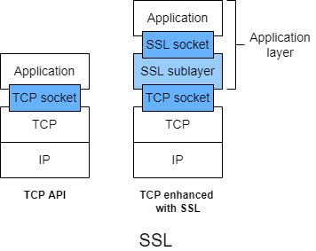

​		**安全套接字层**使用用保密性、数据完整性和端点认证来强化TCP。SSL 3.1称为**安全传输层**。SSL常用于为通过HTTP的事务提供安全性，实际上，SSL为TCP提供安全性，故任何通过TCP的应用程序都可以使用SSL。SSL提供了一个简单的具有套接字的API，该接口类似于TCP的API。

​		SSL具有握手、密钥派生和数据传输三个阶段。

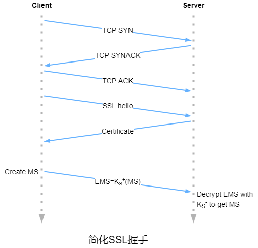

​		在握手阶段，客户端与服务器创建TCP连接并对服务器认证，然后客户端发送给服务器一个主密钥，客户端和服务器都将使用该密钥生成 SSL会话所需的所有对称密钥。一旦建立TCP连接，客户端就向服务器发送一个hello报文，服务器用其证书响应，证书中包括服务器的公钥$K^+_S$。客户端生成一个仅用于SSL会话的**主密钥**，用$K^+_S$加密MS得到加密主密钥并发送给服务器。服务器收到后对EMS使用服务器的私钥$K^-_S$进行解密获得MS。

​		在密钥派生阶段，发送端和服务器各自使用MS派生用于加密和报文完整的密钥，$E_C$和$E_S$表示客户端和服务器各自用于加密数据的会话密钥。$M_C$和$M_S$表示客户端和服务器各自用于验证数据完整的认证密钥。

​		在数据传输阶段，TCP是一种字节流协议，为了传输流的同时验证数据完整性，SSL将数据流分成多个**记录**，每个记录附加一个认证密钥来验证完整性。为了防御重排序或重放报文段，SSL使用了序号，序号从0开始并随着发送的每条SSL记录递增，SSL记录中并不包含序号，而是在计算MAC时加入序号，即数据加认证密钥加当前序号的散列值。对方跟踪序号并在验证数据完整性的计算中加入序号。

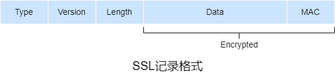

​		SSL记录由类型、版本、长度、数据和MAC组成。前三个字段不加密。类型表示报文类型(握手报文或数据报文)，用于关闭SSL。虽然SSL的关闭连接直接使用了TCP关闭连接，这为**截断攻击**创造了条件，即攻击者使用TCP FIN来关闭连接，但SSL记录中指示了记录类型加上MAC可以防止截断攻击。

​		SSL并未规定加密算法的选择，它允许在SSL会话开始时就加密算法取得一致。

​		1）客户端发送它支持的加密算法列表和客户端不重数。不重数是为了防御连接重放攻击，即攻击者重放从建立连接到关闭连接的所有报文。

​		2）服务器选择一种对称加密算法、一种非对称加密算法和一种MAC算法并将它的选择、证书以及服务器不重数返回给客户端。

​		3）客户端验证证书，提前公钥，生成一个**前主密钥**，用服务器的公钥加密PMS并发送给服务器。

​		4）客户端和服务器使用相同的密钥派生函数并各自根据PMS和不重数计算MS，然后对MS进行切片以生成两个密钥和认证密钥。此外，对称加密中的CBC的IV也从MS获得。

​		5）客户端和服务器分别发送各自握手报文的MAC。

#### 7.6 IPsec和VPN

​		**互联网安全协议**为网络层提供安全性，保护任意两个网络层实体间的IP数据报，可以用来建立VPN。IPsec提供了保密性、源认证、数据完整性和重放攻击防护。

​		与互联网完全分离的物理网络称为**专用网络**。

​		VPN的流量通过互联网而不是专用网络发送，流量在进入互联网前会加密。

​		IPsec协议族中的主要协议有**认证首部**协议和**封装安全有效载荷**协议。AH协议提供源认证和数据完整性但不提供保密性。ESP协议提供源认证、数据完整性和保密性。

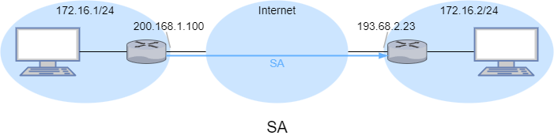

​		在源使用和目的实体发送IPsec数据报之前先建立称为**安全联盟**的网络层逻辑连接。一个SA是单工逻辑连接，如果两个实体需要互相发送IPsec数据报则需要创建两个SA。并非所有网关路由器或主机发送到互联网的流量都受到IPsec保护。

​		IPsec实体将其所有SA的状态信息存储在其**安全联盟数据库**中，该数据库是实体操作系统内核中的一个数据结构，需要维护的SA的状态信息包括称为**安全参数索引**的32位SA标识符、SA的源接口IP地址、SA的目的接口IP地址、将要使用的加密算法类型、加密密钥、完整性验证的类型以及认证密钥。IPsec实体还维护一个称为**安全策略数据库**的数据结构，SPD指示符合条件(IP地址和协议类型)的数据报将被作为IPsec处理并指定SA。

​		IPsec数据报有**隧道模式**和**传输模式**。

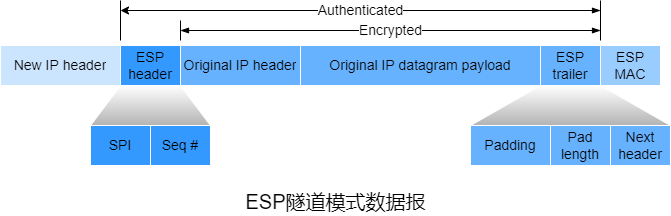

​		IP数据报转换成ESP隧道模式数据报时，先在IP数据报后面附上ESP尾部并使用SA指定的算法和密钥对这部分(IP数据报和ESP尾部)加密。在这个加密部分的前加上ESP首部并附加MAC形成有效载荷，最后加上新的IP数据报首部形成一个IP数据报。	

​		新IP数据报首部源IP地址和目的IP地址是隧道两端路由器的接口，其协议号设置为50，表示使用ESP协议的IPsec数据报。

​		ESP尾部包括填充字段、填充长度和下个首部，下个首部长度表示原IP数据报有效载荷(报文段)的类型。

​		ESP首部包括SPI和序号，SPI表示数据报所属SA，然后接收实体可以使用SPI搜索器SAD以确定对应的认证/加密算法和密钥。序号用于重放攻击防护。

​		IPsec使用**互联网密钥交换**协议来自动创建SA。IKE协议与SSL中握手有些类似，每个IPsec实体都有一个证书，其中包括实体的公钥。两个实体交换证书、协商认证和加密算法并安全地交换密钥材料以在SA中生成会话密钥。与SSL不同的是，IKE通过两次报文交换来完成这些。

​		● 在首次报文交换期间，双方使用DH算法在路由器间生成一个双向的IKE SA，该IKE SA在两台路由器间提供认证和加密的信道。双方还创建用于认证和加密的密钥和第二次报文交换期间将用到的MS。

​		● 在第二次报文交换期间，双方通过数字签名表明了身份，但嗅探器无法嗅探到这些身份，因为报文是通过IKE SA信道发生的。双方还协商用于IPsec SA的加密和认证算法。

​		在IKE协议第二阶段，双方在每个方向建立一个SA。在第二阶段末时，为两个SA在双方建立加密和认证会话密钥。IKE协议有两个阶段的主要动机是计算成本，由于第二阶段不涉及任何非对称加密，IKE可以在两个IPsec实体间能以较低成本生成大量SA。

#### 7.7 WLAN安全

​		802.11规范中标准化的安全机制称为**有线等效保密**协议，WEP协议旨在提供与有线网络类似的安全级别。

​		WEP协议使用对称共享密钥在无线站点和无线AP之间提供认证和加密。WEP协议并没有指定密钥管理算法，因此无线站点和无线AP通过带外方法以某种方式就密钥达成一致。无线站点请求无线AP进行认证，无线AP以128位的不重数响应，无线站点用共享对称密钥加密这个不重数并发送，无线AP收到后解密并和不重数比较。

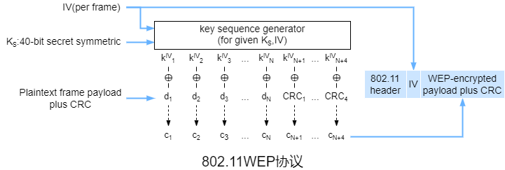

​		若无线站点和无线AP共享40位的对称密钥$K_S$且$K_S$后附加24位的IV来创建用于加密单个帧的64位密钥。每个帧使用的IV都不同，IV以明文形式包含于每个WEP加密的802.11帧的首部中。对于64位密钥，RC4算法产生一个用于加密单个帧中的有效载荷和CRC值的密钥值的流$k^{IV}_1$、$k^{IV}_2$、$k^{IV}_3$，…。通过把有效载荷的第$i$位$d_i$和$k^{IV}_i$进行异或运算来进行加密产生密文$c_i=d_i\oplus k^{IV}_i$，解密同样也是异或运算$d_i=c_i\oplus k^{IV}_i$。

​		对于给定$K_S$只有$2^{24}$个密钥可用，若进行随机选择则在处理12000帧后重复的概率超过99%。攻击者通过IP哄骗的等方式来获取内容已知的加密帧，通过$d_i\oplus c_i=K^{IV}_i$可以获取$K^{IV}_i$，当攻击者再次嗅探到相同的IV时可以对其进行解密。

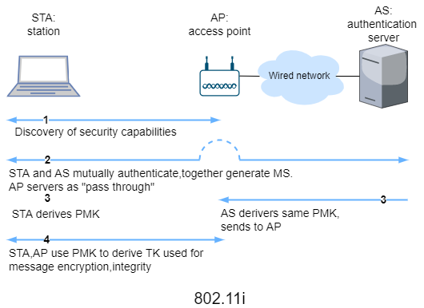

​		相比WEP，802.11i提供了更强大的加密形式、可扩展的认证机制集合和密钥分发机制。802.11i除了无线站点和无线AP，还有认证服务器。认证服务器与无线AP分离允许一个认证服务器为多个无线AP服务，将认证和访问的决策集中在单个服务器内，并降低无线AP的成本和复杂性。

​		1）在发现阶段，无线AP通告它的存在以及它能够给无线站点提供认证和加密的形式。无线站点请求所需形式的认证和加密。虽然无线站点和无线AP已经在交换报文，但无线站点尚未认证，也没有加密密钥。

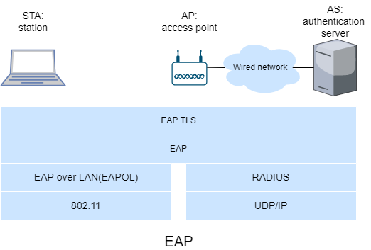

​		2）在相互认证和MK生成阶段，AP作为中继在无线站点和认证服务器间转发报文。**可扩展认证协议**定义了无线站点和认证服务器间的报文格式。EAP使用EAPOL封装并通过802.11无线链路发送，EAP报文在无线AP拆封并使用RADIUS协议重新封装以便通过UDP/IP传输给认证服务器。802.11i并未规定认证方法，但常使用EAP TLS认证方案。EAP TLS使用了非对称加密(不包括不重数和散列算法)来实现无线站点和认证服务器相互认证并派生共享的MS。

​		3）在生成**成对主密钥**阶段，MK是仅无线站点和认证服务器所共享的密钥，它们各自使用它来生成第二个密钥，即PMK。认证服务器向无线AP发送PMK。现在无线站点和无线AP共享密钥且相互认证。

​		4）在生成**临时密钥**阶段，无线站点和无线AP可以生成用于通信的附加密钥。其中的关键是TK，TK用于通过无线链路发送的数据的链路层加密。

​		802.11i提供了多次加密形式，包括基于AES的加密方案和WEP加密的增强版本。

#### 7.8 防火墙和入侵检测系统

##### 7.8.1 防火墙

​		**防火墙**是硬件和软件的组合，它将内网与整个互联网隔开，允许部分分组通过并阻止其他分组。防火墙允许网络管理员通过管理进出这些资源的流量来控制互联网和受管网络内的资源之间的访问。防火墙的目标包括进出受管网络的流量都必须通过防火墙，仅允许本地安全策略定义的授权流量通过以及防火墙本身免于渗透。

​		防火墙包括**传统分组过滤器**、**状态过滤器**和**应用程序网关**。

​		一个组织通常有一个网关路由器，将其内网连接到其ISP或互联网。所有进出内网的流量都经过这个路由器，**分组过滤**在这个路由器上进行。

​		传统分组过滤器单独检查每个数据报并根据过滤规则来确定转发或丢弃数据报。过滤决策通常基于IP地址、数据报中协议类型、端口、TCP标志位(SYN和ACK等)、ICMP报文类型、数据报出入网络的规则以及不同路由器接口的不同规则。

| 策略                                   | 防火墙设置                                                  |
| -------------------------------------- | ----------------------------------------------------------- |
| 无外部Web访问                          | 丢弃所有到任何IP地址、端口80的分组                          |
| 除访问内网的公共Web服务器外无入TCP连接 | 丢弃所有到除指定IP地址、端口80外的任何IP地址的入TCP SYN分组 |
| 防止Web无线电占用带宽                  | 丢弃除DNS分组外的所有入UDP分组                              |
| 防御smurf dos攻击                      | 丢弃所有到指定广播地址的ICMP ping分组                       |
| 防止路由跟踪                           | 丢弃所有ICMP TTL过期分组                                    |

​		相比传统分组过滤器，状态过滤器实际跟踪的是TCP连接并可以根据TCP状态进行过滤。状态过滤器跟踪连接表中所有正在进行的TCP连接，通过三次握手来知晓新连接的开始，通过FIN分组或一段时间内未检查到连接活跃来知晓连接结束。

​		应用程序网关是应用程序特定的服务器，所有应用程序数据都必须通过它。多个应用程序网关可以在同一台主机上运行，但每个应用程序网关都有独立进程。除了IP/TCP/UDP首部，应用程序网关还根据应用数据做决策。		应用程序网关并非没有缺点。首先，不同应用程序需要不同的应用程序网关。其次，由于所有的流量都通过应用程序网关进行中继，应用程序网关的负担较大。最后，当用户发送请求时客户端必须知道如何联系应用程序网关并告知其连接到对应的外部服务器。

​		实际中，一个机构的邮件服务器和Web缓存都是应用程序网关。

##### 7.8.2 入侵检测系统

​		为了检测多种攻击类型，需要执行**深度分组检测**，即深入检测分组的有效载荷。应用程序网关经常进行DPI，但仅对特定的应用程序执行。

​		当检测到潜在恶意流量时发送警报的设备称为**入侵检测系统**。过滤可疑流量的设备称为**入侵防御系统**。由于IDS和IPS的重要技术都是检测可疑流量，所以将IDS和IPS统称IDS。

​		IDS可用于检测多种攻击，包括网络映射(例如使用nmp分析)、端口扫描、TCP栈扫描、DOS带宽泛洪攻击、蠕虫、病毒、操作系统漏洞攻击和应用程序漏洞攻击。

​		IDS大致分为**基于特征的IDS**和**基于异常的IDS**。基于特征的IDS维护了一个范围广泛的攻击特征数据库。每个特征是与一个入侵活动相关的一组规则。特征可能是单个或多个分组相关的特征列表(端口、协议类型或特定位串等)，当分组符合特征时发送警报，但实际中可能由于各种情况无效或误报。基于异常的IDS观测正常流量时会生成一个流量概况文件并查找在统计上异常的分组流，但区分正常流量和在统计上异常的流量仍是一个挑战。

​		一个机构可能在其内网部署一个或多个IDS传感器。由于IDS不仅需要进行DPI，还需要将每个分组与诸多的特征比较，这可能是极大的处理量，因此可能需要多个IDS传感器。将IDS传感器放置在更下游的位置，每个IDS传感器仅能检测到部分流量，这样更易于维护。

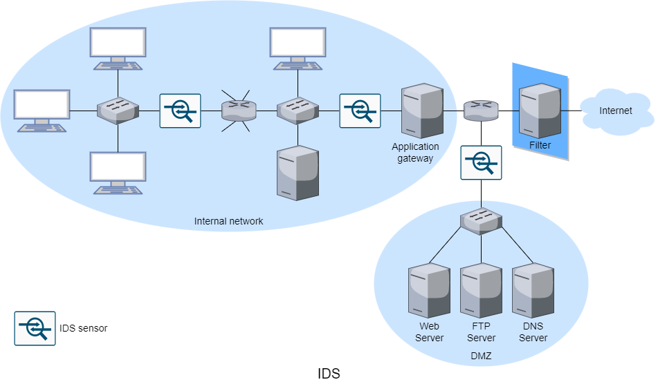

​		当部署多个IDS传感器时，它们通常协议工作，将有关可疑流量的信息发送到中心IDS处理器，中心IDS处理器收集并综合这些信息，当时机合适时发送警报。该机构将内网划分为较高安全区和称为**隔离区**的较低安全区，较高安全区由分组过滤器和应用程序网关保护，DMZ仅由分组过滤器保护，它们都受IDS传感器监控。DMZ包括了该机构需要与互联网通信的服务器，例如Web服务器、FTP服务器和权威DNS服务器等。实际中，有很多高性能的IDS和IPS供使用，因此有些机构仅需一个位于接入路由器附近的IDS传感器。

​		Snort是一个公共域的开源IDS，它使用通用嗅探接口libpcap(Wireshark和其他分组嗅探器也使用该接口)。