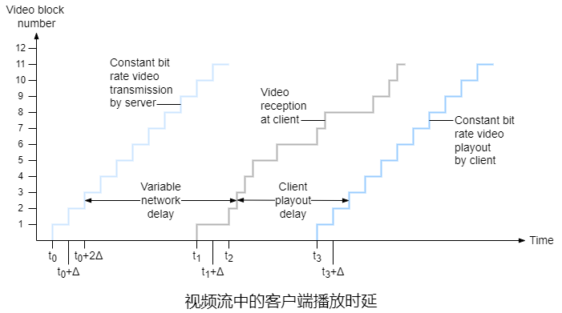
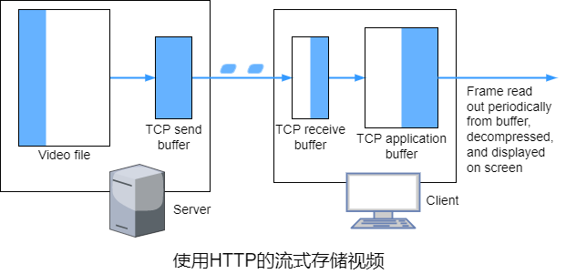
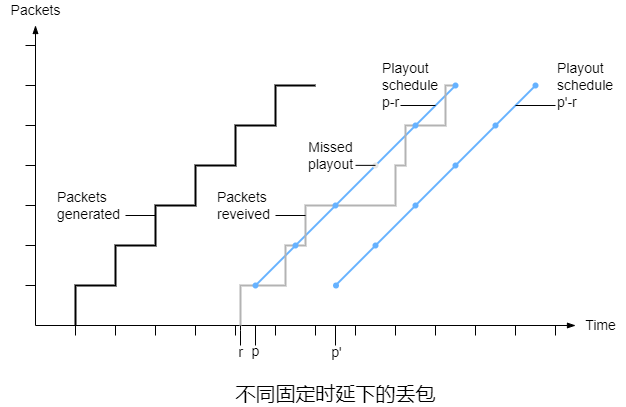
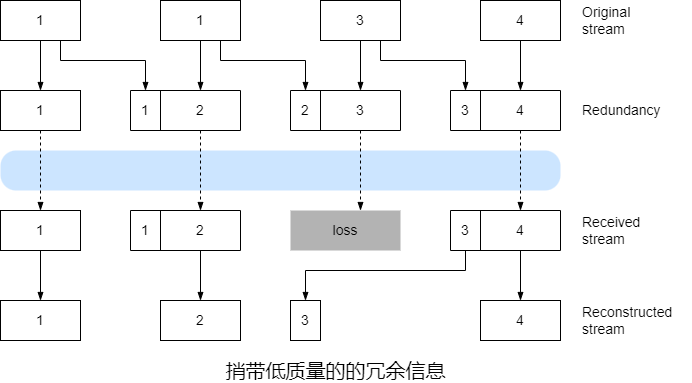
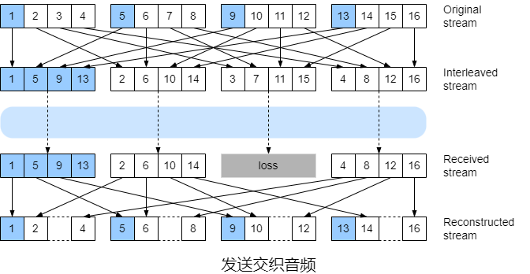
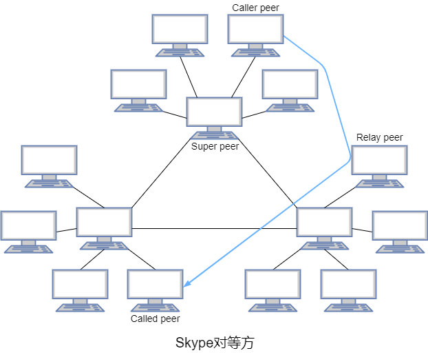
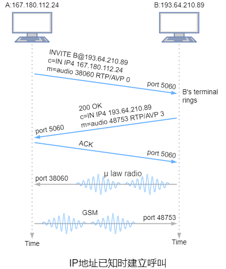
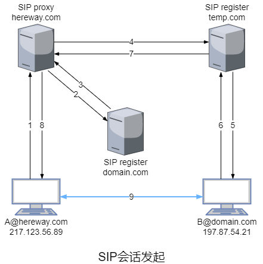
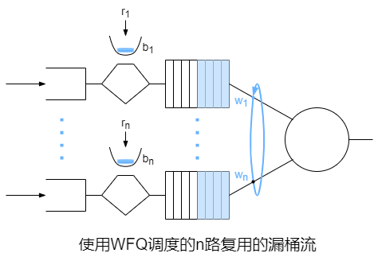
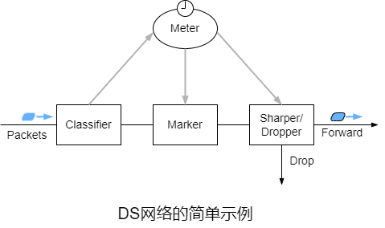

### 第八章 多媒体网络

​		视频最为显著的特点是**高比特率**，另一个重要特点是可以被压缩，从而在视频质量和比特率之间权衡。视频有两种类型的冗余，都可以用来进行**视频压缩**。<span style="background-color: yellow">空间冗余</span>是给定图像的内部冗余，主要由空白组成的图像具有高度冗余，可以在不牺牲图像质量下进行冗余。<span style="background-color: yellow">时间冗余</span>反映了图像间的重复。可以通过压缩来生成**多重版本**的视频，不同版本具有不同的质量等级。

​		模拟音频信号以某个固定速率进行采样，每个采样值近似取值为有限数量的值之一，该操作称为**量化**，这些值的数量称为**量化值**，通常是2的幂。每个量化值由固定数量的位表示。解码后的的信号只是原始信号的近似值，音质可能有所下降(可能丢失高频的声音)。增加采样率和量化值的数量可以让解码后的信号更接近原始信号。

​		**脉冲编码调制**是一种音频编码技术，语音使用的PCM采用速率是每秒8000个样本，每个样本用8位表示，因此速率是64$Kb/s$。音频光盘使用的PCM采用速率是每秒44100个样本，每个样本用16位表示，单声道速率为705.6$Kb/s$，立体声速率为$1.411Mb/s$。

​		压缩也可以用于降低音频流的比特率，人类语音可以压缩到小于10$K(b/s)$且依旧可以理解。用于接近CD质量的立体声音乐的流行压缩技术是**MP3**(MPEG 1 layer 3)，MP3编码器可以压缩到不同的速率，128$Kb/s$的编码速率可以保证很小的声音失真，一种相关标准是**高级音频编码**。

​		多媒体应用大致可以分为<span style="background-color: yellow">流式存储音频/视频</span>、<span style="background-color: yellow">会话式IP语音/视频</span>和<span style="background-color: yellow">流式实况音频/视频</span>。

​		**流式传输**时，客户端在从服务器接收音频/视频一段时间后就可以播放，在播放的同时继续接收剩余部分，避免了在播放前需要接收整个文件。

​		● 流式存储视频依赖的媒体是服务器上预先录制的视频，用户向服务器请求以按需观看视频。流式存储视频的特点是**流媒体**、**交互性**和**不间断播放**。由于视频是预先录制的，用户可以进行快进等操作并获得即时响应。视频播放开始后应按照录制的时序进行，因此必须从服务器及时接收数据。流式存储音频与流式存储视频相同。

​		● 互联网上的实时会话式语音通常称为**网络电话**或**IP语音**。因为从用户的角度，它类似于传统的电话交换服务。会话式语音/视频是<span style="background-color: yellow">时延敏感</span>但<span style="background-color: yellow">容忍丢包</span>的。

​		● 流式实况音频/视频类似于传统的电台和电视，只是它通过互联网传输。

​		分发存储和实况视频经常使用CDN。

​		对于VOIP等会话时实时应用，重传一个错过预计播放时间的分组没有意义。

#### 8.1 流式存储视频

​		流式视频系统分为**UDP流**、**HTTP流**和**自适应HTTP流**。这三种形式的视频流的共同特点是广泛使用了客户端应用程序的缓存来减轻变化的的端到端时延以及变化的客户端和服务器间可用带宽的影响。这种**客户端缓存**不仅可以吸收服务器到客户端时延中的波动，而且当其未完全耗尽时，即使服务器到客户端的带宽暂时低于视频消耗速率，客户端也能维持不间断播放。



​		假设视频以固定的比特率编码，因此每个视频块包含在固定时间$\Delta$播放的视频帧。服务器在$t_0$传输第一个视频块，在$t_0+\Delta$传输第二个视频块，依此类推。一旦客户端开始播放，每个块应该在前一个块之后播放$\Delta$时间单元来保证原始视频录制时的时序。若在$t_1$就开始播放视频则第二块不能在$t_1+\Delta$内到达，相反，若$t_3$开始播放，此时前6块已到达，所有收到的块都能按序且不间断地播放。

##### 8.1.1 UDP流

​		UDP流通常使用的客户端缓存较小。由于UDP没有拥塞控制，服务器能够以客户端的视频消耗速率的传输视频。在视频块传递给UDP前，服务器将视频块封装在传输分组中，该传输分组专为传输音频/视频设计，使用了**实时传输协议**或**会话发起协议**等类似的方案。RTP可用于传输常见格式和专用的音频和视频格式，它也是其他实时交互协议(如**生成树协议**)的补充。SIP是一个开放的轻量级协议。

​		使用UDP时，除了服务器到客户端的视频流外，客户端和服务器还同时维护一个单独的控制链接，客户端通过该连接发送有关会话状态变化的命令(如暂停、重新开始、重定位等)，**实时流传输协议**是一种用于这种控制连接的协议。

​		UDP存在三个重大缺陷，首先，由于服务器和客户端之间的可用带宽不可预测且不断变化，因此恒定速率UDP流不一定能保证不间断播放。其次，需要RTSP服务器这样的媒体控制服务器来为每个正在进行的客户端会话处理客户端到服务器的交互请求并跟踪客户端状态，这增加了大规模部署成本和复杂性。最后，许多防火墙配置为阻止UDP流量。

##### 8.1.2 HTTP流

​		在HTTP流中， 视频作为具有特定URL的文件存储在HTTP服务器上。当用户要观看视频时，客户端与服务器建立一个TCP连接并对该URL发起HTTP GET请求。服务器在HTTP响应报文中发送该视频文件，即以TCP拥塞控制和流控制允许的情况下尽快发送。在客户端，数据被收集在客户端应用程序缓存中。一旦缓存中字节数量达到阈值就开始播放，它周期性地从客户端应用程序缓冲区中抓取视频帧，对帧解压并在用户屏幕上显示。

​		对于流式存储视频，客户端能够以高于消耗速率的速率下载视频，从而**预取**将被消耗的视频帧。当平均TCP吞吐量大约是媒体比特率的两倍时，TCP流达到最小的饥饿和低缓存时延。

​		由于TCP的拥塞控制机制，服务器到客户端的传输速率可能波动很大，而且分组可能由于重传机制而出现较大的时延。使用了客户端缓存和预取后，这些不一定会妨碍不间断播放。

​		HTTP基于TCP，因此更容易穿越防火墙和NAT。HTTP流无需媒体控制服务器，从而减低大规模部署的成本。



​		服务器的视频文件通过套接字后，字节在传输到互联网前存放在TCP发送缓存，当服务器的TCP发送缓存已满时，服务器暂时无法将更多的字节从视频文件发送到套接字。客户端应用程序从TCP接收缓存(通过套接字)读取字节并将字节存放到客户端缓存。同时客户端应用程序周期性地从客户端缓存抓取视频帧并解压播放。若客户端缓存大于该视频文件则从客户端直接按照TCP允许的最快速率从服务器接收视频。

​		当客户端缓存变满时，可能会导致TCP接收缓存边满，进而TCP发送缓存也会变满，服务器不能向套接字中发送字节。因此，播放暂停可能服务器被迫停止传输直到继续播放。在常规的播放中，若客户端缓存变满，进而导致TCP缓存变满，迫使服务器降低发送速率，因此服务器的发送速率不能高于客户端视频消耗速率。因此，当使用HTTP流时，满的客户端缓存间接地限制了服务器到客户端的传输速率。

​		$B(b)$表示客户端应用程序的缓存，$Q(b)$表示客户端应用程序开始播放前必须的缓存。$r(b/s)$表示视频消耗速率。只要客户端应用程序的缓存未满，服务器会以恒定速率$x(b/s)$发送数据，则经过$t_{play}=\frac{Q}{x}$后首次播放。若$x<r$，客户端在开始播放后应用程序缓存会以$r-x$的速率消耗，在$t_{pause}=\frac{Q}{r-x}$后出现停滞，再经过$t_{play}$后开始播放，一直循环这个过程直至结束。若$x>r$，客户端在开始播放后应用程序缓存会以$x-r$的速率增加，经过$t_{full}=\frac{B-Q}{x-r}$后应用程序缓存达到最大值，播放开始后不会停滞。

​		现在进一步假设服务器发送数据的速率$x$不是恒定，初始为0，在$T(s)$后<span style="background-color: yellow">线性增长</span>到最大值$H(b/s)$，然后变为0并再次线性增长，一直循环这个过程。为了保证不会停滞，需要$\overline{x}>r$，因此$H>2r$。当$x$从0开始线性增长时，其加速度$\alpha=\frac{H}{T}$，期间服务器发送数据$D=\frac{Ht^2}{2T}(b)$。

​		若需要保证$Q$最小，则需要$x$从0增长到$r$期间消耗的数据刚好为$Q$，因此$Q_{min}=\frac{r^2}{2a}=\frac{Tr^2}{2H}$。

​		HTTP流经常使用HTTP GET请求报文中的**HTTP字节范围首部**，用来指定客户端当前想要从所需视频中检索的特定字节范围。当需要跳转到视频中未播放的某个时间点时，客户端发送一个新HTTP请求，用字节范围首部指示服务器应该从文件中的对应字节发送，服务器收到后从字节范围首部指示的字节开始发送。当视频跳转到未播放的某个时间点或提前终止时，服务器传输的一些预取但未播放的视频将跳过，导致相关的带宽和服务器资源浪费，无线链路浪费的带宽和服务器资源可能更多。因此，很多流系统进使用了适当的客户端缓存或者使用HTTP请求中的字节范围首部来限制预取的视频。

#### 8.2 IP语音

​		VOIP一般默认使用UDP，当用户位于阻止UDP的NAT或防火墙后时才使用TCP。UDP存在丢包的问题，TCP没有丢包的问题，但TCP的重传会增加端到端时延，而且丢包后由于拥塞控制，发送端的传输速率可能降低到低于接收端的消耗速率，从而可能导致缓存饥饿。

​		实际中，VOIP可以容忍1%到20%的丢包，这取决于语音的编码、传输方式以及接收端隐藏丢包的方式。使用FEC将冗余信息和原始信息一起发送，能够从冗余信息中恢复一些丢失的初始数据。丢包率超过10%~20%则无法采取任何措施来恢复可接受的音频质量。

​		对于VOIP，小于150ms的时延收听者察觉不到，150ms~400ms的时延可以接受，但不够理想，超过400ms就影响语音交谈的质量。因此，VOIP应用程序的接收端通常忽略时延超过阈值的所有分组。

​		分组在路由器中经历的变化的排队时延是端到端时延的组成部分之一，因此发送端生成分组到接收端接收到分组的时间可能随着分组的变化而波动，称为**抖动**。

​		时延抖动可以通过**序号**、**时间戳**和**播放时延**来消除。发送端为每个音频块标记其生成时间。类似于流式存储视频的播放时延，接收端的音频块的播放时延必须足够大，以便大多数分组在其预计播放时间之前接收，播放时延可以固定或自适应。

##### 8.2.1 在接收端消除时延抖动

​		使用固定延迟策略时，接收端尝试在块生成后$q(ms)$播放，若块在$t(ms)$时被标记时间戳，则接收端在$t+q$播放该块，若该块在$t+q$后到达则会被丢弃并视为丢包。若网络时延经常出现较大的变化则$q$较大更好，若网络时延较小且变化也较小则$q<150ms$更好。



​		对于第一个固定播放时延$p-r$，第4个分组在预计时间未到达则认为丢包。对于第二个固定播放时延$p'-r$，所有分组都在预计时间内到达。7

​		为了尽可能小的播放时延，可以估计网络时延及其变化并在每次语音的突发期开始时相应地调整播放时延，这会导致发送端的静默期的压缩或拉长。对于第$i$个分组，$t_i$表示生成时间，$r_i$表示接收时间，$p_i$表示播放时间，$r_i-t_i$表示网络时延，$d_i$表示收到该分组时的平均网络时延的估计值。$u$表示一个常数。
$$
d_i=(1-u)d_{i-1}+u(r_i-t_i)
$$
​		$v_i$表示估计网络时延与估计的平均网络时延的平均偏差的估计值。
$$
v_i=(1-u)v_{i-1}+u|r_i-t_i-d_i|
$$
​		若分组$i$是语音突发期首个分组，则$p_i=t_i+d_i+Kv_i$，$K$是一个正的常数，$Kv_i$用于将播放时间设置到足够大，保证语音突发期的分组丢包率较低。突发期内之后的每个分组的播放时间被计算为该突发期内首个分组的播放时间的偏移量。语音突发期的首个分组生成到播放的时间跨度$q_i=p_i-t_i$，若分组$j$属于该突发期，它的播放时刻$p_j=t_j+q_i$。

##### 8.2.2 丢包恢复

​		VOIP通常使用<span style="background-color: yellow">FEC</span>和<span style="background-color: yellow">交织</span>这两种类型的**丢包恢复方案**。

​		FEC的基本思想是在初始的分组流增加冗余信息。以略微增加传输速率为代价，这些冗余信息可以用于重建一些丢失分组的近似或准确版本。

​		一种FEC机制是在每$n$个块后发送一个冗余编码块，冗余块通过异或$n$个初始块获得，由于接收端在播放前必须收到整个组的分组，因此增加了播放时延。



​		第二种FEC机制是发送一个低质量的音频流作为冗余信息，发送端生成一个标称音频流和与一个相应的低分辨率、低比特率的音频流(标称流可以是$64Kb/s$的PCM编码，而低质量的流可以是$13Kb/s$的GSM编码。接收端在播放前只需接收两个分组，因此增加的时延较小。若低质量冗余音频的编码比标称音频小很多则增加的额外传输速率并不大。若需要处理连续丢失，发送端可以每个块附加更多低质量块，但同时也会增加传输带宽和播放时延。



​		在交织中，发送端在传输前对音频数据单元重新排序，从而使传输流中原本相邻的单元分开。交织可以减轻丢包的影响从而提高音频流的质量。交织不增加流的带宽，且开销也较低，但增加了时延。

​		丢包恢复试图为丢失的分组产生一个相似的代替。音频信号表现除大量的短期自相似性，因此差错掩盖方案适用于丢失率较小(低于15%)和分组较小(小于音素)的场景，但损失长度接近音素的长度时，就会失效，因为听者可能听错。

##### 8.2.3 案例学习：Skype

​		对应音频和视频，Skype客户端使用多种不同的编码方式。Skype默认使用UDP发送音频和视频分组，但控制分组通过TCP发送，UDP被拦截时才使用TCP发送音频和视频分组。Skype客户端通过改变视频质量和FEC开销来使其发送的音频流和视频流适应当前网络环境。

​		Skype中除了主机间VOIP使用了P2P，用户定位和NAT穿透也使用了P2P。



​		Skype中对等方组织成一个分层的覆盖网络，对等方分为超级对等方和普通对等方。Skype维护一个将用户映射到当前IP地址(和端口)的索引，该索引分布在超级对等方上。当A需要呼叫B时，客户端会搜索该分布式索引以决定B当前的IP地址。

​		NAT用于阻止外网的主机连接到内网主机，若A和B都有NAT，可以通过超级对等方和**Skype中继**来让A和B建立连接。A向非NAT的超级对等方建立连接，B也向非NAT的超级对等方建立连接。A通知A的超级对等方，A的超级对等方通知B的超级对等方，B的超级对等方再通知B。两个超级对等方选择第三个非NAT的超级对等方作为中继对等方，然后A、B都向中继对等方建立连接。

​		若$N(N>2)$个参与者进行音频会议，每个参与者将音频流的副本发送给其他$N-1$个参与者，因此需将$N(N-1)$个音频流副本发送到网络中。为了减少带宽消耗，每个参与者向发起者发送其音频流，发起者将这些音频流结合为一个流(基本是将所有的音频流信号加在一起)并发送给其他$N-1$个参与者，因此需要将$2(N-1)$个音频流的副本发送到网络。

​		若$N(N>2)$个参与者进行视频会议，视频并不能像音频一样结合为一个流且大多数接入链路的上行链路带宽明显低于下行链路带宽(上行链路可能无法支持P2P方式的$N-1$个视频流)，因此每个参与者的视频流被路由选择到一个服务器集群，该集群将该视频流中继给其他$N-1$个参与者。

#### 8.3 实时会话应用协议

##### 8.3.1 RTP

​		若应用程序集成了RTP，而不是使用有限载荷类型、序号和时间戳这种专用方案，该应用程序更容易与其他应用程序交互。

​		RTP不提供任何机制来确保及时交互数据或提供其他QOS保证，也不保证分组交互或防止分组失序。RTP允许每个源(例如一个麦克风或摄像头等)分配其独立的RTP分组流。很多编码技术将音频和视频捆绑在一个流中，因此也只产生一个RTP流。

​		RTP分组不仅限于单播应用，也可以经过一对多和多对多的多播树发送。对于多对多的多播会话，所有的发送端和源通常使用相同的多播组来发送RTP流。一起使用的RTP多播流(例如视频会议中多个发送端发出的音频和视频流)同属于一个**RTP会话**。

​		对于语音，若语音源使用$64Kb/s$的PCM编码，每个编码数据的时间长度是$20ms$，即每个音频块有160字节，发送端在每个音频块前添加一个RTP首部，RTP首部通常为12字节，音频块和RTP首部一起形成**RTP分组**。


​		RTP首部包括7位**有限载荷类型**、16位**序号**、32位**时间戳**、32**位同步源标识符**以及其他字段。

​		● 有限载荷类型字段表示音频/视频的编码类型。发送端可以在会话过程中改变编码。

| 有限载荷类型 | 媒体编码格式 | 描述                           |
| ------------ | ------------ | ------------------------------ |
| 0            | PCM μ-law    | 采样率是8KHz，速率是64Kb/s     |
| 1            | 1016         | 采样率是8KHz，速率是4.8Kb/s    |
| 3            | GSM          | 采样率是8KHz，速率是13Kb/s     |
| 7            | LPC          | 采样率是8KHz，速率是2.4Kb/s    |
| 9            | G.722        | 采样率是16KHz，速率是48~64Kb/s |
| 14           | MPEG音频     | 采样率是90KHz                  |
| 15           | G.728        | 采样率是8KHz，速率是16Kb/s     |
| 26           | MJPEG        |                                |
| 31           | H.261        |                                |
| 32           | MPEG1视频    |                                |
| 33           | MPEG2视频    |                                |

​		● 发送端每发送一个RTP分组，序号加1，接收端根据序号来检测丢包和恢复分组。

​		● 时间戳表示RTP分组中第一位的采样时刻。

​		● SSRC用于标识流的源。在RTP会话中通常每个流的SSRC不同。当新的流生成时分配随机数，若两个流分配的SSRC相同则重新分配SSRC。

##### 8.3.2 SIP

​		SIP是常用于发起和结束呼叫的信令协议，可以用于视频会议和基于文本的会话。实际中，SIP可以作为即时通信应用程序的基本组件。

​		SIP提供了通过IP网络在呼叫者和被呼叫者间建立呼叫的机制，允许呼叫者通知被呼叫者将要开始呼叫，允许参与者就媒体编码达成一致，也允许参与者接收呼叫。

​		SIP为呼叫者提供被呼叫者的当前IP地址。用户可能没有固定IP地址，因为它们可能动态分配IP地址或使用多个IP设备。

​		SIP提供了呼叫管理机制，例如呼叫期间添加新媒体流、呼叫期间更改编码、呼叫期间邀请新新参与者、呼叫转移和呼叫保持等。

​		SIP是一个带外协议，发送和接收SIP报文使用了不同于发送和接收媒体数据的套接字。SIP报文是ASCII，与HTTP报文类似。SIP要求所有的报文都有确认，因此能够在UDP或TCP上运行。



​		当A知道B的IP地址时，A通过UDP向B的5060端口发送一个INVITE报文(类似于HTTP请求报文)，此时一个SIP会话开始。INVITE报文包括B的标识符、A当前IP地址、A希望接收的音频格式以及接收端口。B收到INVITE报文后向A的5060端口发送SIP响应报文(类似于HTTP响应报文)，SIP响应报文包括`200 OK`、B当前IP地址、B希望接收的音频格式以及接收端口。A收到SIP响应报文后响应SIP ACK报文，然后双方就可以开始发送音频。

​		若B在收到A的INVITE报文后发现不支持A希望接收的音频编码，则会响应`606 NOT Acceptable`并在报文中列出支持的编码。A从中选择一个编码并再发送一个INVITE报文。B也能直接发送表示拒绝的代码来拒绝呼叫。

​		B的SIP地址是`B@193.64.210.89`，实际上SIP地址可能类似于email地址或电话号码或姓名等。SIP可以包含于Web页面中，当访问者点击SIP地址，访问者设备中SIP应用将启动并向该SIP地址发送INVITE报文。

```http
INVITE sip:B@domain.com SIP/2.0
Via: SIP/2.0/UDP 167.180.112.24
From: sip:A@hereway.com
To: sip:B@domain.com
Call-ID: a2e3a@pigeon.hereway.com
Content-Type: application/sdp
Content-Length: 885
 
 c=IN IP4 167.180.112.24
 m=audio 38060 RTP/AVP 0
```

​		INVITE行包含SIP版本。每当SIP报文通过SIP设备(包括产生该报文的设备)时，它附加一个`Via`首部来指示该设备的IP地址。SIP报文包含一个`From`首部行和一个`To`首部行。`Call-ID`是呼叫的唯一标识符。`Content-Type`表示SIP报文中内容的格式。在一个换车和换行后就是报文的内容部分。

​		每个SIP用户都有一个相关联的**SIP注册器**。SIP注册器的功能类似于权威DNS，将SIP地址转换为IP地址。SIP注册器和**SIP代理**通常运行在同一台设备上。每当启动SIP应用程序时都会向SIP注册器发送SIP注册报文来告知它的当前IP地址。

```http
REGISTER sip:domain.com SIP/2.0
Via: SIP/2.0/UDP 193.64.210.89
From: sip:B@domain.com
To: sip:B@domain.com
Expires: 3600
```

​		`Expires`表示注册有效期，过期后需要重新向SIP注册器注册。



​		若当前IP地址为217.23.56.89的A需要对当前IP地址为197.87.54.21的B发起VOIP会话，A向hereway的SIP代理发送INVITE报文，该代理在注册器上对domain进行DNS查询并将报文转发给domain的SIP注册器。由于B并没有在domain的SIP注册器上注册，该注册器返回一个重定向到temp的应答。hereway的SIP代理向temp的SIP注册器发送INVITE报文，temp的SIP注册器将INVITE报文转发给B，B收到返回SIP响应，temp的SIP注册器将SIP响应转发给hereway的SIP代理并进一步转发给A。至此A、B可以开始传输音频(还有个SIP ACK)。

#### 8.4 多媒体网络

| 方法            | 粒度                     | 保证                | 机制                                      | 复杂度 | 当前部署状态 |
| --------------- | ------------------------ | ------------------- | ----------------------------------------- | ------ | ------------ |
| 尽力而为服务    | 公平处理所有流量         | 无/软               | 应用级支持，CDN，覆盖网络，网络级资源供给 | 最小   | 无处不在     |
| 区分服务        | 不同类型的流量处理不同   | 无/软               | 分组标识，监管，调度                      | 中等   | 部分         |
| 每个连接QOS保证 | 每个源到目的地流处理不同 | 一旦流被准入，软/硬 | 分组标识，监管，调度，呼叫准入和信令      | 高     | 很少         |

​		**带宽供应**指在给定拓扑中能达到给定性能水平的网络链路容量。**网络定制**指设计一个能达到给定水平端到端性能的网络拓扑。

​		为了预测端到端的应用程序级性能，需要考虑<span style="background-color: yellow">端到端间的流量需求模型</span>、<span style="background-color: yellow">明确定义的性能要求</span>和<span style="background-color: yellow">用于预测给定负载模型的端到端性能模型并求出满足所有用户需求的最低成本带宽</span>。

##### 8.4.1 提供多种类型的服务

​		在聚合流量(多种流量类型而不是单个连接)中提供了DS。相同类型的流量受到相同的服务，而与它们的所属的端到端连接无关。通过少量的聚合流量而不是大量的单个连接，提供优于尽力而为服务的新型网络机制更简单。

​		**分组标记**使得路由器区分属于不同类型流量的分组。在流量类型间提供一定程度的**流量隔离**防止某类流量受到另一类异常流量的负面影响，同时尽可能地保证资源利用率最大化。

​		一种实现流量隔离的方法是**流量监管**，若流量类型或流满足某些标准则可以实施监控机制以确保遵守这些标准。若流量被监管的应用程序异常，则采取某种行动(丢包或延时)以确保进入网络的流量符合这些标准。分组分类、分组标记和流量监管都一起在网络边缘或端系统或边界路由器中实现。另一种实现流量隔离的方法是链路级的分组调度机制为每种流量类型明确地分配固定的链路带宽。

​		流量监管有<span style="background-color: yellow">平均速率</span>、<span style="background-color: yellow">峰值速率</span>和<span style="background-color: yellow">突发大小</span>这3个监管准则。平均速率用于限制较长时间内可以发送网络中的流量，峰值速率用于限制较短时间内可以发送的最大分组数量，突发大小用于限制瞬时发送到网络中分组数量。

​		漏桶机制是可用于描述流量监管准则的一种抽象，一个漏桶可以容纳$b$个令牌。可能潜在地添加到桶中的新令牌总是以$r$个每秒的速率生成。当生成一个新令牌时，若桶中的令牌数量少于$b$则将新令牌添加到桶中，否则，忽略该令牌。

​		漏桶机制可以用来监管分组。若分组被进入到网络之前，它必须先从桶中取出一个令牌。若桶为空，则分组必须等待令牌(或丢弃分组)。桶最多可以容纳$b$个令牌，因此最大突发大小是$b$个分组。由于令牌生成速率是$r$，因此长度为$t$的时间间隔内，可以进入网络的最大分组数为$rt+b$。此外，令牌的生成速率$r$用于限制长期内分组进入网络的平均速率。


​		可以通过串联漏桶来监管流量的峰值速率，第一个漏桶以$r$个令牌每秒的速率生成令牌，其容量为$b$，第二个桶以$p$个令牌每秒的速率生成令牌，其容量为1。显然$r<p$，因为$r>p$会导致队列溢出并丢失分组。若峰值速率持续时间为$t$，则$rt+b=pt$，因此$t=\frac{b}{p-r}$。



​		使用了WFQ调度的路由器的输出链路复用了$n$条流。流$i$被参数为$b_i$和$r_i$的漏桶监管，至少有$\frac{w_iR}{\sum_{j=1}^{n}{w_j}}$的共享链路带宽。若流1的令牌桶最初是满的，然后$b_1$个分组突发到达流1的漏桶监管器，因此流1的漏桶中不再有令牌，$b_1$个分组进入流1的WFQ等待区域。因为这$b_1$分组以至少$\frac{w_iR}{\sum_{j=1}^{n}{w_j}}$分组每秒的速率得到服务，其中最后一个分组有最大时延$d_{max}=\frac{b_1\sum^{n}_{j=1}{w_j}}{w_1R}$。

​		若在时间$t$内到达的分组需要排队，此期间内分组流1发送到网络的分组数量和WFQ队列中排队的分组数量分别表示为$S$和$Q$。显然，$S\geqslant\frac{w_iRt}{\sum_{j=1}^{n}{w_j}}$，$Q=r_1t+b_1-S$。
$$
\begin{align}
Q&\leqslant r_1t+b_1-\frac{w_iRt}{\sum_{j=1}^{n}{w_j}}\\
Q&\leqslant (r_1-\frac{w_iR}{\sum_{j=1}^{n}{w_j}})t+b_1
\end{align}
$$
​		若$r_1<\frac{w_iR}{\sum_{j=1}^{n}{w_j}}$，则$Q\leqslant b_1$，即分组流1WFQ队列中排队的最大分组数是$b_1$，这些分组得到服务的速率最小值是$\frac{w_iR}{\sum_{j=1}^{n}{w_j}}$，因此分组流中任何分组在WFQ队列中承受的最大时延都是$d_{max}$。

##### 8.4.2 DS架构

​		DS架构由<span style="background-color: yellow">边缘功能(分组分类和流量调节)</span>和<span style="background-color: yellow">核心功能(转发)</span>的集合组成。在网络的传入边缘到达的分组将被标记，即将数据报首部中的DS字段设置为某个值。DS架构的一个关键原则是路由器的**每跳行为**仅基于分组(DS)标记，即分组所属的流量类型。因此，DS架构无需为各个源到目的地对保持路由器状态，这是DS具有可扩展性的一个关键考虑因素。

​		PHB导致不同服务类型的流量行为不同，PHB虽然定义了类型间的行为差异，但并未规定特定的机制来实现这些行为。行为的差异必须可以观察，因此可以计量。只需满足外部可观察的行为准则，任何实现机制和任何缓存/带宽分配策略都可以使用。已定义了**加速转发**和**确保转发**这两种PHB。EF PHB规定了一类流量离开路由器的速率达到某个已配置的速率，AF PHB将流量分为4类，每个类都确保提供某种最小的带宽和缓存。



​		到达边缘路由器的分组首先被分类，分类器根据一个或多个分组首部字段选择分组并引导到对应的标记器。某些情况下，端用户可能同意限制分组发送速率来符合某个声明的**流量配置文件**(该流量配置文件可能包含对峰值速率和突发大小的限制)。只要用户符合流量配置文件，分组就会收到优先级标记并被转发到目的地，否则，超出限制的分组可能被整形(为了保持最大速率而延时)或丢弃。**计量功能**用于将传入的分组流与协商的流量配置文件进行比较并确定是分组否符合规范，而不符合规范时的操作由网络管理员决定。

​		若不总是有足够的资源可以且需保证呼叫(端到端流)的QOS，则需要进行**呼叫准入控制**，即呼叫声明其QOS所需资源，若网络能保证所需资源则准入，否则，拦截该流。保证呼叫的QOS所需资源的唯一方法是显式地为该呼叫分配这些资源，称为**资源预留**。资源预留需要源到目的地路径上的每个路由器都预留足够的资源，这是**呼叫建立**的工作，主要通过**资源预留协议**等信令协议完成。一旦资源被保留，呼叫持续期间都可以按需访问这些资源，而忽略其他呼叫的QOS所需资源。